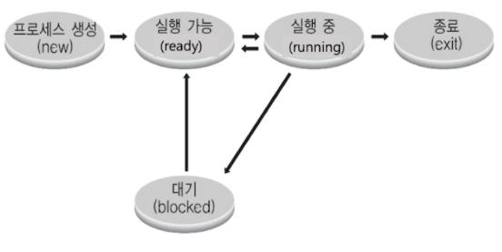
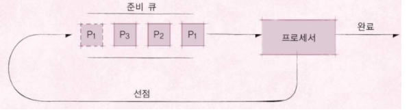

[toc]

# 서술형

### 1. 프로세스 구조에 대해 간결하게 설명해주세요.

```

```

### 2. 시스템 콜에 대해 간결하게 설명해주세요.

```
OS가 각 기능을 사용할 수 있도록 제공하는 인터페이스이며, 보통 시스템 콜을 직접 사용하기 보다는 시스템 콜을 사용해서 만든 라이브러리(API)를 사용한다.
```

### 3. 인터럽트에 대해 간결하게 설명해주세요.

```

```

### 4. 멀티 태스킹에 대해 간결하게 설명해주세요.

```
단일 CPU에서 여러 응용 프로그램이 동시에 실행되는 것처럼 보이도록 하는 시스템이다.
```


<hr>


# 퀴즈

### 1. 운영체제에 대한 일반적인 설명으로  틀린 것은?

```
1. 사용자가 운영체제 기능과 서비스를 조작할 수 있도록 하는 프로그램으로 또다른 용어로 쉘이라고도 부름
2. 하드웨어 시스템 자원을 관리하는 관리자
3. 하드웨어가 요청하는 시스템 자원을 제공하고 관리하는 관리자
4. 응용 프로그램이 필요로하는 시스템 자원을 제공하는 소프트웨어
```

> 1

<br>

### 2. 운영체제가 하드웨어 시스템 자원을 관리해야 하는 이유가 아닌 것은? 

```
1. 응용 프로그램이 Storage에 있는 데이터를 함부로 삭제하거나, 수정할 수 있기 때문
2. 응용 프로그램이 함부로 컴퓨터 자체를 다운시키지 못하도록 하기 위함
3. 특정 응용 프로그램이 하드웨어 자원을 독점해서 사용하는 것을 막기 위함
4. 특별한 권한이 없는 응용 프로그램도 마음껏 하드웨어 자원을 사용할 수 있도록 하기 위함
```

> 4

<br>

### 3. 운영체제 기능으로 알맞지 않은 것은?

```
1. 여러 응용 프로그램 중 특정 시간에 어떤 응용 프로그램을 실행시킬지를 관리한다.
2. 한번에 여러 응용 프로그램을 실행시킬 수 있도록 한다.
3. 응용 프로그램을 사용하는 사용자를 관리한다.
4. Instruction set을 제공한다.
```

> 4 ?


<br>

### 4. CPU Protection Rings 에 대한 설명으로 알맞지 않은 것은? 

```
1. 인텔 CPU 에서 CPU Protection Rings은 Level(Ring) 0, Level(Ring) 1, Level(Ring) 2, Level(Ring) 3 이 있다.
2. 통상적으로 Level(Ring) 3 을 사용자 모드, Level(Ring) 0을 커널 모드로 사용한다.
3. 커널 모드에서는 특권 명령어를 실행하는데 사용한다.
4. 사용자 모드는 운영체제 커널이 사용하는 모드이다.
```

> 4


<br>

### 5. 시스템 콜에 대한 설명으로 알맞지 않은 것은?

```
1. 프로그래밍 언어별로 시스템 콜 기반, 라이브러리를 제공하는 것이 일반적이다.
2. 운영체제는 다양한 시스템 콜을 제공한다.
3. 프로그래밍 언어별로 시스템콜을 만들어야 한다.
4. 응용 프로그램이 운영체제에 시스템 자원을 요청할 때 사용한다.
```

> 2


<br>

### 6. 응용 프로그램, 라이브러리, 시스템 콜에 대한 설명으로 알맞은 것은? 

```
1. 일반적으로 라이브러리는 운영체제가 사용한다.
2. 응용 프로그램은 라이브러리를 사용하고, 라이브러리는 시스템 자원이 필요할 경우, 내부적으로 시스템 콜을 호출할 수 있다
3. 응용 프로그램은 시스템 콜을 제공한다.
4. 운영체제는 반드시 라이브러리를 통해서만 시스템 자원을 요청할 수 있도록 설계되어 있다.
```

> 2

<br>

### 7. 쉘(Shell) 에 대한 설명으로 가장 알맞은 것은?

```
1. 사용자가 운영체제 기능과 서비스를 조작할 수 있도록 인터페이스를 제공하는 프로그램
2. GUI 환경으로 작성되어, 사용자가 파일을 관리할 수 있는 프로그램
3. 시스템 관리자가 운영체제 테마를 관리할 수 있는 프로그램
4. 터미널 환경으로 사용자가 운영체제를 복구할 수 있는 프로그램
```

> 1


<br>

### 8. 프로세스에 대한 설명으로 가장 알맞은 것은?

```
1. 실행이 가능한 프로그램 바이너리 코드 이미지를 의미함
2. 메모리에 올려저서, 실행중인 프로그램을 의미함
3. 프로그램으로 동작할 수 있는 프로그래밍 언어로 작성된 코드를 의미함
4. 응용 프로그램을 구성하는 프로그램 코드 이미지와 관련 파일을 포함한 설치 프로그램을 의미함
```

> 2


<br>

### 9. General Purpose OS 에 대한 설명으로 가장 알맞은 것은? 

```
1. 정확하게 프로그램 시작, 완료 시간을 보장하는 운영체제
2. Hardware 로 프로그램 실행 시간을 제어하는 운영체제
3. 응용 프로그램 실시간 성능 보장을 목표로 하는 운영체제
4. 프로세스 실행시간에 민감하지 않고, 일반적인 목적으로 사용되는 운영체제
```

> 4


<br>

### 10. 프로세스 스케쥴링에 대한 설명으로 옳지 않은 것은?

```
1. 시분할 시스템: 다중 사용자 지원을 위해, 컴퓨터 응답시간을 최소화하는 시스템
2. 멀티 태스킹: 단일 CPU에서 여러 응용 프로그램이 동시에 실행하는 것처럼 보이는 시스템
3. 멀티 프로그래밍: 최대한 CPU를 일정 시간당 많이 활용하는 시스템
4. 멀티 프로세싱: 단일 CPU에서 여러 응용 프로그램이 동시에 실행하는 것처럼 보이는 시스템
```

> 4
>
> 멀티 프로세싱: 여러 CPU에서 하나의 응용프로그램을 병렬로 실행하게 해서, 실행 속도를 높이는 기법


<br>

### 11. 운영체제 스케쥴러와 관련된 설명으로 알맞지 않은 것은?

```
1. 스케쥴러에서 실행되는 프로세스는 일반적으로 프로세스 상태 정보를 가지고 있다.
2. 스케쥴러는 하나의 응용프로그램은 하나의 프로세스로 구성되므로, 응용프로그램 단위로 스케쥴링을 한다.
3. 대표적인 프로세스 상태 정보로는 running, ready, block 등을 들 수 있다.
4. 스케쥴러는 멀티 프로세싱을 지원하기 위한 핵심 운영체제 기술이다.
```

> 2
>
> 하나의 응용 프로그램은 여러 개의 프로세스(프로그램)가 상호 작용을 하면서 실행될 수도 있다.


<br>

### 12. 다음 그림을 보고, 프로세스 상태에 대한 설명으로 알맞지 않은 것은?



```
1. 실행(running) 상태는 프로세스가 CPU에서 실행 중인 상태를 의미한다.
2. 준비(ready) 상태는 프로세스가 CPU에서 실행이 가능한 상태를 의미한다.
3. 블록(block) 상태는 프로세스가 바로 CPU에서 실행이 가능하여, 대기하는 상태를 의미한다.
4. 생성(new) 상태는 프로세스가 생성된 상태를 의미한다.
```

> 3


<br>

### 13. 멀티 프로세싱에 대한 설명으로 가장 알맞지 않은 것은? 

```
1. 멀티 프로세싱은 여러 CPU에서 하나의 응용 프로그램을 병렬로 실행해서, 실행속도를 높이는 기법이다
2. 멀티 프로세싱은 배치 프로세싱과는 달리 하나의 응용 프로그램을 여러 CPU에서 실행할 수 있다
3. 멀티 프로세싱은 다양한 스케쥴링 기법 중 하나이다
4. 특정 응용 프로그램의 실행시간이 오래 걸릴 경우, 다른 응용 프로그램은 그만큼의 시간을 기다려야 하는 단점을 가지고 있다.
5. 멀티 프로세싱은 다른 말로 멀티 태스킹이라고도 부른다.
```

> 5
>
> 멀티 태스킹: 단일 CPU에서 여러 응용 프로그램이 동시에 실행되는 것처럼 보이도록 하는 시스템


<br>

### 14. 다음 그림은 Round Robin 스케쥴러 정책을 설명한 것입니다. 가장 알맞은 설명은?



```
1. 각 프로세스는 우선순위에 따라서 실행 순서가 정해진다.
2. P1, P2, P3라는 프로세스가 순서대로 각 프로세스의 실행이 끝날 때까지 한번에 실행이 된다.
3. P1, P2, P3라는 프로세스가 순서대로 실행이 요청되면 실행 순서는 P1, P2, P3, P1, P2, P3 와 같은 형태로 동일한 실행순서를 가지는 것이 일반적이다.
4. P1, P2, P3라는 프로세스가 실행되다가 새로운 프로세스(P4)가 들어오면, P4를 우선 실행한다.
```

> 3


<br>

### 15. 우선순위 기반 스케쥴러에 대한 설명으로 알맞지 않은 것은? 

```
1. 정적 우선순위 기반 스케쥴러는 프로세스의 우선순위가 미리 정해져있다.
2. 동적 우선순위 기반 스케쥴러는 프로세스의 우선순위가 바뀔 수 있다.
3. 우선순위가 높은 프로세스를 먼저 실행한다.
4. 여러 프로세스에게 가급적 동일한 CPU 실행시간 배분을 위해 고안되었다.
```

> 4


<br>

### 16. 선점형 스케쥴러에 대한 설명으로 가장 알맞은 것은? 

```
1. 하나의 프로세스가 끝나지 않으면 다른 프로세스는 CPU를 사용할 수 없도록 하는 스케쥴러
2. 하나의 프로세스가 현재 CPU에서 실행 중인 프로세스를 대신에, 바로 CPU를 차지할 수 있도록 하는 스케쥴러
3. 하나의 프로세스가 현재 CPU에서 실행 중인 프로세스가 실행완료된 후, 바로 CPU에서 실행할 수 있도록 하는 스케쥴러
4. FIFO 스케쥴러에서 반드시 지원해야 하는 스케쥴링 기법
```

> 2


<br>

### 17. 인터럽트에 대한 설명으로 가장 알맞은 것은? 

```
1. 프로그램 실행 중에, 프로그램을 종료할 수 있는 기능을 의미함
2. CPU가 프로그램 실행 중에, 입출력 하드웨어 등의 장치나 예외상황에 발생하여 처리가 필요할 경우, CPU에 알려서 처리할 수 있는 기능을 의미함
3. 운영체제가 다운될 경우, 이를 복구할 수 있는 기능을 의미함
4. CPU가 프린터등 입출력 하드웨어 등의 장치를 제어할 수 있는 기능을 의미함
```

> 


<br>

### 18. 일반적으로 인터럽트가 필요한 이유가 아닌 것은? 

```
1 입출력 하드웨어와의 커뮤니케이션
2 선점형 스케쥴러 구현
3 예외 상황 핸들링
4 비선점형 스케쥴러 구현
```

> 


<br>

### 19. 다음중 외부 인터럽트가 아닌 것은?

```
1 전원 이상
2 하드웨어 문제
3 타이머 이벤트
4 0 으로 나누었을 때
```

> 


<br>

### 20. 시스템 콜과 인터럽트에 대한 설명으로 가장 알맞은 것은? 

```
1 시스템 콜이 호출되면, 시스템 콜이 처리되는 동안 인터럽트는 처리되지 않도록 함
2 시스템 콜 호출을 위해 강제로 코드에 인터럽트 명령 (int 0x80) 을 넣어 CPU에 전달함
3 시스템 콜이 호출되면, 해당 시스템 콜이 처리되게끔, 인터럽트가 강제로 현재 모드를 사용자 모드로 바꿔주도록 되어 있음
4 시스템 콜이 호출되면, 관련된 프로그램을 인터럽트로 깨움
```

> 


<br>

### 21. 다음중 일반적인 프로세스 구조에 없는 것은?

```
1 TEXT(CODE)
2 DATA
3 STACK
4 QUEUE
```

> 


<br>

### 22. 프로세스 구조 중 TEXT(CODE) 영역에 대한 설명으로 가장 알맞은 것은?

```
1 전역 변수를 위한 공간
2 동적으로 할당된 메모리를 위한 공간
3 함수 실행을 위한 지역 변수를 위한 공간
4 프로그램 코드가 저장되는 공간
```

> 


<br>

### 23. 가장 프로세스 실행시간이 짧은 프로세스부터 먼저 실행시키는 정책을 가진 스케쥴링 알고리즘은? 

```
1 FIFO 스케쥴러
2 SJF 스케쥴러
3 정적 우선순위 스케쥴러
4 라운드로빈 스케쥴러
```

> 2


<br>

### 24. 다음 중 소프트웨어 인터럽트가 아닌 것은?

```
1 계산 결과가 Overflow 가 났을 때의 인터럽트
2 사용자 모드에서 허용되지 않은 명령 또는 공간 접근시 일어나는 인터럽트
3 0 으로 나누었을 때 일어나는 인터럽트
4 키보드를 눌렀을 때 일어나는 인터럽트
```

> 

<br>

### 25. 인터럽트 번호와 각각의 실행 코드를 가리키는 주소를 가진 데이터가 기록되어 있는 곳은?

```
1 PCB
2 SP
3 JOB
4 IDT
```

> 

<br>

### 26. 프로세스 구조 중 STACK 에 대한 가장 알맞은 설명은?

```
1 프로그램 코드가 저장된 공간
2 전역 변수등이 저장된 공간
3 동적으로 할당된 메모리를 위한 공간
4 함수 실행을 위한 지역 변수등이 저장된 공간
```

> 


<br>

### 27. 다음 중 I/O Device 가 아닌 것은?

```
1 CPU
2 Monitor
3 Network
4 Mouse
```

> 


<br>

### 28. 다음 중 배치 처리 시스템에 대한 설명으로 가장 알맞은 것은?

```
1 하나의 CPU에 여러 응용 프로그램이 동시에 실행하는 것처럼 보이도록 하는 시스템
2 다중 사용자 지원을 위해 컴퓨터 응답 시간을 최소화 하는 시스템
3 컴퓨터 프로그램 실행 요청 순서에 따라 순차적으로 프로그램을 실행하는 방식
4 여러 CPU에 하나의 프로그램을 병렬로 실행해서 실행속도를 극대화 하는 방식
```

> 3


<br>

### 29. 프로세스에서 다음 실행할 명령어의 주소를 가지고 있는 레지스터를 반드시 영어대문자로 2글자로 작성해주세요

```

```

> 


<br>

### 30. 프로세스 구조에서 동적으로 할당된 메모리를 저장하는 영역을 일컫는 영어단어를 반드시 영어대문자로 4글자로 작성해주세요

```

```

> 