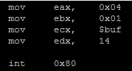
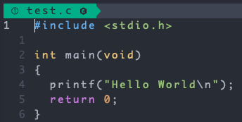

[TOC]

# 서술형

### 1. 리눅스 운영체제는 여러 배포판이 있습니다. 이 중에서 가장 널리 사용되는 Debian GNU, Ubuntu, CentOS, RedHat 4가지의 차이점을 정리하여 작성해주세요. 각 배포판별 장점과, 주요 사용처를 포함하여 작성해주세요.

```
- Ubuntu: 설치가 간단하고 데스크탑 환경이 뛰어나 일반적인 사용자가 주로 사용한다.
- Debian GNU: GNU 의 공식적인 후원을 받는 배포판이며 서버 안정성이 높아 기업에서 주로 사용한다.
- CentOS: 레드햇의 무료버전 OS. 안정적인 서버 성능으로 기업에서 주로 사용한다.
- RedHat: 지속적인 업데이트로 여러 장점이 있으나, 기술 지원을 받기 위해선 금액을 지불해야함. 데스크탑, 서버용 모두 사용한다.
```


### 2. 리눅스 파일 시스템(ext file system)에 대해서 정리한 내용을 작성해주세요.

> inode에 대한 설명은 반드시 포함하여 주세요.

```
파일 시스템은 크게 super block, inode, disk block 으로 볼 수 있다.
super block은 전체 사이즈, 어떤 파일 시스템 알고리즘인지 등 파일 시스템의 정보를 가지고 있다. 
각각의 파일들은 `파일이름:inode`로 매핑이 되어있으며, inode를 기반으로 파일에 엑세스한다. inode에는 파일 권한, 소유자 정보, 파일 사이즈, 생성시간 등 시간 관련 정보, 데이터 저장 위치 등등
관련 기반 메타데이터가 저장된다. disk block은 파일을 논리적인 단위 집합으로 관리한다. 저장되는 파일은 블록단위로 분할되어 파일 시스템 정책에 따라 저장된다. 
```


### 3. 다음은 실제로 리눅스 운영체제에서 시스템 콜을 구현한 어셈블리 코드 예제이다. 아래 코드를 해석하여, 어떤 프로그램 명령을 수행한 코드인지 서술해주세요.



```
eax, ebx, ecx, edx 레지스터의 역할을 포함합니다.
0x04, 0x01이 의미를 포함합니다.
int 0x80의 의미를 포함합니다.
```

```
eax: 시스템 콜 번호
ebx: 시스템 콜에 해당하는 인자값 - 파일 서술자
ecx: 시스템 콜을 사용해 처리할 내용 (메세지) - 파일 서술자에 쓰려고 하는 데이터 
edx: 위 내용의 바이트 사이즈 
0x04: 4
0x01: 1
int 0x80: 인터럽트 번호, 시스템콜은 0x80으로 지정

1. 시스템콜 인터럽트 명령을 호출하면서 0x80값을 넘겨준다.
2. IDT에서 0x80에 해당하는 주소(system_call 함수)를 찾아 실행한다.
3. system_call() 함수에서 eax로 부터 받은 시스템콜 번호 0x04번 시스템콜 함수 sys_write에 ebx의 0x01(표준 출력 스트림), ecx의 메세지, edx의 byte size 를 전달해 실행한다.
4. 즉, 14바이트 사이즈인 $buf를 write 시스템 콜에 표준 출력 스트림으로 넘긴다.
```


### 4. 리눅스 운영체제에서 사용자가 CLI를 통해서 “gcc -o test test.c” 명령어를 실행했을 때 실제 내부에서 동작하는 방식을 상세하게 서술해주세요.



```
- 사용자가 커멘드창을 오픈하면, 자동으로 쉘프로그램이 실행됨
- gcc 명령은 주어진 C 파일을 컴파일 하는 명령어임
- 해당 쉘에서는 키보드를 입력하면, 해당 키보드 문자가 화면에 표시하며, 엔터를 누르면 그동안 입력받은 문자열을 명령으로 인식하고, 해당 명령을 실행함
- 스케쥴링 방식은 선점형을 지원하며, 기본적으로 멀티 태스킹을 지원함
- 인터럽트가 발생하며 내부에서는 gcc 컴파일러가 수행됨
- gcc 컴파일러는 주어진 옵션으로 test.c에 해당하는 test.o를 생성함
- test.o 파일을 기준으로 실행파일인 test 파일을 생성함

➡ 위에서 기술한 사항 외에 추가 가정이 꼭 필요한 경우에는 각자 가정한 상황을 기술하고, 동작 방식을 기술하세요.
```

```
1. gcc -o test test.c 라는 문자열을 명령으로 인식한다. 
2. /bin/gcc 프로그램을 실행하여 메모리에 올리고, 컴파일 하겠다는 -o 옵션으로 인해 해당 코드가 동작한다.
3. 프로그램은 test.c 파일을 메모리에 올리고 코드를 한줄씩 읽어가며 컴파일을 수행한다. (컴파일 과정은 헤더를 읽고, 어셈블리어로 변환하고, 기계어로 변환하여 사람이 읽을 수 없으나 컴퓨터가 바로 실행할 수 있는 파일로 변환하게 된다.)
4. test.c 파일을 test 라는 실행파일로 만든다.
```

