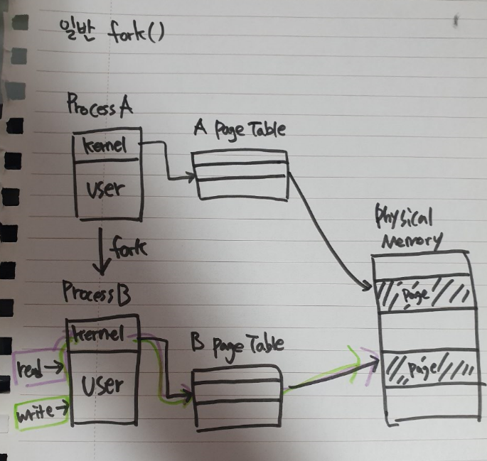
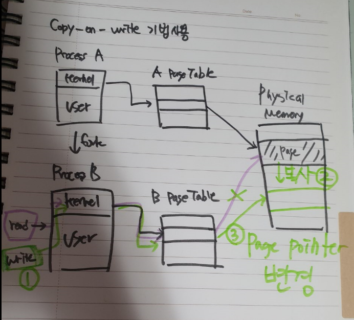

[TOC]

# 서술형

### 1. **fork() 함수와 달리 exec() 함수는 다양한 기능들을 제공하는 exec 계열 함수들이 존재합니다. execl, execlp, execle, execv, execv, execvp, execvpe 함수들의 기능을 설명하고 각 함수들의 차이점을 표로 정리하세요.** exec의 suffix로 붙는 문자의 의미를 반드시 설명해 주세요.

```
exec() 함수는 시스템콜을 실행시킨 프로세스 공간에 새로운 프로세스 이미지를 덮어씌우고, 새로운 프로세스를 실행합니다. 

[exec의 suffix 문자 의미]
l: char *로 하나씩 argv인자를 넘겨줄 때 사용합니다.
v: char *[]로 배열로 한번에 argv인자를 넘겨줄 때 사용합니다.
e: char *[]로 배열로 환경변수를 넘겨줄 때 사용합니다.
p: p가 있는 경우에는 환경변수 PATH를 참조하기 때문에 절대경로를 입력하지 않아도 됩니다. 파일 이름만 넘겨주면 프로세스 환경변수에서 파일명을 검색합니다.

[각 함수의 기능, 차이점]
1. execl
char *로 하나씩 argv인자를 넘겨주며, 파일 이름을 디렉토리와 파일 이름이 합친 전체 이름으로 검색한다.
- execl("디렉토리와 파일 이름이 합친 전체 이름", "명령어 인수", "끝은 NULL로 끝나야함");

2. execlp
char *로 하나씩 argv인자를 넘겨주며, 파일 이름을 해당 프로세스를 실행한 프로세스의 환경변수(path)를 검색한다. 
- execlp("파일 이름", "명령어 인수", "끝은 NULL로 끝나야함");

3. execle
char *로 하나씩 argv인자를 넘겨주며, 환경 변수를 지정하고자 할 때 사용한다.
- execl("파일 이름", "명령어 인수", "환경변수");

4. execv
인수 리스트를 내용으로 하는 문자열 배열을 넘겨줄 때 사용한다.
- execv("디렉토리와 파일 이름이 합친 전체 이름", "명령어 인수 리스트")

5. execvp
인수 리스트를 내용으로 하는 문자열 배열을 넘겨줄 때 사용하며, 파일 이름을 해당 프로세스를 실행한 프로세스의 환경변수(path)를 검색한다.
- execvp("파일 이름", "명령어 인수 리스트")

6. execvpe 
인수 리스트를 내용으로 하는 문자열 배열을 넘겨줄 때 사용하며, 환경 변수를 지정하고자 할 때 사용한다.
- execvpe("파일 이름", "명령어 인수 리스트", "환경변수")
```


### 2. **프로세스간 커뮤니케이션 (Inter-process Communication) 기법 중 Pipe, Shared Memory를 포함해 3가지 이상 기법을 조사하고 각 기법들의 제약 조건, 사용 방식의 차이점에 대해 작성해주세요.**

```
[Pipe]
- 기본 파이프는 단방향 통신이다.
- fork()로 자식 프로세스를 만들었을 때, 부모와 자식간의 통신 방법이다.
- 부모 프로세스가 파이프에 쓰게 되면(fd[1]), 자식 프로세스는 그 파이프에서 읽는(fd[0]) 방식으로 쓰인다.

[Shared Memory]
- 공유 메모리는 kerneal space에 메모리 공간을 만들고, 해당 공간을 변수처럼 쓰는 방식이다.
- message queue처럼 FIFO(First In First Out)방식이 아니고 해당 메모리 주소를 마치 변수처럼 접근하는 방식이다.
- 공유 메모리 KEY를 가지고 여러 프로세스가 접근 가능하다.
- shmget로 공유 메모리를 생성하고, shmaddr로 공유 메모리를 연결하고, shmdt로 공유 메모리의 변수를 해제하고, shmctl로 공유 메모리를 삭제할 수 있다.
- shmid는 shmget 함수로 생성한 공유 메모리 식별자이다.

[message queue]
- FIFO(First In First Out) 방식으로 데이터를 전송한다.
- 부모 프로세스, 자식 프로세스 관계가 아니여도 커뮤니케이션이 가능하다.
- msgget으로 큐를 생성해 msqid(식별자) id를 받을 수 있다.
- msgsnd(msqid, &sbuf, buf_length, IPC_NOWAIT)와 같은 방법으로 메세지 큐에 데이터를 쓸 수 있다.
- 메세지를 수신할때는 msgrcv(msqid, &rbuf, MSGSZ, 1, 0)와 같은 방법으로 수신할 수 있다. 
```


### 3. **Fork를 이용한 프로세스 생성시 메모리 복사 비용을 줄이기 위한 기법 중 하나로 copy-on-write 기법이 있습니다. Copy-on-write 기법이 있을 때와 없을 때 두 경우에 대해서 프로세스 A, B가 사용하고 있는 메모리 공간에 Read와 Write 수행하면 생기는 변화를 각 Process의 메모리 공간, 각 Process의 Page Table, 그리고 Physical Memory Space를 사용해 그림으로 나타내세요.**

```
fork(): 별도의 프로세스 공간을 만들고, 부모 프로세스 공간의 데이터를 그대로 복사한다.
copy-on-write 기법: 자식 프로세스 생성 시, 부모 프로세스 페이지를 우선 적용한다. 부모 또는 자식 프로세스가 해당 페이지를 읽기가 아닌, 쓰기 처음 요청 시 이 때 페이지를 복사하고, 분리한다.
```

`+사진`






### 4. **파일에 접근하는 방법으로 read, write 함수들을 사용하는 방식과 mmap을 사용하는 Memory Mapped File 방식이 있습니다. 두 방식의 차이점과 장단점을 접근 방식, 사용성, OS 내부에서 처리 방식 관점에서 서술 하십시오.**

```

```


