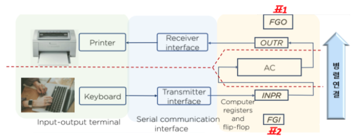
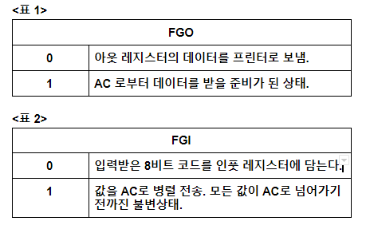
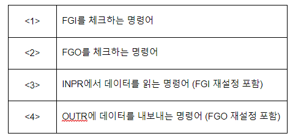
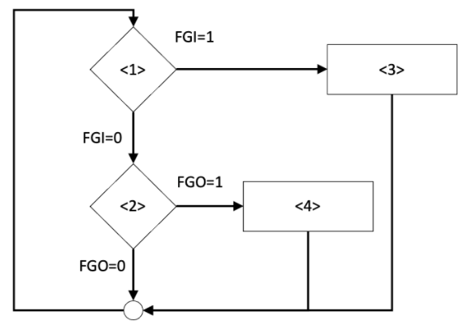
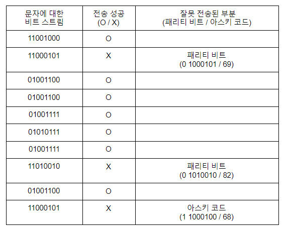

[TOC]

# 서술형

### 1. 주어진 부울 식 E = a’b’c + a’bc’ + ab’c’ + ab’c + abc’ + abc를 카르노(Karnaugh) 맵을 이용하여 간편화하는 과정을 설명해주세요.

- 주어진 부울 식에 대해 카르노 맵을 채워주세요.

| -    | bc   | b'c  | b'c' | bc'  |
| ---- | ---- | ---- | ---- | ---- |
| a    | 1    | 1    | 1    | 1    |
| a'   | 0    | 1    | 0    | 1    |

- 식을 간편화하는 과정을 적어주세요.

```
1. 인접 민텀끼리 묶으면 먼저 a라인의 bc, b’c, b’c, bc’는 1이되어  a만 남게된다.
2. 다음 인접 민텀끼리 묶으면 ab’c와 a’b’c가 있는데 a와 a’가 1이되어 b’c가 남게된다.
3. 마지막 인접 민텀끼리 묶으면 abc’와 a’bc’가 있는데 a와 a’가 1이되어 bc’가 남게된다.
```

- 최종 결과를 적어주세요.

```
a + b’c + bc’
```


### 2.  다음과 같은 메모리 상태 예제가 주어지고, R1 = 101, R2 = 202이 저장되어 있습니다. R1에 202값을 저장하는 마이크로 명령을 작성해주세요.

> 마이크로 명령은 총 4가지 종류로 “직접 값 모드” , “레지스터 모드”, “직접 모드”, “메모리 간접 모드”가 있습니다. 4가지 모드 각각에 대해 답안을 작성해주세요.

| Add  | Con  |
| ---- | ---- |
| 50   | 201  |
| 51   | 350  |
| ...  | ...  |
| 201  | 202  |
| 202  | 700  |

```
직접 값 모드 
MOV R1, #202

레지스터 모드
MOV R1, R2

직접 모드
MOV R1, 201

메모리 간접 모드
MOV R1, @50
```


### 3. A의 컴퓨터는 입출력 처리를 위해 플래그를 사용한 프로그램 제어 전송 방식을 사용한다. 프로그램 제어 전송 방식의 입출력 구성을 아래 그림과 같다.



- 해당 그림의 FGI와 FGO에서 flag bit의 의미에 대해 아래 표에 작성해주세요.



- 이 컴퓨터의 프로세스 처리 속도는 fetch-and-execute cycle time이 20μs이고 (하나의 instruction을 처리하는데 20μs가 걸림), 입출력 장치 처리 속도는 100 문자/초입니다. (0.01초마다 1 문자가 입/출력됨.) CPU가 수행할 수 있는 instruction은 아래의 4가지입니다.

  

  이 CPU가 아래의 순서도대로 입출력을 수행한다고 할 때, 



(a) 문자 하나를 입력받은 후 (INPR에서 데이터를 한번 읽은 후) 문자 하나를 입력받기까지 <1> 명령어는 몇 회 실행되어야하는지 풀이 과정을 포함하여 작성해주세요.

```
프로세스 처리 속도와 무관히 데이터를 받고, AC에 보내는 관점에서는 
문자 하나를 입력 받아 이미 FGI = 1 이 된 상태에서 데이터를 AC에 보내기 위해 flag 상태를 체크하기위해 한번 필요하다. 
FGI = 0 일 경우에 새로운 값을 레지스터에 저장한다.
위에 가정되어있는 처리 속도를 감안했을땐 1문자를 보낼때 250번의 플래그 체크가 필요하다.
```

(b) 문자 하나를 출력한 후 (OUTR에 데이터를 쓴 후) 문자 하나를 출력하기까지 <2> 명령어는 몇 회 실행되어야하는지 풀이 과정을 포함하여 작성해주세요.

```
문자 하나를 출력하여 FGO = 0 이 된 상태에서, AC에 있는 데이터를 OUTR이 받을 수 있는 상태인지 ( FGO = 1 플래그 체크 ) 한번 필요.
위와 마찬가지로 처리 속도를 감안하면 250번의 플래그 체크가 필요하다.
```


### 4. A는 홀수 패리티를 활용하여 “HELLOWORLD”라는 문자열을 B에게 전송했습니다. (각 문자는 8비트의 아스키 코드를 사용하며 이중 MSB가 패리티 비트로 활용되고, 문자는 모두 대문자를 사용합니다. 예를 들어, 대문자 A는 가장 왼쪽의 패리티 비트를 포함하여 11000001로 표현됩니다.) 이때 B가 A로부터 받은 비트 스트림 (문자열을 비트열로 표시한 결과)은 다음과 같습니다.

> 11001000 11000101 01001100 01001100 01001111 
>
> 01010111 01001111 11010010 01001100 11000101
>
> 위의 비트 스트림에 대해 각 문자가 제대로 전송되었는지 잘못 전송되었는지 작성하고 (O,X로 표시), 잘못 전송된 문자의 경우 패리티 비트나 아스키 코드 중 어느 부분이 잘못 전송되었는지 작성해주세요. (**패리티 비트** 또는 **아스키 코드**로 표시. 문자 전송에 성공했다면 잘못 전송된 부분은 빈 칸으로 남겨주세요.)



