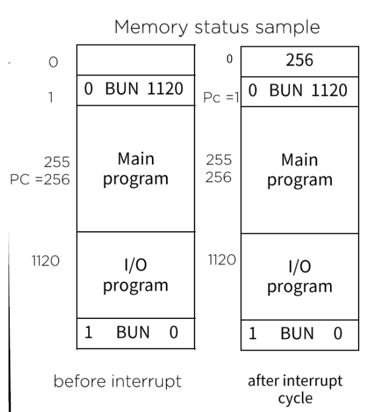

[TOC]

<hr>


# 퀴즈

### 1. 다음 중 컴퓨터 하드웨어에 속하지 않는 것은?

```
Output Device
Input Device
Storage
Operating System
```

> 4

<br>

### 2. 다음 중 주기억장치에 속하지 않는 것은?

```
레지스터
SRAM
DRAM
SSD
```

> 4
>
> SSD는 보조 ㅇㅅㅇ..

<br>

### 3. 다음 중 보조기억장치에 속하지 않는 것은?

```
하드 디스크
USB memory
ROM
Bluray
```

> 3
>
> ROM은 주기억장치..ㅇㅅㅇ..


<br>

### 4. 다음 중 양자컴퓨터에 대한 설명으로 맞지 않는 것은?

```
양자컴퓨터는 양자의 기본 성질인 중첩, 얽힘 등을 이용하여 다수의 정보를 처리할 수 있는 새로운 개념의 컴퓨터이다. ㅇㅇ

현재 나노공정 설계로 제작되는 반도체 칩의 한계를 극복하기 위해 등장하였다.

양자컴퓨터는 현재 양산 가능한 형태로 기술이 개발되어 있다.

양자컴퓨터는 큐비트(qubit)를 기준으로 하는 양자 병렬처리를 통해 엄청나게 빠른 속도로 문제 해결이 가능하다.
```

>2, 3?... 2???


<br>

### 5. 다음 중 bit와 관련된 설명으로 옳지 않은 것은?

```
8bit는 1byte이다.
64bit architecture에서 워드의 길이는 64bit이다.
영어 글자 한 글자는 2byte로 표현된다.
1바이트의 가장 큰 자리수를 담당하는 비트를 MSB라고 부른다.
```

>3
>
>1byte


<br>

### 6. 10진수 숫자 80을 16진수로 바꾼걸로 알맞은 것은?

```
48
49
50
51
```

> 3


<br>

### 7. 다음 중 2진수와 - 16진수의 조합으로 틀린 것은?

```
0000 - 0x00
0110 - 0x06
00100110 - 0x46
01100011 - 0x63
```

> 3


<br>

### 8. 00110101을 2의 보수를 이용하여 변환한 것으로 알맞은 것은?

```
11001010
11001011
00110110
00111010
```

> 2


<br>

### 9. 다음 중 실수 +0.1001 x 2^7을 32비트로 알맞게 표현한 것은? (강의자료 05 데이터 종류, 2.3절의 방법을 사용해주세요. IEEE 754 floating point representation이 아님.)

```
0 0000111 10010000000000000000
0 0000101 10010000000000000000
1 0000111 10010000000000000000
1 0000101 10010000000000000000
```

> 모르겠..ㅎ


<br>

### 10. 다음 중 논리 연산의 결과로 알맞지 않은 것은?

```
0 AND 1 = 0
0 OR 1 = 0
NOT 0 = 1
((0 AND 1) OR 1) = 1
```

> 2


<br>

### 11. 주어진 부울 식 (BC' + A'D)(AB' + CD')을 부울 대수를 이용하여 간략화 시킨 결과로 알맞은 것은?

```
0
1
AB'
CD
```

> 모르겠.. 1??


<br>

### 12. 다음 중 플립플롭의 종류가 아닌것은?

```
SR flip-flop
D flip-flop
JK flip-flop
F flip-flop
```

> 4
>
> 강의에서는 R-S라고 하긴 했는데


<br>

### 13. 다음 중 CPU의 구성요소에 포함되지 않는 것은?

```
PC
MAR
MBR
IPC
```

> 4

<br>

### 14. 다음 중 각종 레지스터에 대한 기능이 올바르지 않은 것은?

```
Program Counter는 다음 수행될 명령어가 들어있는 주기억장치의 주소를 기억하고 있다.

Instruction Register는 PC가 지정하는 주소에 있는 명령어를 임시 기억하고 있다.

general purpose register는 ALU를 직접 연결해서 사용하며, working register는 ALU를 사용하지 않고 별도로 연산을 진행한다.

status register는 CPU의 상태를 나타내는 flag 정보를 저장한다.
```

> 4..?


<br>

### 15. 다음 중 레지스터 마이크로 연산(micro-operation)의 종류로 맞지 않는 것은?

```
shift
count
clear
rotate
```

> 4


<br>

### 16. 다음 중 CPU 디자인과 관련된 설명중 맞지 않는 것은?

```
레지스터들을 직접 연결 하면 장치 수의 제곱에 비례하는 복잡도가 발생한다.

Common Bus line을 이용해서 레지스터들을 연결하면 MUX를 이용해서 손쉽게 구현할 수 있다.

Common Bus line을 이용해서 레지스터들을 연결할 때 Decoder를 이용해서 구현할 수 있다.

내부 스택 구조를 활용하여 Buffer와 같이 순차적 처리를 요하는 자료를 대기하게 만들 때 사용할 수 있다.
```

> 3...?


<br>

### 17. 다음 중 ALU에 포함되는 마이크로 연산이 아닌 것은?

```
ADD
XOR
INC
RTD
```

> 4


<br>

### 18. A = 0010, B = 1101 일 때, A XOR B에 대한 결과로 알맞은 것은?

```
1111
1101
0000
0101
```

> 1


<br>

### 19. 01100110에 ROR 연산을 한번, LSR 연산을 한번 적용한 결과로 알맞은 것은?

```
00110011
00011001
00110101
10011001
```

> 1..?
>
> ㅠㅠ


<br>

### 20. R1 = 200, R2 = 150가 저장되어 있고, 메모리가 아래와 같을 때, 마이크로 명령을 수행한 결과가 다른 것은?

| Add  | Con  |
| ---- | ---- |
| 190  | 150  |
| 191  | 200  |
| 192  | 300  |
| ...  | ...  |
| 200  | 350  |
| 201  | 700  |

```
MOV R1, #150
MOV R1, R2
MOV R1, 190
MOV R1, @190
```

> 4


<br>

### 21. 입출력 구성에 대한 설명으로 맞지 않는 것은?

```
키보드로 입력한 내용은 Serial communication interface를 통해서 레지스터로 정보를 전달한다.

OUTR, AC, INPR, FGI는 모두 병렬로 연결되어 있다.

FGI의 flag bit가 1일 때는 INPR의 정보가 바뀌며, AC로 코드를 전송한다.

OUTR를 통해서 데이터가 output device로 전송된다.
```

> 


<br>

### 22. IEN(Interrupt Enable filp-flop)에 대한 설명으로 맞지 않는 것은?

```
FGI를 이용한 방식은 프로세스와 입출력장치의 속도가 차이가 많이 나서 비효율적이기 때문에 IEN 방식이 제안되었다.

플래그를 이용하지 않고, 외부장치가 준비가 되었을 때 interrupt를 발생시키는 방법이다.

컴퓨터는 실행하면서 플래그를 체크하지 않고, 플래그가 interrupt로 인해 세팅되면 그 때 입출력을 실행한다.

입출력 장치가 interrupt를 요청한 경우, 입출력을 수행하고 나서 계속 입출력장치의 신호를 기다린다.
```

> 


<br>

### 23. 다음 메모리 상태 예제에 대한 설명으로 맞지 않는 것은?



```
현재 256이 프로그램의 복귀 주소이다.
interrupt 이전에 1120에 프로그램이 로드되어 있기 때문에, 1 <- BUN 1120을 로드한다.
interrupt가 실행되면 PC는 1로 바뀌며, R은 1로 세팅이 된다.
I/O program이 실행되면 ION instruction에 의해 IEN이 1로 세팅이 되며 프로그램으로 복귀한다.
```

>


<br>

### 24. 프로그램의 종류에 대한 설명으로 맞지 않은 것은?

```
컴퓨터 소프트웨어는 크게 시스템 소프트웨어와 응용 소프트웨어로 나눌 수 있다.
운영체제, 프로그래밍언어 번역 프로그램은 모두 시스템 소프트웨어에 해당한다.
Device Driver, DBMS는 Application에 해당한다.
일반적으로 사용하는 Web Browser, 메신저 프로그램, 오피스 프로그램은 모두 응용 소프트웨어에 속한다.
```

> 

<br>

### 25. 다음 중 컴파일러형 언어가 아닌 것은?

```
C
C++
Java
Javascript
```

> 4

<br>

### 26. 다음 중 프로그램 처리 과정에 대한 설명으로 알맞지 않은 것은?

```
C언어 같은 고급 언어를 이용하여 작성한 프로그램은 어셈블리 프로그램으로 변환된다.
어셈블리 프로그램은 mnemonic을 이용하여 명령을 표시한다.
어셈블리 언어는 컴퓨터 제조 업체와 관계없이 모두 동일한 규칙을 사용한다.
최종 기계어로 번역된 프로그램이 실제 CPU에서 수행된다.
```

> 


<br>

### 27. 소프트웨어 개발 패러다임에 대한 설명으로 옳지 않은 것은?

```
구조적 기법은 가장 초창기에 사용한 기법으로 함수들을 기준으로 프로그램을 작성하였다.

객체지향 기법은 객체 단위로 프로그램을 단위화하여 캡슐화, 상속 등을 사용하여 재사용성을 가능하게 하였다.

컴포넌트 기법은 interface를 통하여 외부와 쉽게 동작할 수 있고, 단순하게 통신 할 수 있게 하였다.

분산객체 프레임 워크는 동일한 시스템으로 구성된 분산환경에서 동일한 application이 효율적으로 동작하게 하기 위해 개발되었다.
```

> 


<br>

### 28. 다음중 입출력장치 (Input/Output Device)가 아닌 것은?

```
키보드
USB memory
터치 스크린
스캐너
```

> 2


<br>

### 29. 10진수 실수 17.3125를 2진수로 나타낸 것으로 알맞은 것은?

```
10011.0111(2)
10001.0101(2)
10001.0111(2)
10001.0110(2)
```

>2
>
>10001.0101


<br>

### 30. 다음 중 홀수 패리티를 사용하여 아스키 문자 R을 올바르게 표현한 것은? (패리티 1비트, 아스키 7비트 형식)

```
1 1000001
1 1000100
0 1010010
1 1011010
```

>3