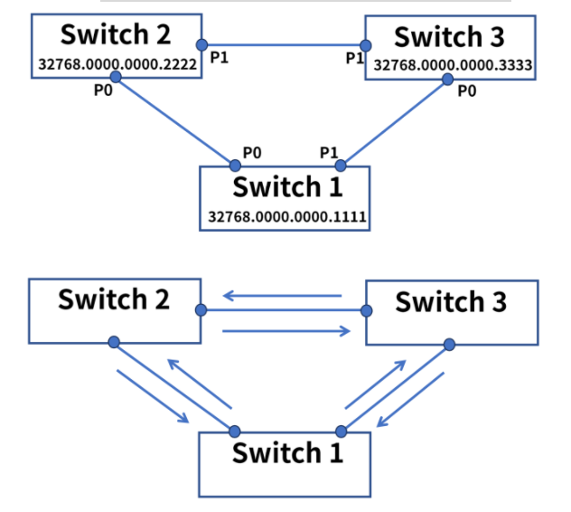
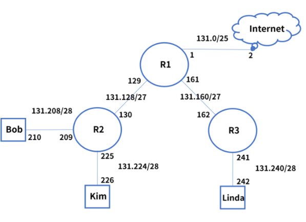
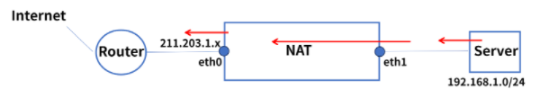
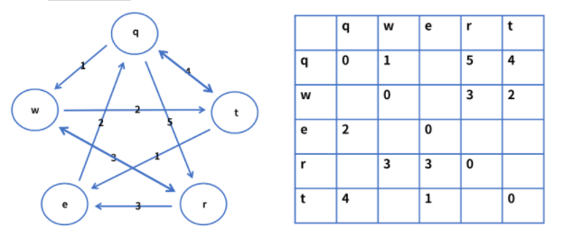
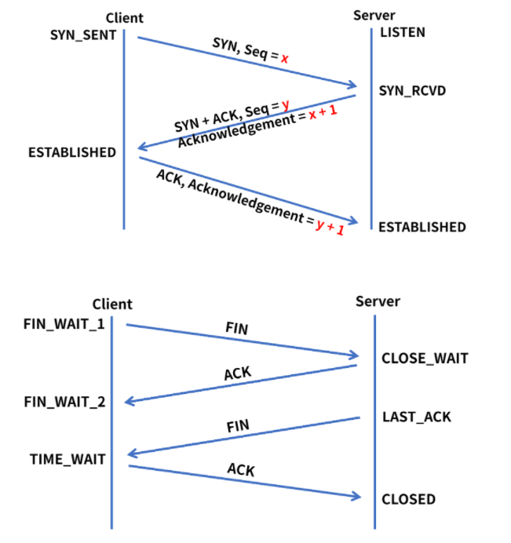

[TOC]

# 서술형

### 1. 네트워크의 전체 구조를 이해하는 OSI 7 Layer model에서 각 계층별 특징에 대해 설명하고, OSI 7 Layer model로 네트워크 구조를 정의했을 때의 장점을 서술하세요.

```
1) 각 계층별 특징
1계층 - Physical
- 장치와 통신매체 사이의 비정형 데이터의 전송을 담당한다.
- 디지털 bit를 전기, 무선 또는 광 신호로 변환한다.
- 전송되는 방법, 제어 신호, 기계적 속성 등을 정의한다.

2계층 - Data Link
- 동일 네트워크 내에서 데이터 전송한다.
- 링크를 통해서 연결을 설정하고 관리한다. 
- 프레임 데이터와 물리적인 주소(MAC)를 이용해 데이터 전송 형태를 결정하는 계층이다.
- 물리계층에서 발생할 수 있는 오류를 감지하고 수정한다.

3계층 - Network
- 다른 네트워크로 데이터 전송한다. 
- 논리적인 주소 IP(Internet Protocol)로 통신한다.
- 출발지 IP에서 목적지 IP로 데이터 통신시 중간에서 라우팅 처리한다.
- 데이터가 큰 경우 분할 및 전송 후 목적지에서 재 조립하여 메시지 구현한다.

4계층 - Transport
- 호스트간의 데이터 (서비스) 전송한다.
- 오류 복구 및 흐름 제어, 완벽한 데이터 전송을 보장한다.
- Port를 제어한다는 의미로 L4 로드 밸런서가 있다.
- 포트 번호를 이용하여 데이터 전송 방식을 결정하는 계층이다.

5계층 - Session
- 로컬 및 원격 애플리케이션 간, 네트워크 간의 IP/Port 연결을 관리한다.

6계층 - Presentation
- 컴퓨터가 인식할 수 있거나, 사용자에게 보여주기 위해 사용자 프로그램과 네트워크 형식간에 데이터를 변환하여 표현과 독립성을 제공한다.
- 인코딩, 디코딩, 암호화, 압축을 한다.

7계층 - Applicaiton
- 사용자와 가장 밀접한 소프트웨어이다.
- 이메일 서비스 SMTP, 또는 파일전송 FTP 등 사용자에게 인터페이스와, 서비스를 제공하는 계층이다.

2) OSI 7 Layer model로 네트워크 구조를 정의했을 때의 장점
- 프로토콜을 기능별로 나누고 계층별로 구분하여 데이터의 흐름을 파악하기 쉽다.
- 벤더간 호환성을 위한 표준을 제시해 쉬운 접근성으로 기술의 발전이 용이하다.
- 유지 보수가 용이하다.
- 여러 계층으로 나눠져 규격화 되었기에 유연성 있는 환경 구성이 가능하다.
```


### 2. 다음 주어진 그림과 같이 3개의 스위치가 연결되어 있을 때, STP(Spanning Tree Protocol) 방법을 사용하여 Looping 상태를 해결하는 과정을 서술하세요.



> Root Bridge, Root Port, Designated Port의 선출과정을 포함하세요.
>
> Looping 상태가 해결되는 과정을 STP 방법의 순서에 따라 설명하세요.

```
1. 스위치가 서로 BPDU를 교환하고, BPDU가 가장 낮은 숫자인 Switch 1이 Root Bridge로 선출된다.
2. 나머지 스위치들은 root path cost를 참조하여 Root Bridge인 Switch 1과 가장 빠르게 연결되는 Root Port를 선출한다. (회선 전송 속도가 필요함.)
3. 각 세그먼트 별 Root Bridge와 가장 빠르게 연결되는 Port를 Designated Port로 선출한다.
4. 선정되지 않은 포트는 Non- Designated Port로 블로킹 상태가 되어 논리적으로 고립되고, looping이 해결된다.
```


### 3. 다음 주어진 그림처럼 IP 주소가 할당되어 있는 네트워크에서 라우팅을 하려고 합니다. Kim이 Linda에게 데이터를 전송하면, Linda가 전송 받은 데이터를 가지고 Internet(구글)에 접속하여 데이터를 업로드하려고 할 때, 라우팅이 어떻게 이루어지는지 서술하세요



```
1. Kim은 목적지 Linda 131.240으로 통신 시도한다.
2. 목적지 IP 주소는 자기 대역이 아니므로 R2로 전달한다. (디폴트 게이트웨이)
3. R2도 Connected 대역이 아니므로 R1으로 전달한다.
4. R1은 정적 라우팅 테이블을 참조하여 Linda의 대역을 갖고있는 R3로 전달한다.
5. R3는 connected 대역인 포트로 전달하여 Linda가 패킷 수신을 완료한다.

6. Linda은 목적지 인터넷 구글로 통신 시도한다.
7. 목적지 IP주소는 자기대역이 아니므로 R3로 전달한다.(디폴트 게이트웨이)
8. R3도 Connected 대역이 아니므로 R1으로 전달한다.
9. R1은 정적 라우팅 테이블을 참조했으나 없는 대역이기에 isp와 연결된 포트에 해당 요청을 전달한다.
10. 인터넷 라우터들을 통해 구글에 도착한다.
```


### 4. 각자 지금 사용하고 있는 컴퓨터(노트북 포함)에서 네트워크 정보를 확인합니다.
확인한 네트워크 정보에서 DHCP가 적용되어 있는지 확인하고, 본인의 컴퓨터가 DHCP를 통해 IP주소를 할당받았다면, 이 때 DHCP로 할당받은 IP주소로 미국 캘리포니아 마운틴 뷰에 위치하고 있는 구글 홈페이지(google.com)에 접속하는 과정을 Dynamic NAT를 사용한다고 가정하고 서술해보세요.

> 아래 그림에서 eth0에 해당하는 주소는 실제 공유기의 주소이지만, 알아내기 힘들다면 “**211.203.1.100”**으로 생각하고 작성해보세요.



```
1. 구글 웹 사이트 접속 시도한다.
2. eth1에 패킷이 도달한다. 
3. NAT 테이블의 공인 IP 대역 Pool을 확인하고 매핑한다.
4. 사설 IP가 eth0에서 Dynamic NAT를 통해 매핑된 공인 IP 주소 211.203.1.100으로 변환되어 외부로 통신 시도한다.
4. 라우터에 도착한 공인 아이피(soruce ip), destination ip (google.com)의 헤더 정보로 ISP를 통해 인터넷 라우터들을 거쳐 구글에 도착한다.
```


### 5. 다음 그림은 라우팅 알고리즘 중 Distance Vector 기반의 알고리즘 방법인 “Bellman-Ford” 알고리즘의 예시입니다. 해당 예시를 강의자료 5-1. 동적 라우팅의 개요 Page5, 6을 참고하여 모든 라우팅 테이블이 업데이트 되는 과정을 서술해주세요.



```
dq(e), c(q,w), dq(e) = min { dq(인접노드) + d인접노드(e) }
1) t가 q에게 e까지의 경로 cost 전달, q는 e까지의 경로를 계산해 업데이트 dq(e) = 5 
2) t가 w에게 e까지의 경로 cost 전달, w는 e까지의 경로를 계산해 업데이트 dw(e) = 3
3) t가 w에게 q까지의 경로 cost 전달, w는 q까지의 경로를 계산해 업데이트 dw(q) = 6
4) w가 q에게 e까지의 경로 cost 전달, q는 e까지의 경로를 계산해 업데이트 dq(e) = 4 최단 경로값 4로 업데이트.
5) w가 q에게 r까지의 경로 cost 전달, q는 r까지의 경로를 계산해 업데이트 dq(r) = 4 최단 경로값 4로 업데이트.
6) w가 r에게 t까지의 경로 cost 전달, r은 t까지의 경로를 계산해 업데이트. dr(q) = 5
7) e가 r에게 q까지의 경로 cost 전달, r은 q까지의 경로를 계산해 업데이트. dr(q) = 5
8) e가 t에게 q까지의 경로 cost 전달, t는 q까지의 경로를 최단 경로값 3으로 업데이트
9) q는 e에게 w까지의 경로 cost 전달, e는 w까지의 경로를 업데이트. de(w) = 3
10) q는 t에게 w까지의 경로 cost 전달, t는 w까지의 경로를 업데이트. dt(w) = 5
11) q는 e에게 r까지의 경로 cost 전달, e는 r까지의 경로를 업데이트. de(r) = 6
12) e는 t에게 r까지의 경로 cost 전달, t는 r까지의 경로를 업데이트. dt(r) = 7
13) q는 e에게 t까지의 경로 cost 전달, e는 t까지의 경로 업데이트. de(t) = 6
```


### 6. 다음 2장의 그림은 첫번째 그림은 3-way handshake를, 두번째 그림은 4-way handshake를 나타냅니다. 3-way handshake 방법과 4-way handshake 방법의 차이점을 쓰고 해당 차이점을 기준으로 3-way handshake가 통신하기 이전에 연결을 위해서 사용되는 이유와, 4-way handshake가 연결이 종료되는 시점에 사용되는 이유에 대해 서술하세요.



```
1) 3-way handshake 방법과 4-way handshake 방법의 차이점
3way handshake는 연결을 시도할 때 사용하는 방법이고 ( 연결 가능 여부 확인, 응답, 연결 순 )
4way handshake는 연결을 종료할때 사용하는 방법이다. ( 종료 요청, 요청확인, 종료. 확인 순 )

2) 3-way handshake가 통신하기 이전에 연결을 위해서 사용되는 이유
TCP의 특성 상 TCP는 연결지향 프로토콜로 클라이언트 - 서버가 통신하기 전 서버간 신뢰성 있는 데이터 교환을 위해 3way를 통해 연결을 위한 관계를 수립하기 위해 사용한다.

3) 4-way handshake가 연결이 종료되는 시점에 사용되는 이유
TCP의 특성 상 예기치 못한 연결 종료 시 데이터 유실 방지를 위해 클라이언트 - 서버간 세션을 정상적으로 종료시키기 위함.
```


