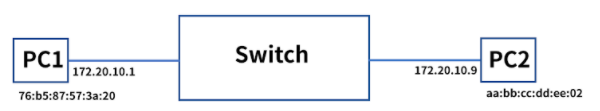
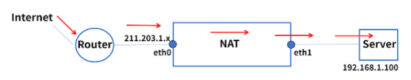

1. 다음 중 네트워크의 구조가 아닌 것은?
1점
star
bus
tree
cylinder
> 4

2. 다음 OSI 7 Layer중 설명이 틀린 것은?
1점
Application - HTTP, SMTP 같은 인터넷 응용 서비스와 관련
Transport - TCP/IP 연결 수립, 유지, 중단
Network - IP 통신, 라우팅
Data Link - 이더넷, MAC 통신, 에러검출 및 재전송 관련
> 2

1. 다음 중 Network Layer에 대한 설명으로 틀린 것은?
1점
다른 네트워크로 데이터를 전송하는 것을 관리하며 IP 주소로 통신
출발지의 IP부터 목적지의 IP까지 통신 시 중간에서 라우팅을 담당 및 처리
호스트 간의 데이터 전송 담당
데이터가 큰 경우 분할 및 전송 후 재조립하여 메세지 구현
> 3

4. TCP/IP 모델의 구성요소로 맞지 않는 것은?
1점
Application
Transport
Network
Data Link
> 4

5. 다음 중 물리계층에 대한 설명으로 틀린 것은?
1점
OSI 7 layer의 첫번째 계층으로 하드웨어로 표현
네트워크 장치의 전기적, 기계적 속성 및 전송 수단을 정의
인접한 네트워크 노드끼리 데이터 전송하는 기능 및 절차 제공
통신 장치와 커넥터, 송수신 담당 회로 등으로 구성
> 3

6. 다음 중 물리계층의 장비들에 대한 설명으로 틀린 것은?
1점
허브는 전기 신호를 증폭하여 좀 더 먼거리에 있는 단말기끼리 통신이 가능하게 해준다.
물리계층에서 주로 사용하는 케이블의 종류는 Coaxial, TP, Fiber가 있다. ㅇㅇ
데이터의 단위는 bit, KB, MB, GB, TB를 주로 사용한다. ㅇㅇ
물리계층에서 사용하는 장비의 capacity는 주로 Bandwidth, Throughput, Backplane으로 설명한다.
> 1 아닌가요..!? 먼거리가 아니라 연결된 단말기끼리.. 아닌가요..?ㅇㅂㅇ..!

7. 다음 중 Wi-Fi 규격에 포함되지 않는 것은? :heavy_multiplication_x:
1점
802.11ac
802.11g
802.11n
802.11v
> 2 -> 4

8. 다음 중 데이터 링크 계층에 대한 설명으로 맞지 않는 것은?
1점
OSI 7 layer의 두번째 계층으로 인접한 노드끼리 데이터를 전송하는 기능과 절차 제공
물리계층에서 발생하는 오류를 감지하고 수정
대표적인 프로토콜로 ethernet이 있으며 해당 장비로는 스위치를 사용
프레임을 신호로 인코딩하여 네트워크 장치로 전송
> 4 아닌가욧..!? 인코딩, 디코딩 등은 6계층 Presentation에서..!

9. 다음 중 이더넷 프레임 구조에 대한 설명으로 틀린 것은?
1점
Preamble은 이더넷 프레임의 시작과 동기화됩니다.
Destination Address는 목적지의 MAC 주소를 포함하고 있습니다.
Type은 현재 프레임이 어떤 종류인지에 대한 정보를 담고 있습니다.
FCS는 에러 체크와 관련된 정보를 담고 있습니다.
> 3 맞슴돠
>
>  Type: 캡슐화 되어 있는 패킷의 프로토콜 정의

10. 다음 중 스위치의 동작 방식에 대한 설명으로 틀린 것은?
1점
처음 목적지 주소를 MAC 주소 테이블에서 확인하여 포트로 프레임을 전달합니다.
출발지 주소가 MAC 주소 테이블에 없으면 해당 주소를 저장하는 기능을 Creating이라고 합니다.
목적지 주소가 MAC 주소 테이블에 없으면 전체 포트로 주소를 전달하는 기능을 Broadcasting이라고 합니다.
목적지 주소가 MAC 주소 테이블에 있으면 해당 포트로 전달하는 기능을 Forwarding이라고 합니다.
> 2 맞는듯..!

11. 다음 그림을 보고 ARP에 대한 동작 과정으로 틀린 것은?
1점

PC1은 목적지 IP 172.20.10.9로 패킷 전송을 시도하기 위해 자신의 ARP Cache Table을 확인한다.
ARP Cache Table에 주소가 있으면 패킷을 전송하고, 그렇지 않으면 PC2에게 주소를 요청한다.
IP 172.20.10.9에서 목적지 MAC 주소를 ARP Reply로 전달받는다.
목적지 MAC주소는 ARP Cache Table에 저장되고 패킷이 전송된다.
> 2 맞는듯!
>
> ARP Cache Table에 있으면 패킷 전송, 없으면 ARP Request전송 - Broadcasting

12. 다음 중 VLAN에 대한 설명으로 옳지 않은 것은?
1점
물리적 구성이 아닌 논리적인 가상의 LAN을 구성하는 기술
불필요한 데이터를 차단하기 위해 브로드캐스트 도메인 별로 따로 관리
호스트의 물리적 이동과 함께 LAN 그룹 변경이 가능
새로운 LAN 추가시 물리 스위치 구매 불필요
> 3

13. 다음 중 네트워크 계층에 대한 설명으로 옳지 않은 것은?
1점
OSI 7 layer의 세번째 계층으로 패킷 포워딩과 네트워크 간 라우팅을 수행한다.
IP주소를 사용하여 통신을 하며, 계층적 구조로 이루어져 있다.
대표적인 장비로 라우터를 사용한다.
노드 간 end-to-end 연결을 관리한다.
> 4 
>
> e-t-e 는 Transport

14. 다음 중 IPv4 헤더 구조에 대한 설명으로 틀린 것은?
1점
Version - IPv4
Total Packet Length - IP 패킷의 전체 길이
Time to Live - IP 패킷 수명
Source IP Address - 출발지 IP 주소를 암호화한 정보
> 4 암호화는 아닌듯 맞는듯

15. 다음 중 주어진 IP주소와 IP 주소 클래스가 맞게 짝지어진 것은?
1점
127.0.0.1 - B class
128.112.32.5 - C class
192.168.0.1 - C class
0.0.0.0 - E class
> 3

16. IP주소가 209.217.12.11이고, 서브넷 마스크가 255.255.255.0으로 주어졌을 때, 다음 중 해당 서브넷 네트워크로 포함되는 것은?
1점
11010001.11011001.00001100.00000010
11010001.11011001.00001101.00000000
11010001.11011001.11110011.00000000
11010001.11011001.00101100.11001110
> ??.. 1 = 2 / 4 = 206 둘다 되는거 아닌가?!?!? 아 ㅈㅅ 4번은 0010 1100 이네 ;;  답은 11111번!
>
> 귀차느니까 1번 믿고 간다!

17. 다음 중 ICMP의 타입 별 설명이 틀린 것은?
1점
Type 8 - 출발지에서 목적지로 ICMP Echo request를 보내서 reply를 받는 것으로 연결 여부 확인
Type 9 - 자신이 Router임을 응답
Type 3 - 로컬 네트워크에 2개 이상의 경로가 있을 때 더 좋은 경로를 추천
Type 11 - TTL(Time to Live)가 초과되는지 확인
> 333 type 5가 추천인듯  ㅇㅇㅇ
>
> Type 5 Redirect: 로컬 네트워크에 2개이상의 경로가 있을 때 더 좋은 경로를 알려줌

18. 다음 중 DHCP에 대한 설명으로 틀린 것은?
1점
DHCP는 동적으로 클라이언트에게 IP주소를 할당해주는 프로토콜이다.
IP변경이 잦은 호스트는 DHCP로 관리하기가 힘들다.
잘못된 IP 설정으로 인해 생기는 장애를 예방할 수 있다.
요청이 생길 때만 IP주소를 할당하는 것으로 효율성을 극대화시킬 수 있다.
> 2

19. 다음 중 동적 라우팅 방법에 대한 설명으로 틀린 것은?
1점
Distance Vector 기반의 방법은 주기적으로 업데이트가 일어난다.
Link State 기반의 라우팅 방법은 이벤트 기반으로 업데이트가 일어난다.
Bellman-Ford 알고리즘은 주기적 업데이트를 통해 연결 링크의 비용과 최단 거리를 계속해서 업데이트 한다.
Dijkstra's 알고리즘은 각 라우터들이 다른 테이블 정보를 가지고 있다가, 이벤트가 발생할 시 최상의 경로를 계산한다.
> 4 로가자..

20. 다음 중 BGP FSM에 대한 설명으로 틀린 것은?
1점
Idle : 모든 자원을 초기화하고 피어 연결 준비 상태
Active : 연결이 완료되기를 기다리면서 활성화되어 있는 상태
Open Sent : OPEN 메세지를 보내는 상태
Open Confirm : OPEN 메세지를 받은 상태
> 2
>
> \- Active: 연결 실패 이후 다시 연결을 시도하는 상태

21. 다음 중 OSPF에 대한 설명으로 틀린 것은?
1점
Link State 기반 라우팅 기법으로 IGP용 라우팅 프로토콜이다.
VLSM을 사용하여 효율적으로 IP를 관리한다.
홉 카운트의 제한이 있어, 변경된 정보만 전파한다.
단순 라우터의 홉이 아닌 링크의 상태로 경로를 설정한다.
> 3

22. 다음 중 Transport 계층에 대한 설명으로 틀린 것은?
1점
End-to-End 연결을 관리한다.
소켓을 통해서 프로세스별로 통신한다.
Source IP, Source Port, Destination IP, Destination Port, Protocol 정보를 통신에 사용한다.
서비스에 대한 사용자 인터페이스를 제공한다.
> 4444

1.  다음 중 TCP와 UDP에 대한 설명으로 틀린 것은?
1점
TCP는 신뢰성을 기반으로 데이터를 에러없이 1:1 통신으로 전달한다.
TCP는 에러 발생시 재전송을 요청하고 에러를 복구한다.
UDP는 신뢰성은 낮으나, 데이터 전송이 빠르다.
UDP는 TCP와 마찬가지로 에러 발생시 재전송을 통해 빠르게 에러를 복구한다.
> 4

24. 다음 중 TCP 통신과 관련하여 잘못된 설명은?
1점
TCP는 초기 연결은 4 way handshake로 사용하고 정상적으로 연결이 종료될 때는 3 way handshake를 사용한다.
TCP 타이머는 Retransmission, Persistence, Time waited, Keepalive가 있다.
Flow control은 송신과 수신측의 데이터 처리 속도 차이를 해결해준다.
Congestion Control은 수신측으로 유입되는 트래픽 양이 대역폭을 넘어가지 않게 제어해준다.
> 1 연결3 종료4

25. 다음 중 NAT에 대한 설명으로 잘못된 것은?
1점
사설 IP 네트워크를 연결하여 라우팅 가능한 공인 IP로 변환해주는 기술이다.
공인 IP 대역에 영향을 주지 않고 내부 네트워크 구성 변경이 가능하다.
공인 IP를 할당할 필요가 없어져서 유지 비용이 감소된다.
내부 IP 주소가 외부에 공개되지만, 방화벽을 통해 보완 가능하다.
> 4

26. 다음 그림에 대해서 Static NAT에 대한 설명으로 옳지 않은 것은?
1점

외부에서 211.203.1.x으로 접속을 시도, 공인 IP는 접근을 시도할 때 자동으로 할당된다.
외부에서 Router를 통해 eth0으로 패킷이 도달
NAT는 서버 연결을 위해 내부 IP주소 Pool를 찾고, eth1에 연결하여 패킷을 전달
192.168.1.100인 eth1을 통해서 패킷이 전달되어 서버에 도착
> 1 ?? 스태틱은 1:1 매핑이라 이미 할당되있는거 아닐까 맞는거같음...!

27. 다음 중 TELNET에 대한 설명으로 틀린 것은?
1점
원격 호스트 컴퓨터에 접속하기 위해 사용되는 프로토콜
TCP 23번을 사용하며, 일반적으로 Shell을 사용
장비 관리 또는 서버 접속시에 사용
TELNET을 사용해도 해당 IP주소에 서비스 포트가 열려있는지 확인 불가
> 4

28. 다음 중 SSH에 대한 설명으로 틀린 것은?
1점
TELNET을 대체하기 위해 개발
원격지에 있는 컴퓨터를 제어
TCP 80번을 사용하며, 암호화 통신을 제공
OpenBSD팀에서 개발하여 GNU 라이센스를 가지고 있는 오픈소스
> 3333
>
> TCP 22번!

29. 다음 중 Application 계층에 대한 설명으로 틀린 것은?
1점
OSI 7 layer에서 최상위 계층으로 사용자와 가장 가까운 소프트웨어이다.
서비스에 대한 사용자 인터페이스를 제공한다.
HTTP, DNS, SMTP 등이 이 계층에서 사용되는 서비스들이다.
사용자 간 통신을 직접 관리하여 네트워크 연결을 유지 관리해준다.
> 4

30. 다음 중 DNS에 관련된 설명으로 잘못된 것은?
1점
웹 사이트 접속시에 IP 주소를 도메인 이름으로 접속할 수 있도록 해주는 서비스
도메인 이름을 IP 주소로 변환해주며 53번 포트를 사용한다.
컴퓨터는 도메인 주소를 이해하지 못해, 다시 IP주소로 변경이 필요하다.
애플리케이션 계층에서는 도메인 주소 대신 IP주소를 사용하여 서비스를 운영한다.
> 1?? 4?? 도메인을 -> ip주소로 변경하는거고.. 애플리케이션 계층에서는 도메인 주소를 사용해서 서비스를 운영하는뎁..
> 1번이 그나마 더 정답에 가깝지 않을까 싶네용
>
> 저는 4번같슴돠..!!!!!! 에잇 몰라 4번해버렸!!