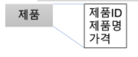
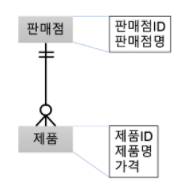

[TOC]

# 서술형

### 1. 아래의 CRUD Matrix를 완성하세요.

| -                   | 회원 | 제품 | 주문 | 배송 |
| ------------------- | ---- | ---- | ---- | ---- |
| 신규 회원 등록한다. | C    |      |      |      |
| 제품을 주문한다.    |      | R    | C    |      |
| 주문량을 변경한다.  |      |      | U    |      |
| 주문을 취소한다.    |      |      | D    |      |
| 주문을 완료한다.    |      |      | R    | C    |
| 배송을 완료한다.    |      |      | D    | D    |


### 2. 엔티티 관계(ER) 모델링 표기법 중 Chen 표기법과 정보공학(Information Engineering) 표기법에 대해서 (1) 엔티티를 표시하는 방법, (2) 관계 유형을 표시하는 방법, (3) 관계비(Cardinality)를 표시하는 방법, (4) 해당 표기법을 사용한 간단한 예시를 기술하세요.

| 표기법   | 엔티티 | 관계유형   | 관계비S        |
| -------- | ------ | ---------- | -------------- |
| Chen     | 상자   | 다이아몬드 | 1, n           |
| 정보공학 | 상자   | 실선       | 까마귀 발 모양 |

```
(4)-1. Chen 표기법 예시

(4)-2. 정보공학 표기법 예시
```


### 3. 데이터베이스 관리 시스템(DBMS)를 선정하기 위한 고려사항을 5가지 이상 제시하고 그에 대한 설명을 간단히 기술하세요.

| DMNS 선정 시 고려사항 | 설명                                                   |
| --------------------- | ------------------------------------------------------ |
| 운영체계 지원         | 현재 사용중인 조직내 운영체계(OS) 지원 여부            |
| 조직 유형             | 전통적 문화에 대한 적응력 등 평가                      |
| 벤치마킹              | 트랙잭션 프로세싱 성능 카운슬 (TPC) 성능 기준 벤치마킹 |
| 확장성                | 요구 사용자 수와 용량 확장에 대한 용이성 평가          |
| 기술자                | DBA 등 기술지원 및 애플리케이션 프로그래머 지원 능력   |


### 4. 제품ID, 제품명, 가격을 속성으로 갖는 제품 엔티티 유형을 테이블로 생성하는 SQL 구문을 작성하세요

> 제품 ID와 가격은 정수, 제품명은 50자 이내의 문자열입니다.
>
> 테이블 이름과 컬럼 이름은 자유롭게 정하셔도됩니다.




### 4. 아래의 그림과 같은 제품과 판매점간의 관계가 있을 때, 이를 테이블로 생성하는 SQL 구문을 작성하세요

> 판매점ID, 제품 ID, 가격 은 정수이고 제품명과 판매점명은 50자 이내의 문자열입니다.
>
> 테이블 이름과 컬럼 이름은 자유롭게 정하셔도됩니다.



### 4. 데이터베이스 성능 향상을 위해 사용할 수 있는 기법 중 인덱스와 해싱이 있습니다. 두가지 기법에 대해서 (1) 어떠한 성능 이점이 있는지, (2) 해당 기법을 사용함으로써 감수해야할 단점이 있는지, (3) 기법을 적용함에 있어 주의 사항은 어떤 것이 있는지에 대해 기술하세요.

| -         | 인덱스 | 해싱 |
| --------- | ------ | ---- |
| 성능 이점 |        |      |
| 단점      |        |      |
| 주의사항  |        |      |


### 4. 역정규화 기법의 4가지를 제시하고 (1) 각 기법이 어떠한 동작을 통해 성능 이점을 얻어내는지, (2) 해당 기법을 적용하는데 있어 주의 사항은 어떤 것이 있는지 기술하세요.

| 기법 | 성능이점 | 주의사항 |
| ---- | -------- | -------- |
|      |          |          |
|      |          |          |
|      |          |          |
|      |          |          |


