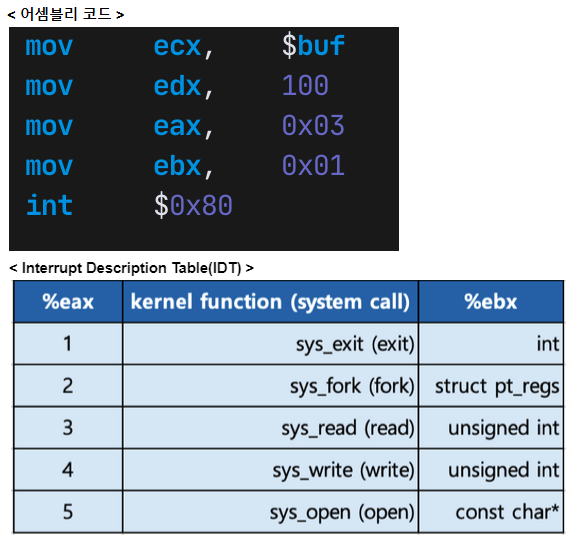
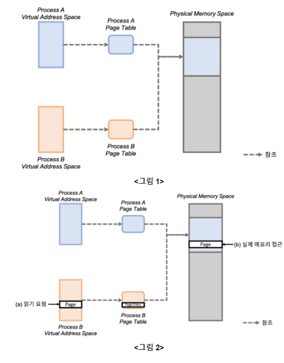
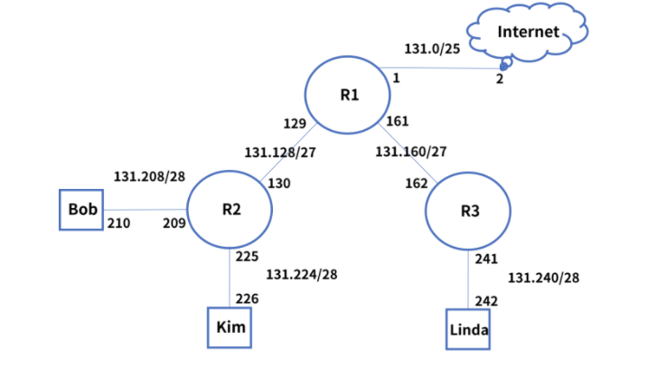

[TOC]

# 서술형

### 1. 운영체제에는 다양한 스케쥴링 알고리즘이 사용됩니다. 그 중에서 SJF(Shortest Job First) 알고리즘과 Round-Robin 알고리즘에 대해 설명하고, 각 기법별 장단점을 서술해보세요.

```
SJF 알고리즘
각 작업의 프로세서 실행 시간을 이용하여 프로세서가 사용 가능할 때 실행 시간이 가장 짧은 작업에 할당하는 방법이다. 항상 실행 시간이 짧은 작업을 신속하게 실행하므로 평균 대기 시간이 가장 짧지만, 초기의 긴 작업을 짧은 작업을 종료할 때 까지 대기시켜 기아가 발생할 수 있으며 기본적으로 짧은 작업이 항상 실행되도록 설정하므로 불공정한 작업을 실행한다. 실행 시간을 예측하기 어려워 실용적이지 못하다.

Round-Robin 알고리즘
시분할 시스템을 위해 설계된 선점형 스케줄링의 하나로서, 프로세스들 사이에 우선순위를 두지 않고, 순서대로 시간단위(Time Quantum/Slice)로 할당하는 방법이다.
모든 프로세스가 공정하게 스케줄링을 받을 수 있지만, 하드웨어적 타이머가 필요하고 미완성 작업은 규정 시간 할당량을 마친 후 프로세서를 기다리니까 평균 처리 시간이 높다.
```


### 2. 운영체제에서 여러 작업을 처리할 때, 멀티프로세싱(Multi-processing)과 멀티쓰레딩(Multi-threading) 기술을 사용합니다. 멀티프로세싱과 멀티쓰레딩 기법에 대해 설명하고, 각 기법별 장단점을 서술해보세요.

```
멀티프로세싱
여러 CPU에 하나의 프로그램을 병렬로 실행해서 실행 속도를 극대화 시키는 시스템이다. 멀티 프로세싱은 하나의 프로세스가 죽더라도 다른 프로세스를 죽이지 않고, critical한 문제가 없지만, 더 많은 리소스가 요구된다.

멀티쓰레딩
하나의 프로세스를 여러 개의 실행 단위이며, 여러 개의 스레드끼리 자원을 공유하는 것을 뜻한다.
멀티 스레딩은 stack 영역을 제외한 메모리를 공유하기에, context switch시 캐시 메모리를 비울 필요가 없고 이를 통해 컴퓨팅 리소스를 아낄 수 있지만, 서로 다른 스레드가 데이터와 힙 영역을 공유하기 때문에 deadlock이 발생할 수 있다.
```


### 3. 다음은 실제로 리눅스 운영체제에서 시스템 콜을 구현한 어셈블리 코드 예제입니다. 아래 코드와 IDT(Interrupt Description Table)을 참고하여, 어떤 프로그램 명령을 수행한 코드인지 서술해주세요.

> eax와 ebx 레지스터의 값을 IDT에서 찾아보세요.
>
> ecx와 edx 레지스터는 eax, ebx와 같은 범용 레지스터 입니다.
>
> mov eax, 0x03의 의미를 파악해보세요.
>
> int 0x80의 의미를 포함하세요.
>
> 

```
eax: 시스템 콜 번호
ebx: 시스템 콜에 해당하는 인자값 - 파일 서술자
ecx: 시스템 콜을 사용해 처리할 내용 (메세지) - 파일 서술자에 쓰려고 하는 데이터 
edx: 위 내용의 바이트 사이즈 
0x03: 3
0x01: 1
int 0x80: 인터럽트 번호, 시스템콜은 0x80으로 지정

1. 시스템콜 인터럽트 명령을 호출하면서 0x80값을 넘겨준다.
2. IDT에서 0x80에 해당하는 주소(system_call 함수)를 찾아 실행한다.
3. system_call() 함수에서 eax로 부터 받은 시스템콜 번호 0x03번 시스템콜 함수 sys_read에 ebx의 0x01(표준 출력 스트림), ecx의 메세지, edx의 byte size 를 전달해 실행한다.
4. 즉, 100바이트 사이즈인 $buf를 read 시스템 콜에 표준 출력 스트림으로 넘긴다.
```


### 4. Process A를 fork하여 Process B를 생성하였고 각 Process의 Virtual Address Space와 Page Table 그리고 시스템의 Physical Memory Space간의 관계를 조사해 보니, 그림 1과 같은 형태가 되었습니다. 보다 자세한 분석을 위해 Process B에서 특정 메모리 주소를 읽도록 한 후 발생한 동작을 조사하였고 그림 2와 같은 접근이 발생하는 것을 확인했습니다.



```sql
(1) 각 Process가 독립된 Physical Memory Space를 가지지 않는 이유
Copy-on-write 방식을 사용할 경우 부모 프로세스의 데이터 부분에 대한 참조만 소유하고 있다가 실제 변경이 발생하는 시점에 복사를 하여 사용한다.


(2) 그림 2에서 읽은 메모리 주소에 대해 쓰기를 수행하였을 때, 어떤 동작이 발생하는지를 그림으로 표시


(3) 각 Process가 fork후에 독립된 메모리 공간을 가졌을 때에 비해 그림 2와 같은 동작이 가지는 장점
처음부터 기존 프로세스 공간을 복사하면 프로세스 생성 시간이 오래 걸리고 공간을 낭비 할 수 있기 때문에, 첫 쓰기 요청시 페이지를 분리하면 새로 생성된 프로세스에 새롭게 할당되어야 하는 페이지 수도 최소화하고 프로세스 생성 시간도 줄일 수 있다.
```


### 5. 4GB 크기의 파일을 mmap을 사용하여 읽고자 합니다. mmap으로 파일을 메모리 영역에 매핑한 후 매핑한 영역의 처음부터 끝까지 (0~4GB 영역 모두) 순차적으로 읽습니다. 4GB 파일은 모두 저장 장치에만 존재하고 메모리에는 사전에 적재되어 있지 않습니다.

> - I/O 비용은 읽는 크기에 정비례합니다. 즉, 1GB = 1024 x 1MB = 262144 x 4KB 입니다.
>
> - I/O를 제외한 Page Fault 인터럽트 처리 비용은 매 회 동일합니다. 
>
>   즉, (1)번 케이스에서 2회 Page Fault = (2)번 케이스에서 2회 Page Fault 입니다.
>
> - I/O 비용과 Page Fault 처리 비용을 제외한 나머지 비용은 무시합니다.

```
(1) Page 크기가 4KB일 때 Page Fault의 총 발생 횟수


(2) Page 크기가 1MB일 때 Page Fault의 총 발생 횟수


(3) Page 크기가 1GB일 때 Page Fault의 총 발생 횟수


(4) 앞의 세가지 경우를 실행 순서가 빠른 순으로 나열

```


### 6. 다음과 같은 메모리 상태 예제가 주어지고, R1 = 81, R2 = 151이 저장되어 있습니다. R1에 151값을 저장하는 마이크로 명령을 작성해주세요.

>마이크로 명령은 총 4가지 종류로 “직접 값 모드” , “레지스터 모드”, “직접 모드”, “메모리 간접 모드” 4가지가 모두 작성되어야 합니다.
>
>| Add  | Con  |
>| ---- | ---- |
>| 50   | 150  |
>| 51   | 350  |
>| ...  | ...  |
>| 150  | 151  |
>| 151  | 700  |

```
(1) 직접 값 모드
MOV R1, #151

(2) 레지스터 모드
MOV R1, R2

(3) 직접 모드
MOV R1, 150

(4) 메모리 간접 모드
MOV R1, @50
```


### 7. 캐시 하나(L1)와 메인 메모리(M) 하나를 가진 CPU가 있습니다. 캐시의 Hit Ratio가 0.2 이고 캐시에 접근하는데 걸리는 시간은 20 ns, 메인 메모리에 접근하는 시간은 1000 ns 입니다. 이 때 평균 데이터 접근 시간을 구하세요. (캐시에 데이터가 존재하는지 여부는 캐시에 우선 접근하고 나서 알게 됩니다.)

```
20 + (1 - 0.2) X 1000 = 820ns
```


### 8.  7번 문제에 제시된 시스템에 추가 예산을 투입해 아래 두가지 중 한가지 옵션을 추가할 수 있습니다. 둘 중 더 나은 성능을 기대할 수 있는 옵션을 선택하고 그 이유를 평균 데이터 접근 시간을 들어 설명하세요.
 Option A: L1 캐시의 Hit Ratio를 0.1 올린다.
 Option B: L1 캐시와 메인 메모리 M사이에 접근시간 200 ns, Hit Ratio 0.4를 갖는 L2 캐시를 추가한다. 

### (접근 순서는 L1-> L2 -> M이 됨.)

```
Option B가 더 나은 성능을 기대할 수 있다. 

각각의 평균 데이터 접근 시간을 구하면
Option A: 20 + (1 - 0.3) X 1000 = 720ns
Option B: 20 + (1 - 0.2)(200 + (1 - 0.4)200) = 276ns
Option B의 성능이 더 높음을 알 수 있다.
```


### 9.  다음 주어진 그림처럼 IP 주소가 할당되어 있는 네트워크에서 라우팅을 하려고 합니다. Bob이 Linda에게 데이터를 전송하면, Linda가 전송 받은 데이터를 가지고 Internet(구글)에 접속하여 데이터를 업로드하려고 할 때, 라우팅이 어떻게 이루어지는지 서술하세요.

> 구글의 IP주소는 “8.8.8.8”이라고 가정하세요.
>
> 정적 라우팅 테이블을 사용하는 것에 대한 내용을 포함하세요.
>
> 각 디폴트 게이트웨이인 R2, R3를 어떻게 사용하는지에 대한 내용을 포함하세요.
>
> 

```
Bob이 Linda의 IP 주소를 목적지 IP 주소로 설정하고 통신을 시도하면, 동일 대역이 아니므로 디폴트 게이트웨이인 R2로 전달한 다. 
R2도 Connected 대역이 아니므로 R1으로 전달하고, R1에서 정적 라우팅 테이블을 참조한다. 
Linda의 PC는 라우팅 테이블에 직접 연결되어 있지 않으므로 S 131.240/28 via 131.162로 설정한다. 
R3는 Connected 대역인 포트로 전달하고, Linda는 패킷 수신 받을 수 있게 된다.  

그리고 전송 받은 데이터를 가지고 목적지 Internet에 접속하기 위해 구글 IP 주소인 8.8.8.8로 통신 시도한다. 목적지 IP 주소는 Linda와 동일 대역이 아니므로 디폴트 게이트웨이인 R3로 전달된다. 
R3도 Connected 대역이 아니므로 R1으로 전달하고, R1은 정 적 라우팅 테이블을 참조했으나 없는 대역이다. 
그래서 S* 0.0.0.0/0 via 131.2로 전달하게 되고, 인터넷 라우터들을 통해 구에 도착하게 된다. 
```


### 10.  데이터베이스 정규화 중 1차, 2차, 3차 정규화 수행 방법을 기술하고 그 중 하나의 정규화를 아래의 테이블에 적용하세요.

| ID   | 거래처 | 단가  | 품목 | 1월출하량 | 2월출하량 | .... | 12월출하량 |
| ---- | ------ | ----- | ---- | --------- | --------- | ---- | ---------- |
| 1001 | A      | 50000 | 골재 | 15        | 15        | ...  | 30         |
| 1002 | B      | 60000 | 자갈 | 20        | 22        | ...  | 42         |
| 1003 | C      | 70000 | 모래 | 5         | 5         | ...  | 5          |

```
(1) 1차 정규화 수행 방법

(2) 2차 정규화 수행 방법

(3) 3차 정규화 수행 방법

(4) 3개의 방법 중 하나의 정규화를 선택하여 적용하세요.

```


