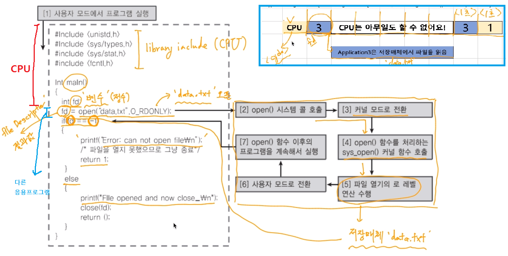
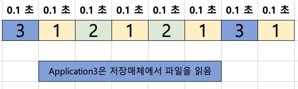
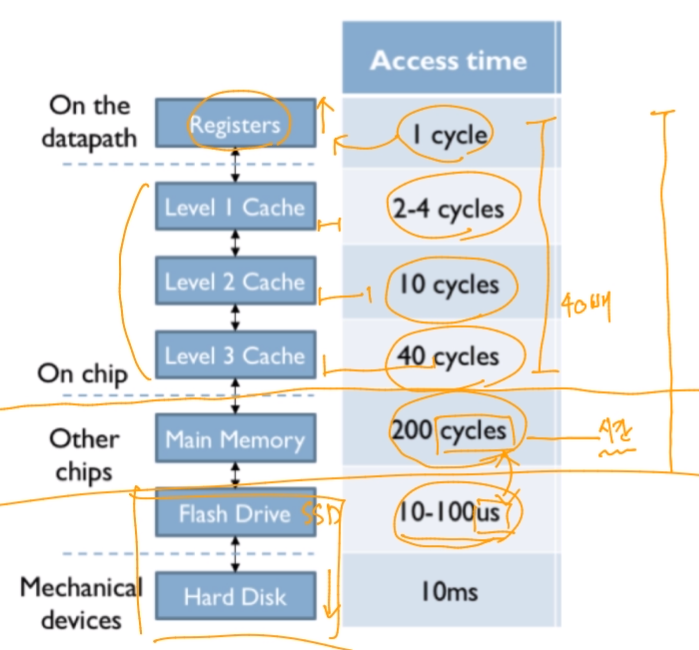
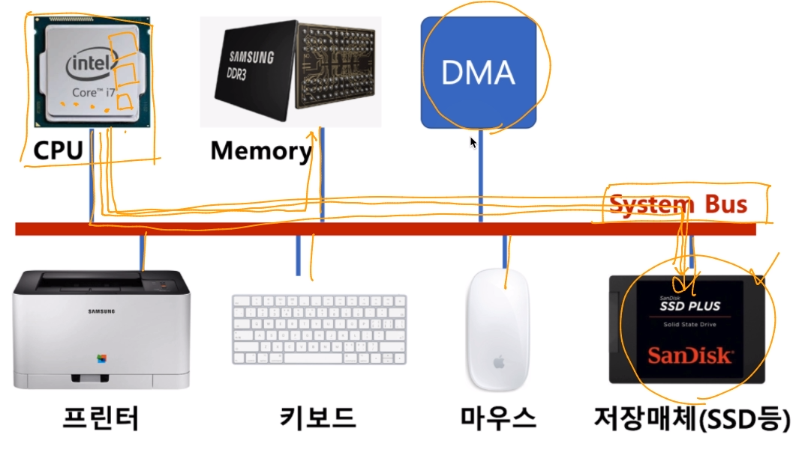

[toc]

# 프로세스(응용프로그램) 스케쥴링 

# - 멀티 프로그래밍

- 최대한 CPU를 많이 활용하도록 하는 시스템
  - 시간 대비 CPU활용도를 높이자
  - 응용 프로그램을 짧은 시간안에 실행 완료를 시킬 수 있음

## :heavy_check_mark: 멀티 프로그래밍

- 응용 프로그램은 온전히 CPU를 쓰기보다, 다른 작업을 중간에 필요로 하는 경우가 많다.
  - 응용 프로그램이 실행되다가 파일을 읽는다. (저장매체에서 파일을 읽는 동안 실행이 안됨)
  - 응용 프로그램이 실행되다가 프린팅을 한다.

**Cpde example)** 

- 저장매체에 접근하는 시간동안 `open()`은 다른 어플리케이션을 실행

  - **3번** 응용프로그램이 파일 오픈 -> blocking 상태 -> 다른 응용프로그램 (**1, 2**)실행 -> 파일 오픈 후 다시 **3번** 응용프로그램을 실행.

    

## :heavy_check_mark: 컴퓨터 구조 복습

### 메모리 계층

[참고](https://computationstructures.org/lectures/caches/caches/html)

### System Bus

> 오래 걸리는 작업(저장매체 작업)을 DMA가 대신함.
>
> DMA가 CPU로 전송

## :heavy_check_mark: 정리

> 실제로는 시분할 시스템, 멀티 프로그래밍, 멀티 태스킹이 유사한 의미로 통용된다.
>
> - 시분할 시스템: 다중 사용자 지원, 컴퓨터 응답 시간을 최소화하는 시스템
> - 멀티 태스킹: 단일 CPU에서 여러 응용 프로그램을 동시에 실행하는 것처럼 보이게 하는 시스템
> - 멀티 프로세싱: 여러 CPU에서 하나의 응용프로그램을 병렬로 실행하게 해서, 실행 속도를 높이는 기법
> - 멀티 프로그래밍: 최대한 CPU를 일정 시간당 많이 활용하는 시스템

### 핵심

- 여러 응용 프로그램 실행을 가능하도록 한다.
- 응용 프로그램이 동시에 실행되는 것처럼 보이도록 함.
- CPU를 쉬지않고 응용 프로그램을 실행하도록 해서, 짧은 시간 안에 응용 프로그램이 실행완료 될 수 있도록 한다.
- 컴퓨터 응답 시간도 짧게해서, 다중 사용자도 지원