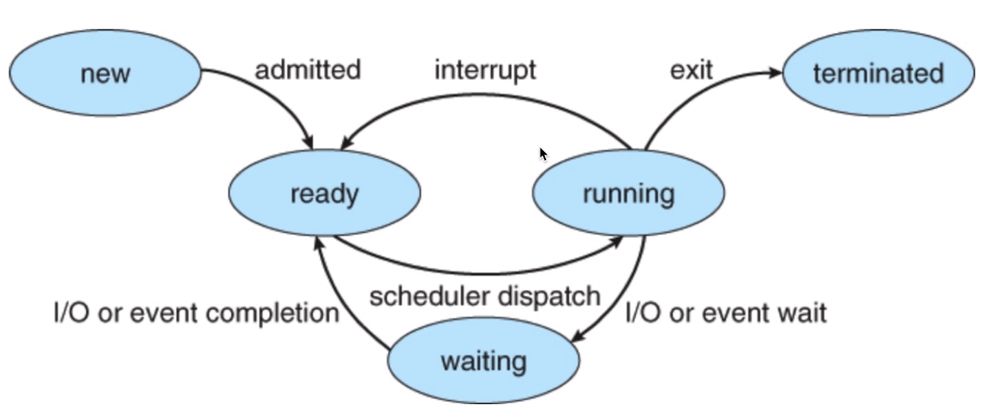
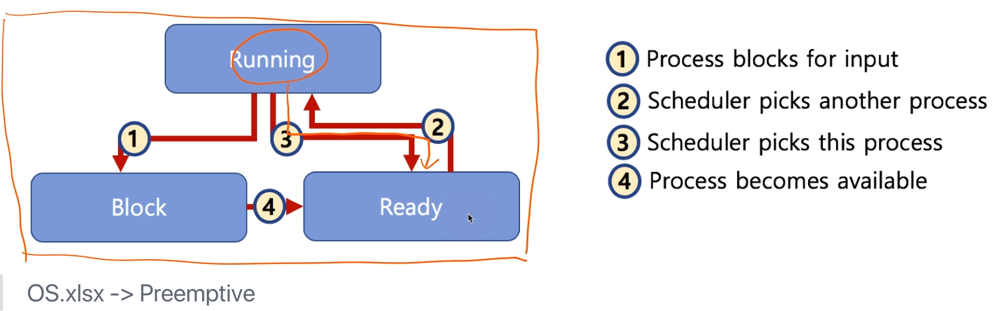
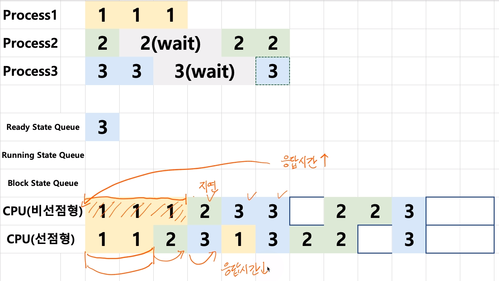

[toc]

# 스케쥴링 알고리즘 - 선점형과 비선점형

## :heavy_check_mark:  선점형과 비선점형 스케쥴러

- 선점형 스케쥴러 (Preemptive Scheduling)
  - 하나의 프로세스가 다른 프로세스 대신에 프로세서(CPU)를 차지할 수 있음
- 비선점형 스케쥴러 (Non-Preemptive Scheduling)
  - 하나의 프로세스가 끝나지 않으면 다른 프로세스는 CPU를 사용할 수 없음

 

### 비선점형

- 프로세스가 자발적으로 blocking 상태로 들어가거나, 실행이 끝났을 때만, 다른 프로세스로 교체 가능

 

### 선점형

- 프로세스 running중에 스케쥴러가 이를 중단시키고, 다른 프로세스로 교체 가능

## :heavy_check_mark:  예시

