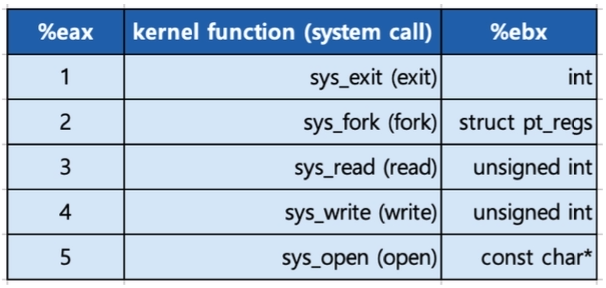
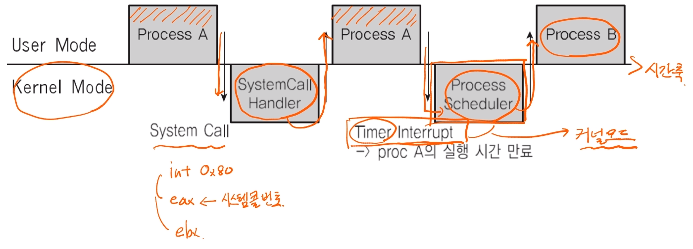
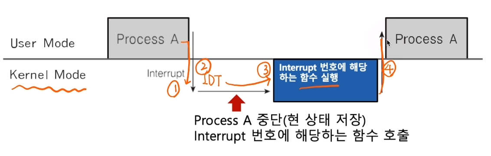
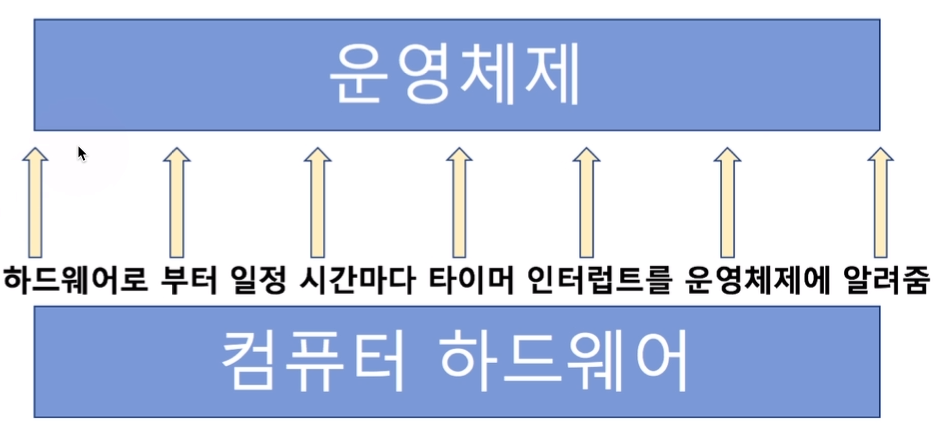

[toc]

# 프로세스와 스케쥴러 이해 - 인터럽트 내부 동작

## :heavy_check_mark: 시스템 콜 인터럽트

- 시스템 콜 실행을 위해서는 강제로 코드에 인터럽트 명령을 넣어, CPU에게 실행시켜야한다.

- 시스템 콜 실제코드

  - eax 레지스터에 시스템 콜 번호를 넣고,
  - ebx 레지스터에는 시스템 콜에 해당하는 인자값을 넣고,
  - 소프트웨어 인터럽트 명령을 호출하면서 0x80(**인터럽트 번호, 시스템콜은 0x80으로 지정**)값을 넘겨줌

  ```
  mov eax, 1 // 시스템 콜 번호
  mov ebx, 0 // 인자
  int 0x80 // 소프트웨어 인터럽트 명령
  ```

  - 시스템콜 인터럽트 명령을 호출하면서 0x80값을 넘겨줌

    1. CPU는 사용자 모드를 커널 모드로 바꿔줌

    2. IDT(Interrupt Descriptor Table)에서 0x80에 해당하는 주소(함수)를 찾아 실행

    3. system_call() 함수에서 eax(**시스템콜 번호: 함수**)로부터 시스템콜 번호를 찾아, 해당 번호에 맞는 시스템콜 함수로 이동

    4. 해당 시스템콜 함수 실행 후, 

       커널모드에서 사용자 모드로 변경, 

       다시 해당 프로세스 다음 코드 진행

    


<hr>

## :heavy_check_mark: 사용자/커널 모드와 프로세스, 인터럽트





<hr>

## :heavy_check_mark: 인터럽트와 IDT (Interrupt Descriptor Table)

- 인터럽트는 미리 정의되어, 각각 번호와 실행 코드를 가리키는 주소가 기록되어 있음

  - Where? IDT에 기록
  - When? 컴퓨터 부팅시 운영체제가 기록
  - What? 운영체제 내부코드

  ```
  - 항상 인터럽트 발생시 IDT 확인
  - 시스템콜 인터럽트 명령은 0x80 번호가 미리 정의되어 있음
  - 인터럽트 0x80에 해당하는 운영체제 코드는 system_call() 이라는 함수
  - 즉, IDT에는 0x80 -> system_call()와 같은 정보(주소)가 기록되어있음!
  ```

- 리눅스 예시
  - 0 ~ 31 : 내부/소프트웨어 인터럽트, 예외상황 인터럽트 (일부는 정의안된 채로 남겨져 있음)
  - 32 ~ 47: 하드웨어 인터럽트 (주변장치 종류/갯수에 따라 변경 가능)
  - 128 (0x80): 시스템콜


<hr>

## :heavy_check_mark: 인터럽트와 프로세스

### 1. 프로세스 실행 중 인터럽트 발생

### 2. 현 프로세스 실행 중단

### 3. 인터럽트 처리 함수 실행 (운영체제)

### 4. 현 프로세스 재실행




<hr>

## :heavy_check_mark: 인터럽트와 스케쥴러

### 선점형 스케쥴러 구현 예

- 수시로 타이머 인터럽트 발생

  > 운영체제가 타이머 인터럽트 발생 횟수를 기억해서 5번 타이머 인터럽트 발생하면
  >
  > 현재 프로세스를 다른 프로세스로 바꿔준다.
  >
  > 


