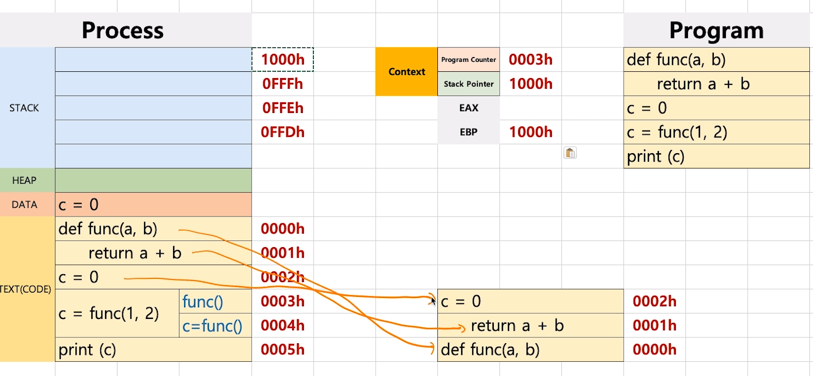
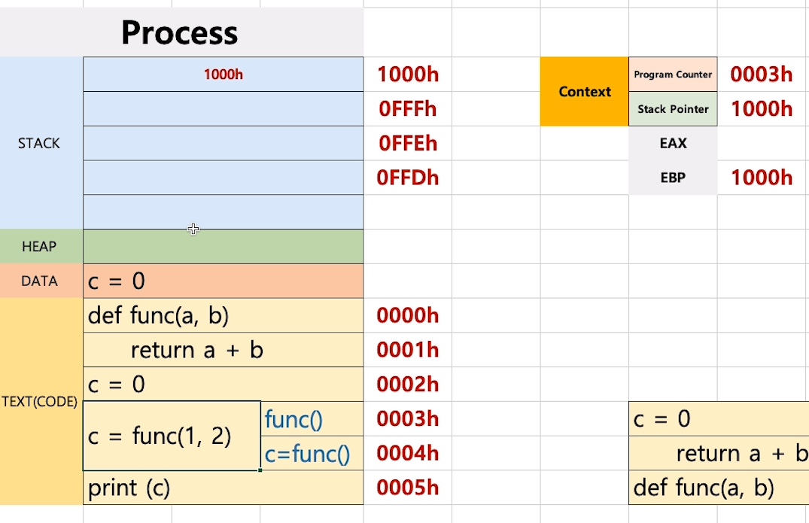
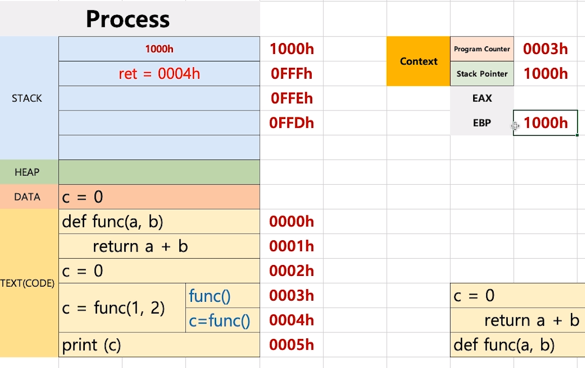
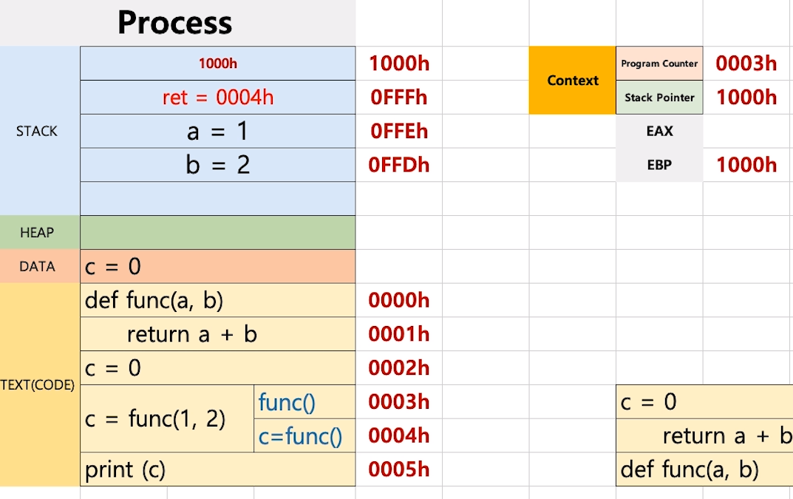
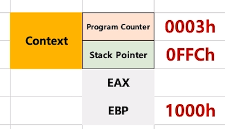
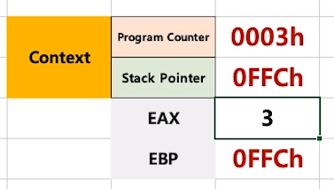
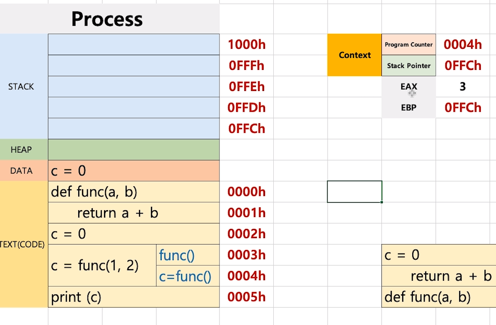
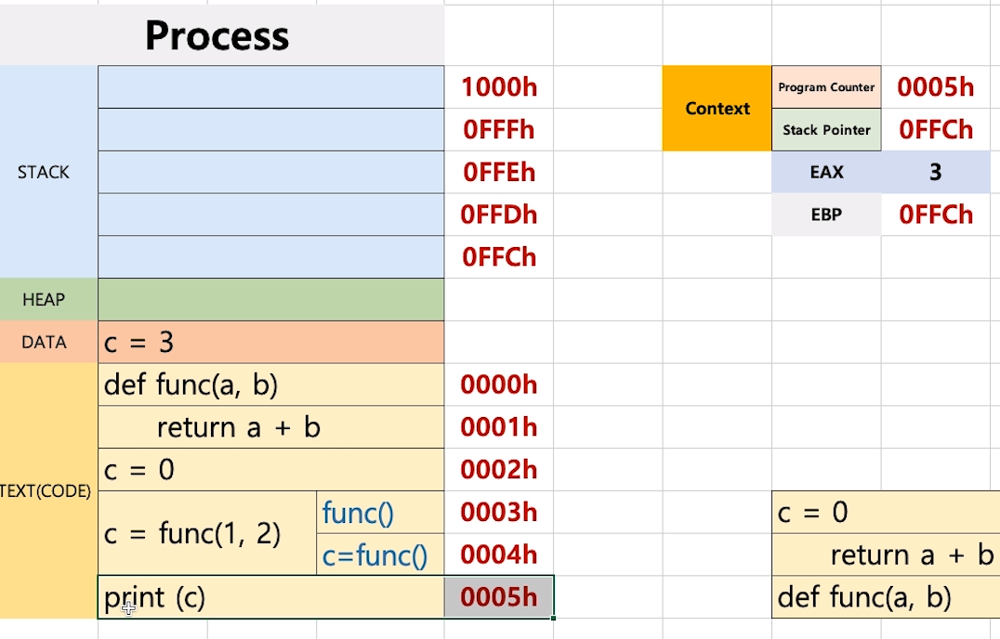

[toc]

# 프로세스와 스케쥴러 이해 

# - 프로세스 구조와 컴퓨터 구조

## :heavy_check_mark: 프로세스와 컨텍스트 스위칭

### 프로세스(process)는 일반적으로 어떻게 구성되어 있을까?

- text (CODE): 코드
- data: 변수/초기화된 데이터
- stack: 임시 데이터 (함수 호출, 로컬 변수 등)
- heap: 코드에서 동적으로 만들어지는 데이터

## :heavy_check_mark: 프로세스와 컴퓨터 구조 복습 예제

PC (Program Counter) + SP (Stack Pointer)

PC가 Text(CODE) 영역 한줄씩 읽음 -> 포인트가 주소를 계속 보면서

- 0003h 실행때, STACK은 EBP(현재 스택포인트 최 상단의 주소)의 값을 처음 넣음

  > ### EBP
  >
  > - 문제를 빠르게 트래킹 하기 위해서 제공
  >
  > - 함수안에서 함수호출, 함수에서 또 함수호출 하는 경우에 오류가 있는 경우 
  >
  >   EBP 레지스터를 통해 최상단 함수 값으로 어느 함수에서 오류가 생겼는지 확인
  >
  > - EBP 다음 줄은 항상 return address

  

- 돌아올 주소 저장 (return address)

  

- 함수의 인자가 순서대로 들어감

  (만약 해당 함수에 지역변수가 있으면 그것도 차례대로 들어감)

  

- Stack Pointer는 이제 맨위를 가리킴

  

- `return a + b` 라는 반환값은 **EAX**에 들어감

  

- Stack이 비워지고, stack에 저장된 **return address**에 따라 code 다음줄 실행

  > PC = 0004h

  

- 이때 c가 갖게 되는 값은 EAX에 저장된 값

  

