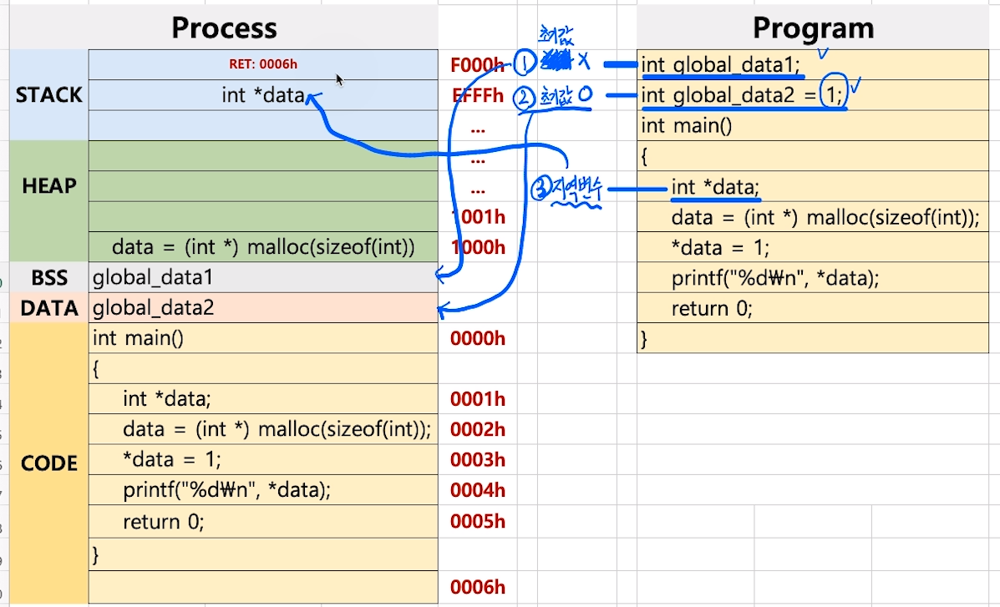

[toc]

# 프로세스와 스케쥴러 이해 

# - 프로세스 구조와 스택 오버플로우 (stack overflow)

## :heavy_check_mark: 프로세스 구조

- STACK

- HEAP

- DATA(BSS, DATA)

  > DATA를 BSS와 DATA로 분리
  >
  > BSS: 초기화되지 않은 전역변수
  >
  > DATA: 초기값이 있는 전역변수

- TEXT(CODE)


<hr>

## :heavy_check_mark: DATA 영역 코드 예제

```c
int global_data1;      // 초기화 X -> BSS
int global_data2 = 1;  // 초기값 O -> DATA

int main()
{
    int *data;
    data = (int *) malloc(sizeof(int));
    *data = 1;
    printf("%d\n", *data);
    return 0;
}
```




<hr>

## :heavy_check_mark: 스택 오버플로우 (Stack Overflow)

= 예전에 해킹기법으로 사용했음

```c
void copy (char *bar)  // argv[1] 주소 
{
    char data[6];		// stack에 6byte 공간 생성 (지역변수)
    strcpy (data, bar); // end포인트까지 계속 복사하는데, stack의 6byte를 넘는 경우 stack overflow
}
int main (int argc, char **argv)
{
    copy (argv[1]);
}
```


