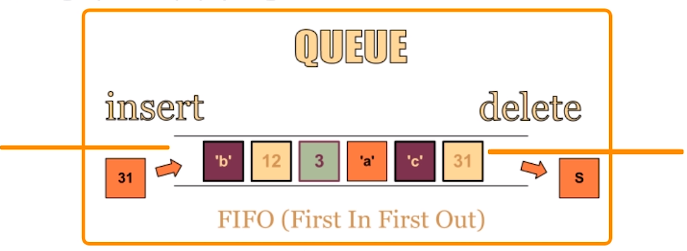
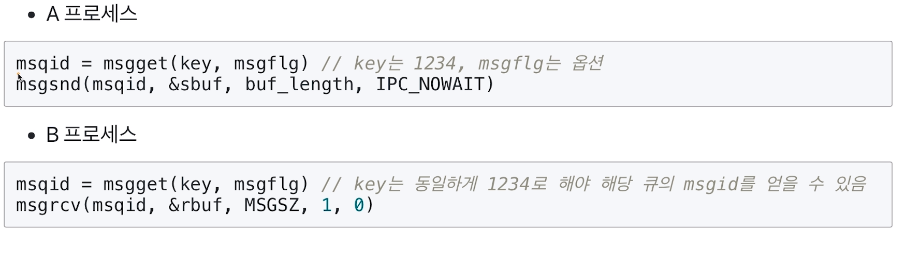
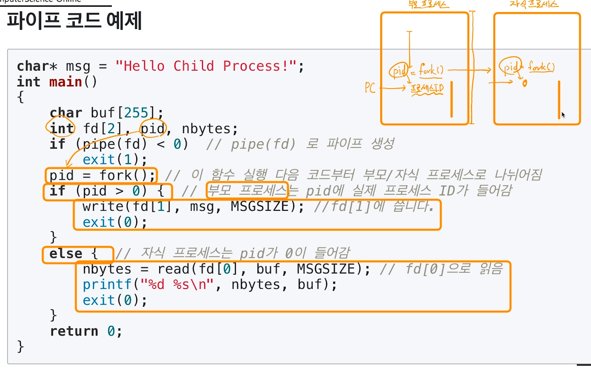
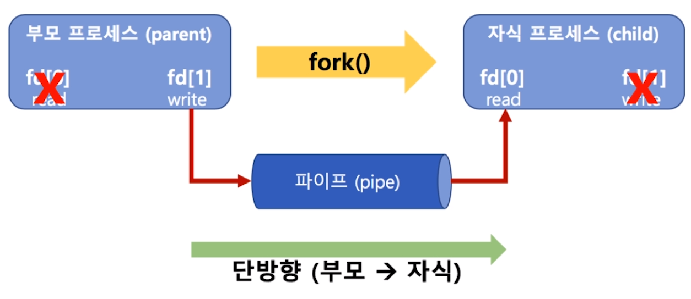
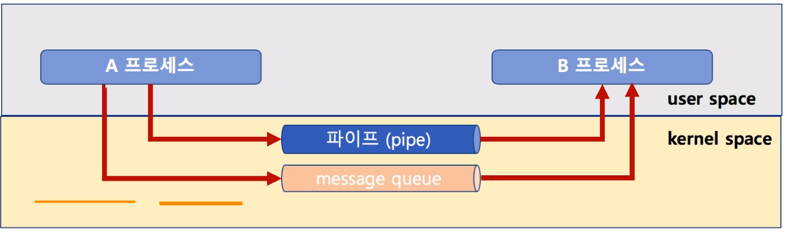
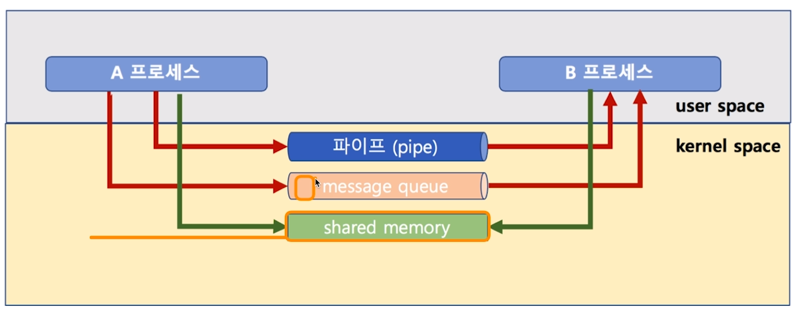
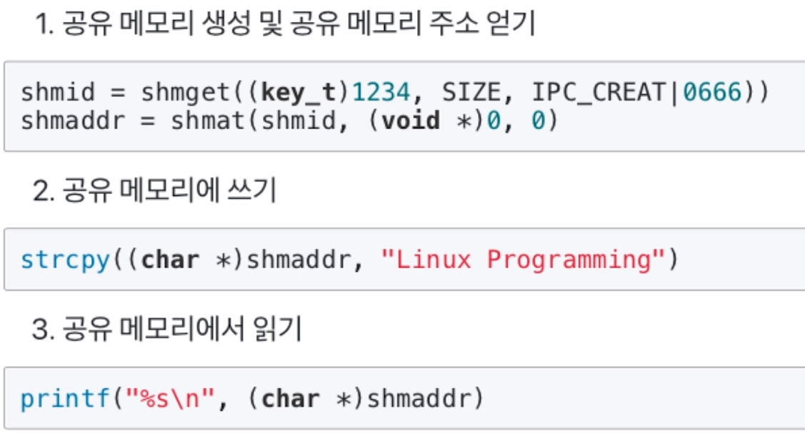

[toc]

# 프로세스와 스케쥴러 이해 

# - IPC (InterProcess Communication) 기법

## :heavy_check_mark: 다양한 IPC 기법

1. file 사용

2. Message Queue

3. Shared Memory

4. Pipe

5. Signal

6. Semaphore

7. Socket

...

> 2~7 프로세스가 커널 공간을 공유

## :heavy_check_mark: 1. file 사용

간단히 다른 프로세스에 전달할 내용을 파일에 쓰고, 다른 프로세스가 해당 파일을 읽으면 됨

- BUT! file을 사용하면, 실시간으로 직접 원하는 프로세스에 데이터 전달이 어려움
  - 해당 프로세스가 파일을 읽어야하는데, 계속 실시간으로 읽기는 힘듦

## :heavy_check_mark: 2. Message Queue (메시지 큐)

- 기본은 FIFO 정책으로 데이터 전송

  

### 코드예제

## :heavy_check_mark: 4. Pipe (파이프)

- 기본 파이프는 단방향 통신

- fork()로 자식 프로세스를 만들었을 때, 부모와 자식간의 통신

  > fork()라는 시스템콜은
  >
  > 호출되면 새로운 프로세스가 생김 (기존 프로세스를 완벽하게 복사)
  >
  > > 기존 프로세스: 부모, 새 프로세스: 자식 -> 자식 프로세스는 pid가 0
  >
  > 왜 프로세스를 두개 생성?

### 코드 예제

> 부모에서 write를 자식에서 read 할 수 있다.

## :heavy_check_mark: 파이프와 메시지 큐

| message queue                                                | pipe             |
| ------------------------------------------------------------ | ---------------- |
| 부모/자식이 아니라, 어느 프로세스간에도 데이터 송수신이 가능 | only 부모/자식간 |
| 먼저 넣은 데이터가, 먼저 읽혀진다                            |                  |
| 양방향 가능                                                  | 단방향만 가능    |

## :heavy_check_mark: IPC 기법과 커널 모드

> pipe, message queue는 모두 커널 공간의 메모리를 사용함

> 메모리 공간도 kernel/user로 구분된다.

## :heavy_check_mark: 3. Shared Memory (공유 메모리)

- 노골적으로 kernel space에 메모리 공간을 만들고, 해당 공간을 변수처럼 쓰는 방식
- message queue처럼 FIFO 방식이 아니라, 해당 메모리 주소를 마치 변수처럼 접근하는 방식
- 공유 메모리 key를 가지고, 여러 프로세스가 접근 가능

### 코드 예제

## :heavy_check_mark: 정리

모두 커널 공간을 활용해서 프로세스간 데이터 공유

