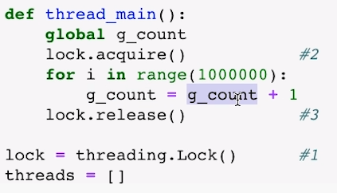
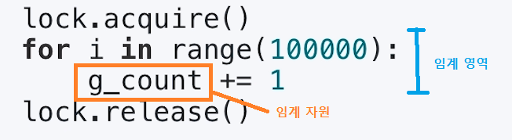

[toc]

# Thread (스레드) - 동기화 문제

## :heavy_check_mark: 동기화 (Synchronization) 이슈 

> 스레드의 실행 순서가 잘못되어 여러스레드에서 변수를 동시에 읽고 쓰다 동기화 이슈가 생길수도

> python 예제
>
> `lock.acquire()`, `lock.release()` 와 같은 함수 사용
>
> 

## :heavy_check_mark: 동기화 이슈 해결 방안

### Mutual exclustion (상호 배제)

- 임계 자원 (critical resource)
- 임계 영역 (critical section)

### 공유변수 동시 접근

- 스레드는 프로세스 모든 데이터를 접근할 수 있으므로,
  - 여러 스레드가 변경하는 공유 변수에 대해 Exclusive Access 필요
  - 어느 한 스레드가 공유 변수를 갱신하는 동안 다른 스레드가 동시 접근하지 못하도록 막기

