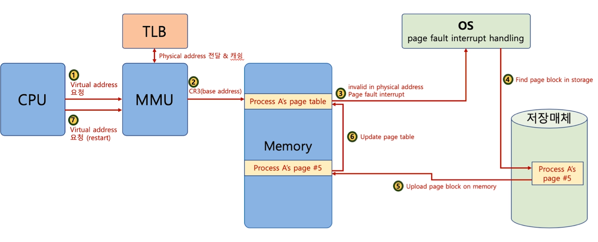

[toc]

# 페이지 폴트

## :heavy_check_mark: 요구 페이징 (Demand Paging or Demanded Paging)

- 프로세스 모든 데이터를 메모리로 적재하지 않고, 실행 중 **필요한 시점에서만 메모리로 적재함**
  - 선행 페이징 (anticipatory paging, prepaging)의 반대 개념: 미리 프로세스 관련 모든 데이터를 메모리에 올려놓고 실행하는 개념
  - 더이상 필요하지 않은 페이지 프레임은 다시 저장매체에 저장 (페이지 교체 알고리즘 필요)

## :heavy_check_mark: 페이지 폴트 (page fault)

- 어떤 페이지가 실제 물리 메모리에 없을때 일어나는 인터럽트
- 운영체제가 page fault가 일어나면, 해당 페이지를 물리 메모리에 올리고 page table update

## :heavy_check_mark: 페이지 폴트와 인터럽트

### 페이지 폴트가 자주 일어나면?

- 실행되기 전에, 해당 페이지를 물리 메모리에 올려야함 -> 시간 오래걸림

### 페이지 폴트가 안일어나게 하려면?

- 향후 실행/참조될 코드/데이터를 미리 물리 메모리에 올리면 됨
  - 앞으로 있을 일을 예측해야함

