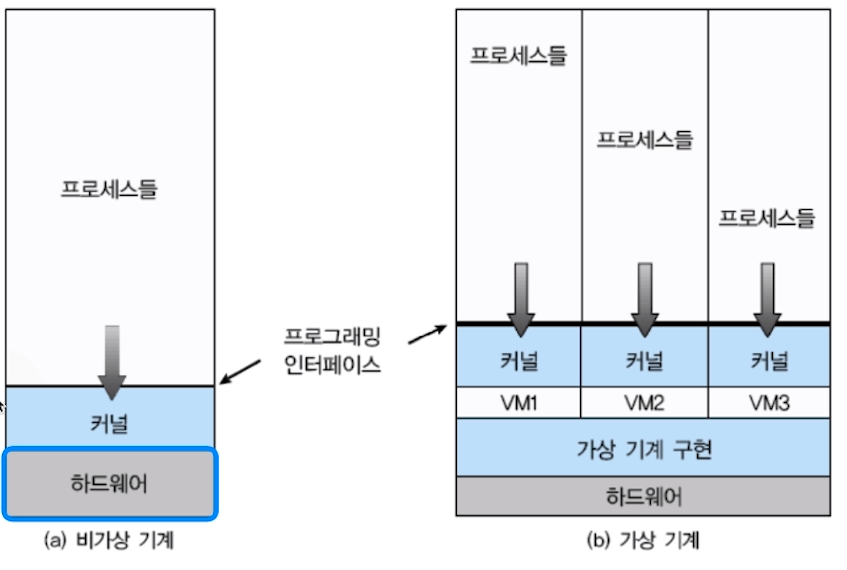
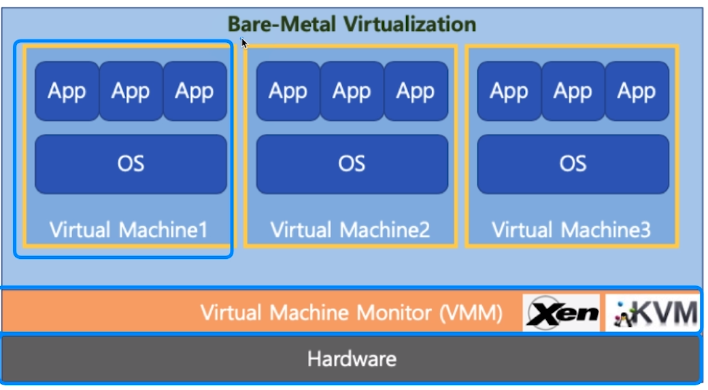
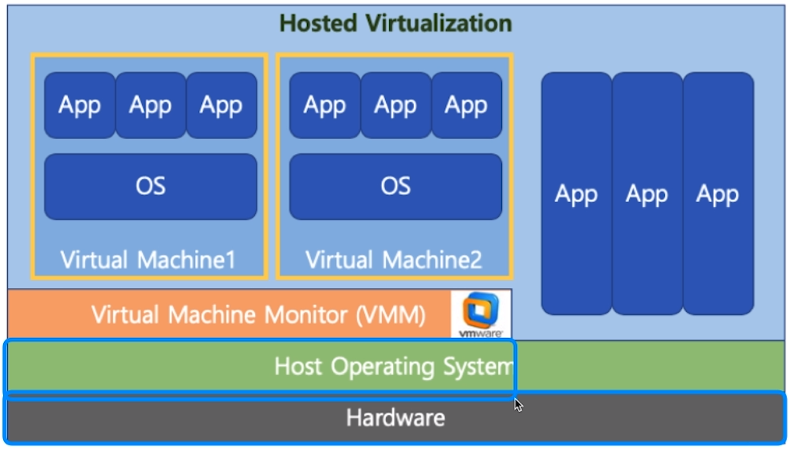
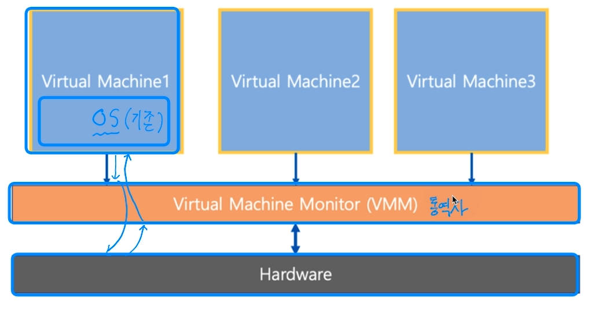
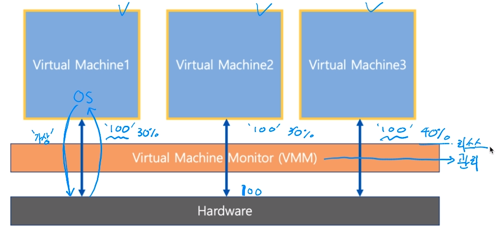
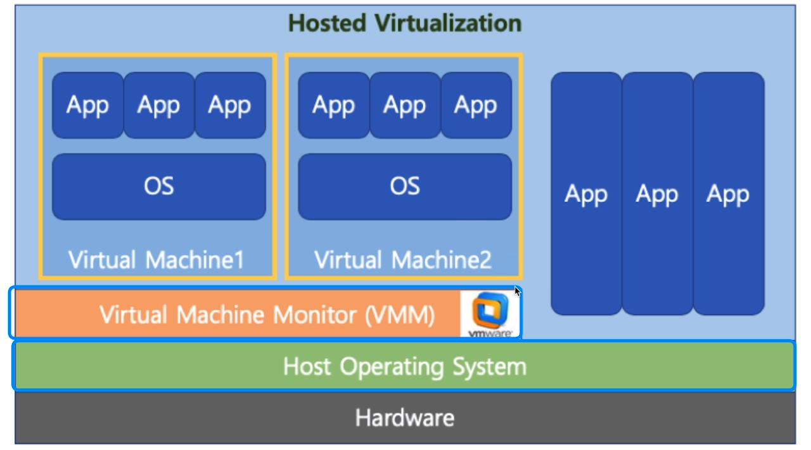
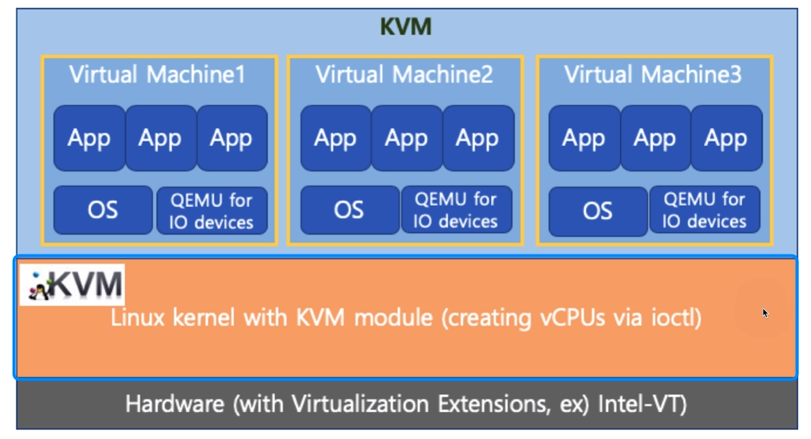
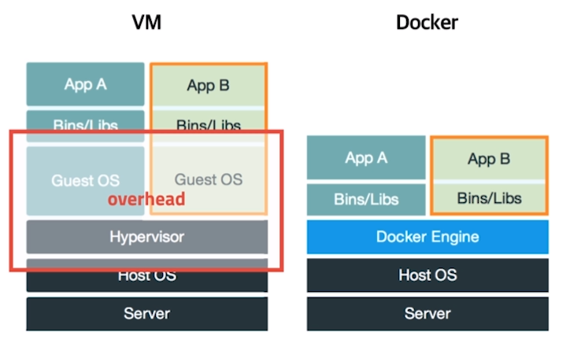
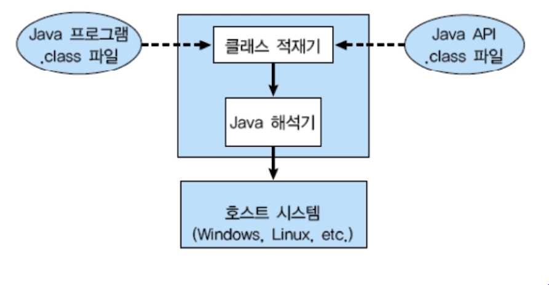

[toc]

# 가상 머신 (Virtual Machine)

- 하나의 하드웨어 (CPU, Memory등)에 다수의 운영체제를 설치하고, 개별 컴퓨터처럼 동작하도록 하는 프로그램

  

## :heavy_check_mark: Virtual Machine Type1 (native or bare metal)

- 하이퍼 바이저 (VMM): 운영체제와 응용 프로그램을 물리적 하드웨어에서 분리하는 프로세스
- 하이퍼바이저 또는 버추얼 머신 모니터(VMM)라고 하는 소프트웨어가 Hardware에서 직접 구동

## :heavy_check_mark: Virtual Machine Type2

- 하이퍼바이저 또는 버추얼 머신 모니터 (VMM)라고 하는 소프트웨어가 Host OS 상위에 설치
  - VMWare, Parallels Desktop (Mac)

## :heavy_check_mark: Full Virtualization vs Half Virtualization

- 전가상화 vs 반가상화

### 전가상화

- 각 가상머신이 하이퍼바이저를 통해 하드웨어와 통신
  - 하이퍼바이저가 마치 하드웨어인 것처럼 동작하므로, 가상머신의 OS는 자신이 가상 머신인 상태인지를 모름

### 반가상화

- 각 가상머신에서 직접 하드웨어와 통신
  - 각 가상머신에 설치되는 OS는 가상 머신인 경우, 이를 인지하고 각 명령에 하이퍼바이저 명령을 추가해서 하드웨어와 통신

## :heavy_check_mark: VMWare

- 대중적인 가상머신 프로그램 (Type2)

## :heavy_check_mark: KVM

- AWS 등에서 사용 (Type1)

## :heavy_check_mark: 가상머신 vs Docker

- 가상머신은 컴퓨터 하드웨어를 가상화 (**하드웨어 전체 추상화**)
  - 하이퍼바이저 사용, 추가 OS 필요 등 성능 저하 이슈 존재
- Docker는 운영체제 레벨에서 별도로 분리된 실행환경을 제공 (**커널 추상화**)
  - 마치 리눅스 처음 설치했을때와 유사한 실행환경을 만들어주는 리눅스 컨테이너 기술 기반
  - 리눅스 컨테이너 기술이므로 macOS나 windows에 설치할 경우는 가상머신 기반 제공

## :heavy_check_mark: 가상 머신 정리

- Bare-Metal 방식이 가장 성능이 좋음
  - 하드웨어 직접 엑세스하기 때문
  - AWS(클라우드 컴퓨팅) 환경도 Bare-Metal 기반 가상 머신 기술 활용 (KVM)

- Docker는 경량 이미지로 실행환경을 통째로 백업, 실행 가능 (실무에 많이 사용)
  - Data Engineering에서 Docker로 시스템 환경 설정 + 프로그램을 한번에 배포
  - 예) 프로그램 업데이트 > Docker 이미지 작성 > Jenkins로 배치잡 생성 및 실행 (AWS EC2 재생성 및 Docker 이미지 설치, 실행)

## :heavy_check_mark: Java Virtual Machine

- 가상머신과는 다른 목적 (응용프로그램 레벨 가상화)
- Java 컴파일러는 CPU dependency를 가지지 않는 bytecode를 생성함
- 이 파일을 Java Virtual Machine에서 실행함
- 각 운영체제를 위한 Java Virtual Machine 프로그램 존재

