[toc]

# 클라우드 컴퓨팅 설정 (AWS)

## :heavy_check_mark: 2. Elastic IP (탄력적 IP) 생성

- IP addr
- 동적 IP
- 고정 IP

### 1. 탄력적 IP 주소 할당

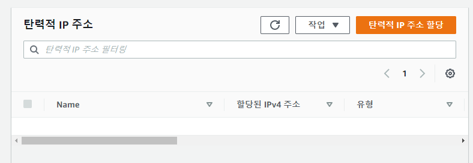

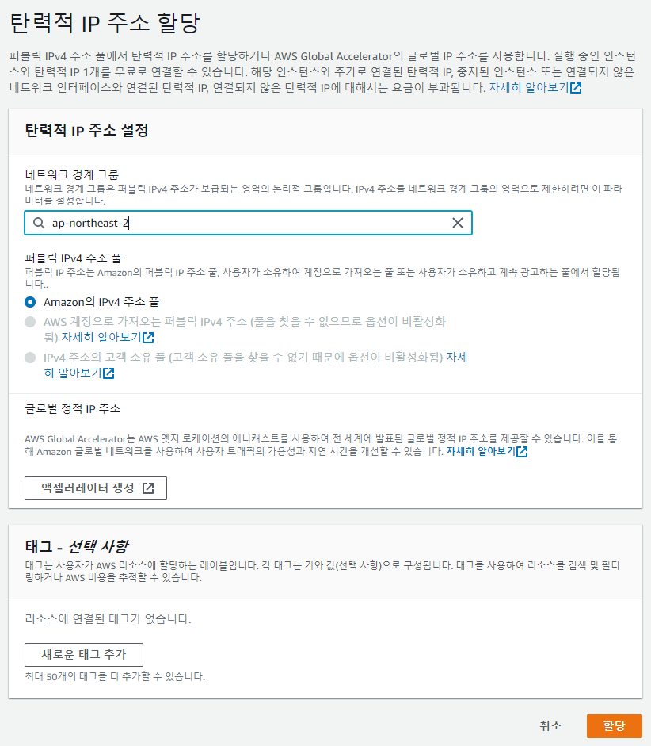

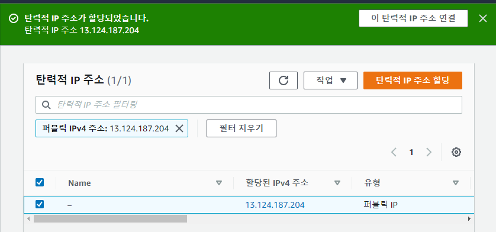

### 2. 탄력적 IP 주소 연결

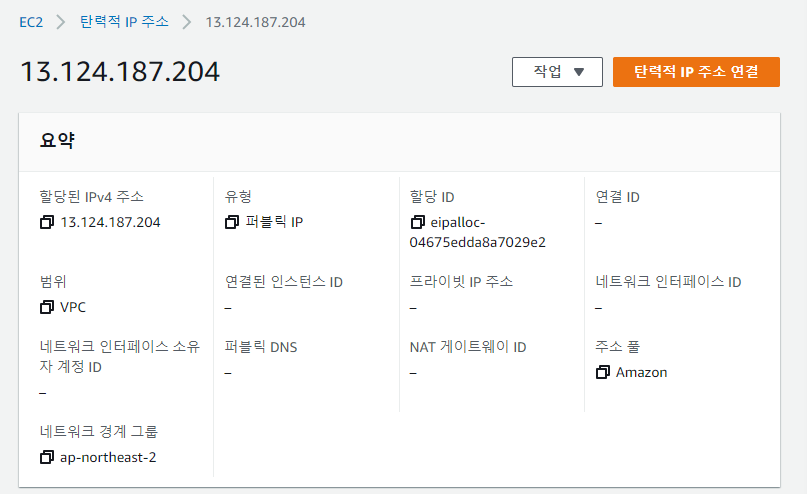

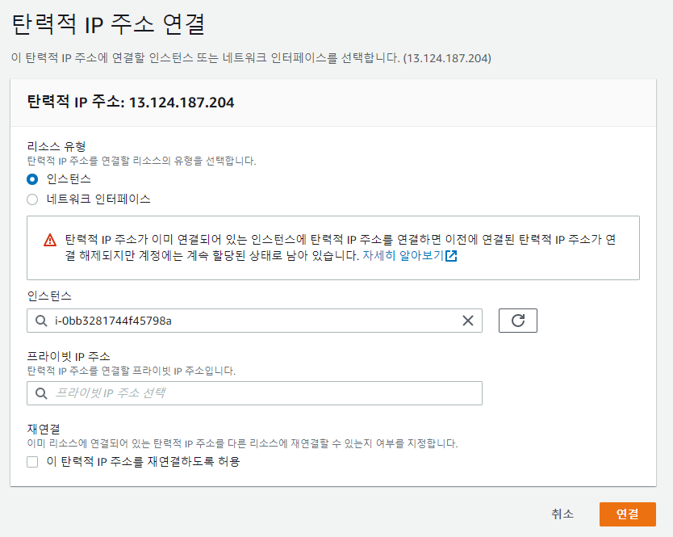

### 3. 인스턴스 확인

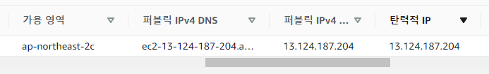

## :heavy_check_mark: 3. 자기 PC(클라이언트)에서 EC2(서버) 접속

### 1. putty 다운

- https://www.chiark.greenend.org.uk/~sgtatham/putty/latest.html

### 2. PuTTYgen 실행

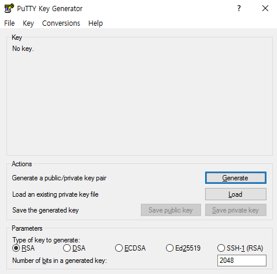

### 3. 키페어 Load 

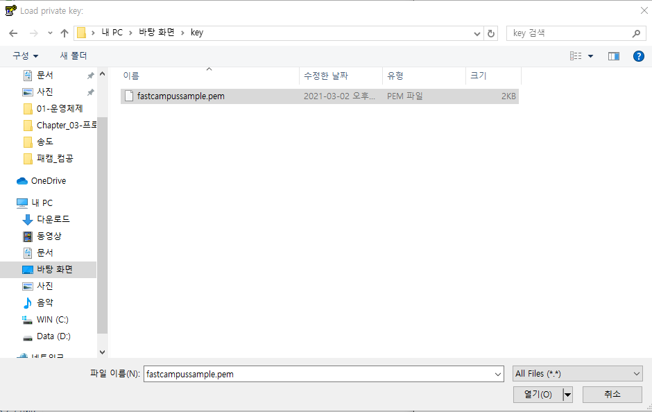

### 4. Save private key

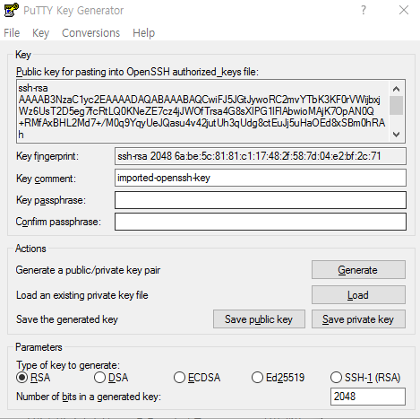

### 5. PuTTY 실행

#### Auth > 키페어 등록

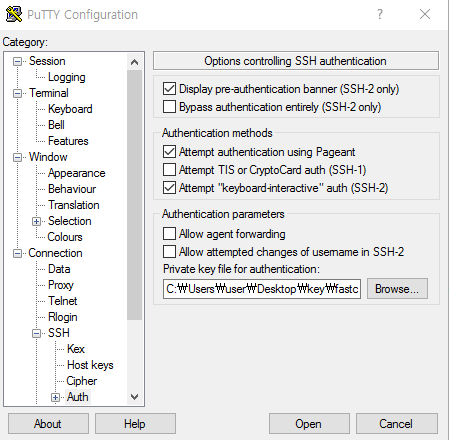

#### Session 설정

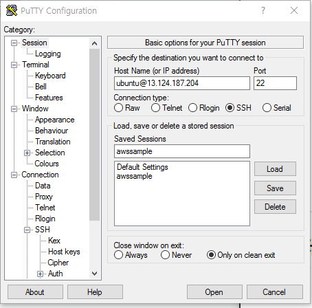

> Open

### 6. 연결 성공!

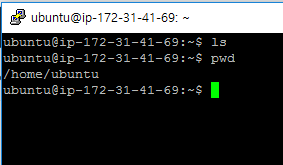

