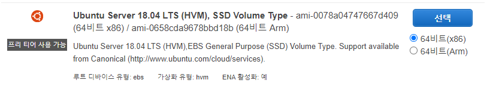
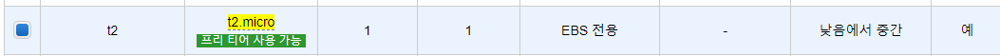
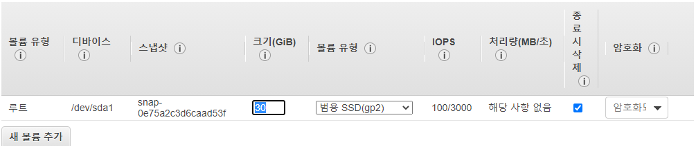
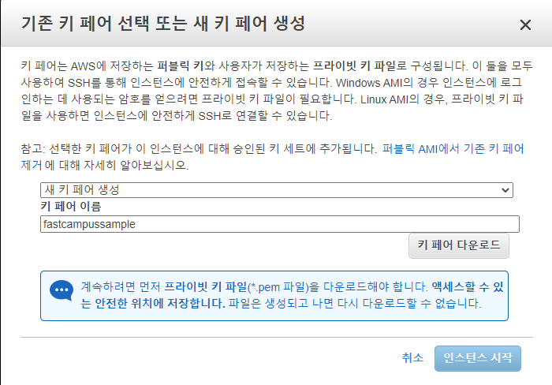

[toc]

# 클라우드 컴퓨팅 설정 (AWS)

## :heavy_check_mark: 1. EC2 또는 인스턴스(서버) 생성

### 1. AMI 선택

- Linux 패키지 선택

### 2. 인스턴스 유형 선택

- t2.micro

### 3. 인스턴스 세부 정보 구성

### 4. 스토리지 추가

- 30GB

### 5. 태그 추가

### 6. 보안 그룹 구성

### 7. 인스턴스 검토 및 시작

### 8. 키페어

