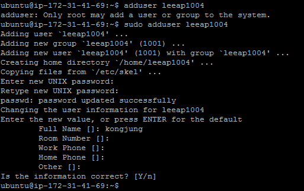
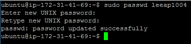
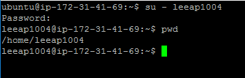

[toc]

# 쉘 사용법 정리 - 다중 사용자 지원 관련 명령어

## :heavy_check_mark: 쉘 종류

- 쉘 (Shell): 사용자와 컴퓨터 하드웨어 또는 운영체제간 인터페이스
  - 사용자의 명령을 해석해서, 커널에 명령을 요청해주는 역할
  - 관련된 시스템콜을 사용해서 프로그래밍이 작성되어 있다.

- 쉘 종류
  - Bourne-Again Shell (bash): GNU 프로젝트의 일환으로 개발됨, 리눅스 거의 디폴트임
  - Bourne Shell (sh)
  - C Shell (csh)
  - Korn Shell (ksh): 유닉스에서 가장 많이 사용됨

## :heavy_check_mark: 기본 명령어

### `whoami`

- 로그인한 사용자 ID

### `sudo`

- root 권한으로 실행하기
- root 계정으로 로그인하지 않은 상태에서 root 권한이 필요한 명령을 실행할 수 있도록 하는 프로그램
- 기본 사용법
  - sudo 명령어
  - ex) `sudo ...`

### `useradd` 

- 사용자 기본 설정 자동으로 X

### `adduser`

- 사용자 기본 설정 자동 수행

### `passwd`

- 로그인한 사용자 ID 암호 변경

### `su`

- 사용자 변경

- 보통 su - 와 함께 사용

  - `su root`: **현재 사용자의 환경설정 기반**, root 변경

  - `su - root` : **변경되는 사용자의 환경설정을 기반**으로, root로 전환

    