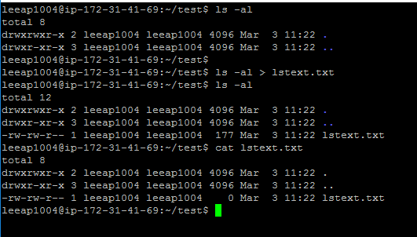
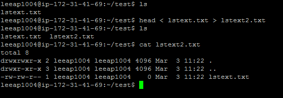
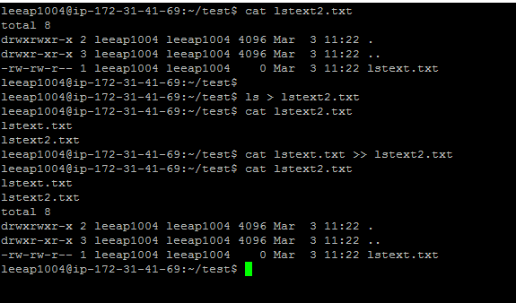
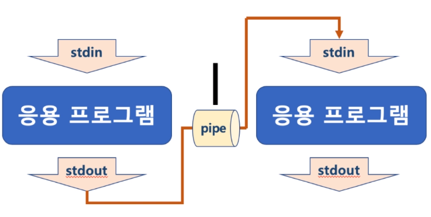
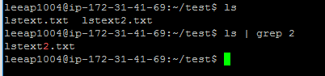
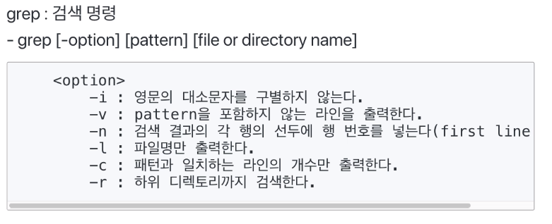
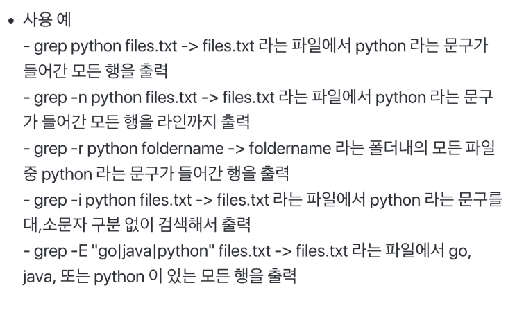

[toc]

# 리다이렉션(redirection), 파이프(pipe)

## :heavy_check_mark: Standard Stream(표준 입출력)

- command로 실행되는 프로세스는 세 가지 스트림을 가지고 있음
  - 표준 입력 스트림 (Standard Input Stream) - **stdin**
  - 표준 출력 스트림 (Standard Output Stream) - **stdout**
  - 오류 출력 스트림 (Standard Error Stream) - **stderr**

- 모든 스트림은 일반적인 plain text로 console에 출력하도록 되어있음

## :heavy_check_mark: 리다이렉션 (redirection) - `>`, `<`

- 표준 스트림 흐름을 바꿔줄 수 있다.
  - 주로 명령어 표준 출력을 화면이 아닌 파일에 쓸 때

### 1. `ls > lstext.txt`

- ls로 출력되는 표준 출력 스트림의 방향을 lstext.txt로 바꿔줌

  lstext.txt에 ls로 출력되는 결과가 저장됨

### 2. `head < lstext.txt`

- lstext.txt 의 파일 내용이 head라는 파일의 처음부터 10라인까지 출력해주는 명령으로 넣어짐

  lstext.txt의 앞 10라인이 출력됨

### 3. `head < lstext.txt > lstext2.txt`

- lstext.txt의 파일 내용이 head로 들어가서, lstext.txt의 앞 10라인을 출력

- head의 출력 스트림은 다시 lstext2.txt로 들어감

- head는 lstext.txt 내용을 출력하지 않고, 해당 출력 내용이 다시 lstext2.txt에 저장됨

  lstext.txt의 앞 10라인이 lstext2.txt에 저장

### 4. `head `

> `>`, `<` 명령어는 해당 파일이 존재하는  경우 덮어 씌어짐

- `>>` 는 기존에 파일이 존재하면, 결과를 추가해줌

## :heavy_check_mark: 파이프 (pipe)

- 두 프로세스 사이에서 한 프로세스의 출력 스트림을 또 다른 프로세스의 입력 스트림으로 사용할 때 사용 된다.

## :heavy_check_mark: 파이프 (pipe) 예

### 1. `ls | grep files.txt`

- ls 명령을 통한 출력 내용이 grep 명령의 입력 스트림으로 들어감
- grep files.txt는 grep 명령의 입력 스트림을 검색해서  files.txt가 들어있는 입력 내용만 출력해줌
- 따라서, ls명령으로 해당 디렉토리/파일 중에 files.txt가 있는지 출력

## :heavy_check_mark: 참고: grep 명령어 

