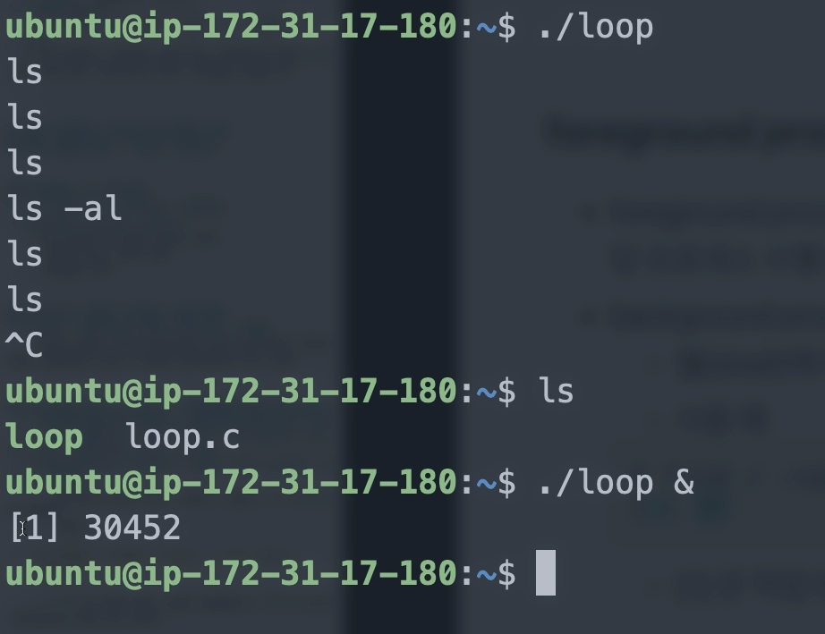

[toc]

# foreground background 프로세스

## :heavy_check_mark: 프로세스 vs 바이너리

- 코드 이미지 또는 바이너리 : 실행파일
- 실행중인 프로그램: 프로세스
  - 가상 메모리 및 물리 메모리 정보
  - 시스템 리소스 관련 정보
  - 스케쥴링 단위


<hr>
## :heavy_check_mark: 리눅스는 다양한 프로세스 실행 환경

- 리눅스는 기본적으로 다양한 프로세스가 실행됨
  - 유닉스 철학: 여러 프로그램이 서로 유기적으로 각자의 일을 수행하면서 전체 시스템이 동작하도록 하는 모델


<hr>
## :heavy_check_mark: foreground / background process

### foreground  process

- 쉘 (shell)에서 해당 프로세스 실행을 명령한 후, 해당 프로세스 수행 종료까지 사용자가 다른 입력을 하지 못하는 프로세스

- `sudo apt-get install gcc` : gcc install

- `vi loop-test.c`

  ```c
  #include <stdio.h>
  
  int main()
  {
  	int i = 1;
  	while (i == 1) {
  	
  	}
  	return 0;
  }
  ```

- `gcc loop-test.c -o loop-test`

- `./loop-test`

  > 이 실행 파일이 끝나기 전까지 명령어가 먹히지 않음


### background process

- 사용자 입력과 상관없이 실행되는 프로세스

  - 쉘(shell)에서 해당 프로세스 실행시, 맨뒤에 &를 붙여줌

  - ex) `find / -name '*.py' > list.txt &`

    > [1]은 작업번호(job num), 52은 pid(process id)를 나타냄




