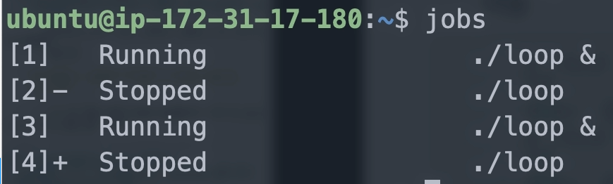
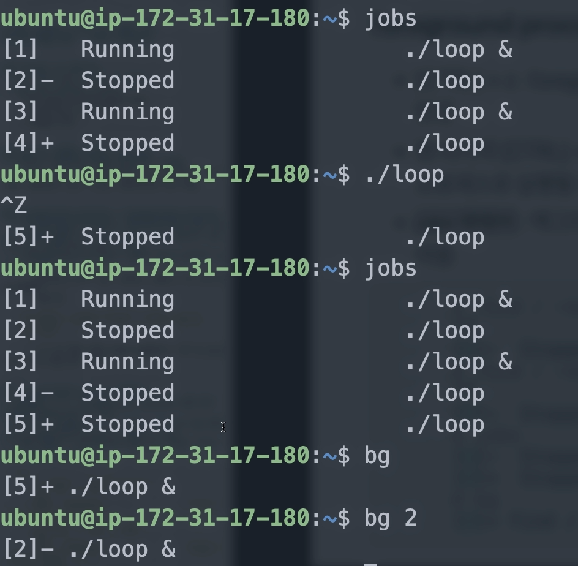
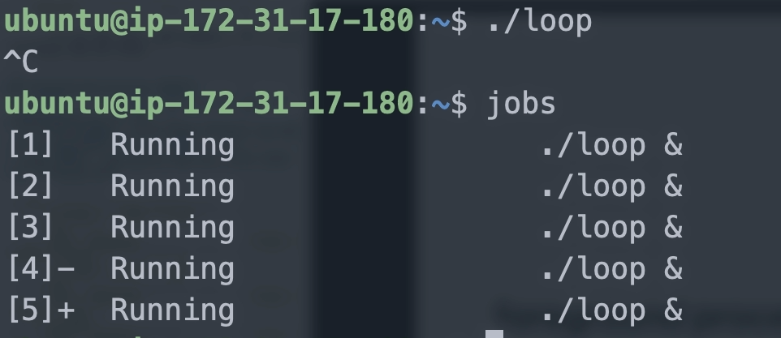
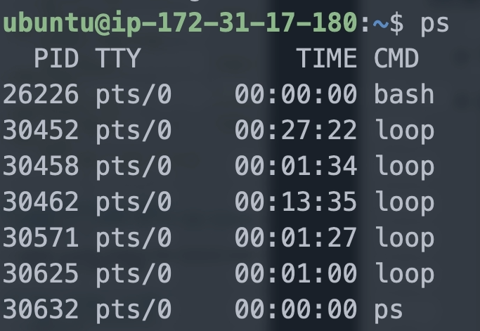
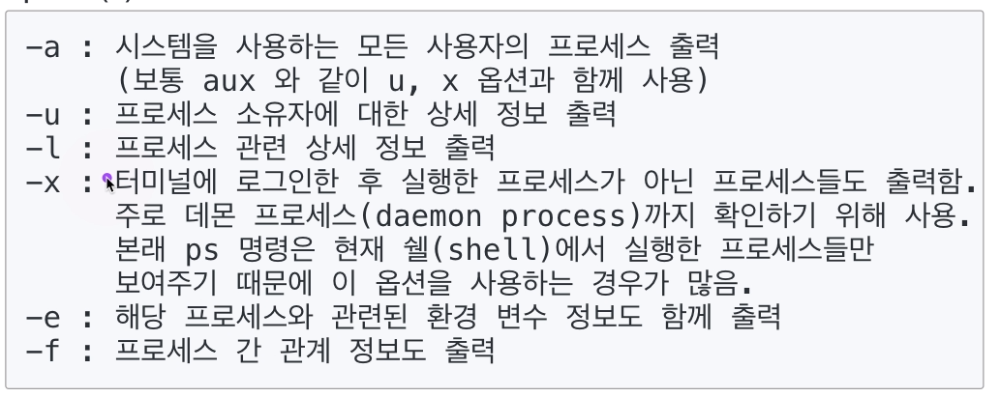

[toc]

# 프로세스 관리 및 제어

## :heavy_check_mark: foreground process 제어하기

### `ctrl + z`

- `ctrl + z` : foreground 프로세스 실행 중지 상태 (suspend 모드)로 변경

- 맨 마지막 `ctrl + z` 로 중지된 프로세스는 bg 명령으로 background 프로세스로 실행될 수 있음

  

### `jobs` 

명령어: 백그라운드로 진행 또는 중지된 상태로 있는 프로세스를 보여줌

### `bg`  or `bg {job num}`

### `ctrl + c`: 프로세스 작업 취소 (완전 종료)

## :heavy_check_mark: 프로세스 상태 확인 - `ps`

### `ps {option}`

> 보통 `ps aux` 많이 씀
>
> 

### 데몬 프로세스 (daemon process)

- 사용자 모르게 시스템 관리를 위해 실행되는 프로세스로 보통 시스템이 **부팅될 때 자동실행**

- `ftpd`, `inetd`

- 보통 24시간 실행

  

## :heavy_check_mark: `kill {pid}`

> process kill

`kill -9 3045 `

> -9: 강제로 끝내기

