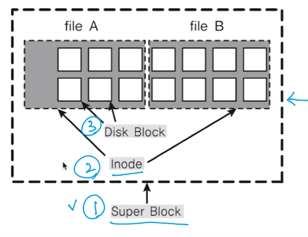
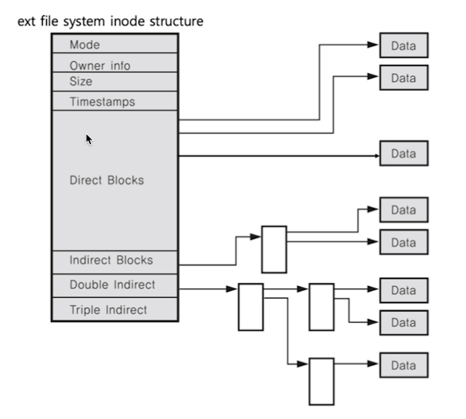

[toc]

# 리눅스 파일시스템

## :heavy_check_mark: 리눅스와 파일 정리

- 모든 것은 파일이라는 철학을 따름
  - 모든 인터렉션은 파일을 읽고, 쓰는 것처럼 이루어져 있음
  - 마우스, 키보드와 같은 모든 디바이스 관련된 기술도 파일과 같이 다루어짐
  - 모든 자원에 대한 추상화 인터페이스로 파일 인터페이스를 활용

## :heavy_check_mark: 가상 파일 시스템

- 파일 네임스페이스

  - A 드라이브 (A:/), C드라이브(C:/windows) -> X

  - `/` root 디렉토리 사용

  - 전역 네임스페이스 활용

    - /media/floofy/dave.jpg

    - 예: cat tty

      `tty`: 가상 파일 시스템 인터페이스를 통해 가상 터미널 황견(디바이스)에 연결

## :heavy_check_mark: 슈퍼블록, inode와 파일

- 슈퍼 블록: 파일 시스템의 정보

- 파일: inode 고유값과 자료구조에 의해 주요 정보 관리

  - '파일이름:inode'로 파일이름은 inode번호와 매칭

  - 파일 시스템에서는 inode를 기반으로 파일 엑세스

  - inode기반 메타 데이터 저장 (파일 권한, 소유자 정보, 파일 사이즈, 생성시간 등 시간 관련 정보, 데이터 저장 위치 등)

    

