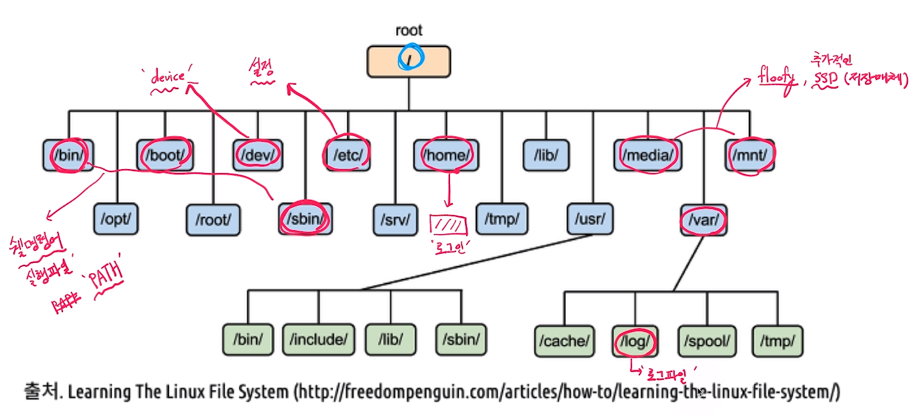

[toc]

# 파일 시스템 탐색

## :heavy_check_mark: 파일과 inode

- 리눅스 파일 탐색 예 - `/home/ubuntu/link.txt`
  - 각 디렉토리 엔트리 (dentry)를 탐색
    - 각 엔티리는 해당 디렉토리 파일/디렉토리 정보를 가지고 있음
  - `/` dentry에서 `home`을 찾고, `home`에서 `ubuntu`를 찾고, `ubuntu`에서 `link.txt`파일 이름에 해당하는 inode를 얻음

## :heavy_check_mark: 리눅스 파일 구조 (참고)

