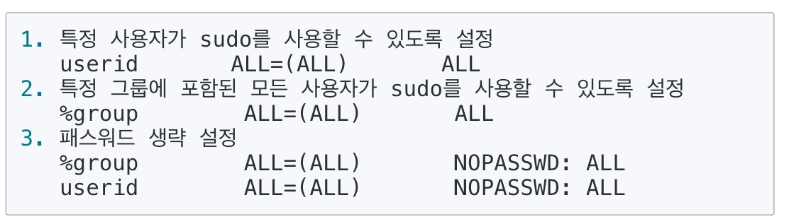
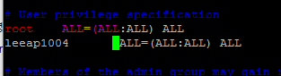
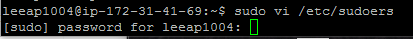
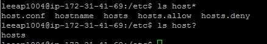
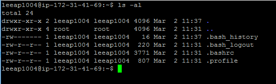
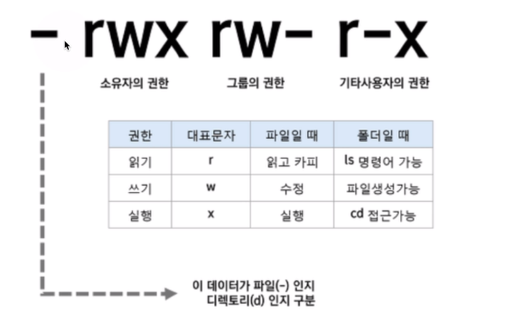
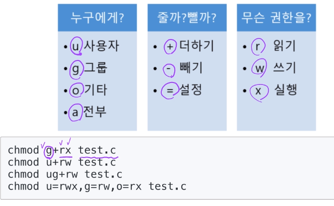
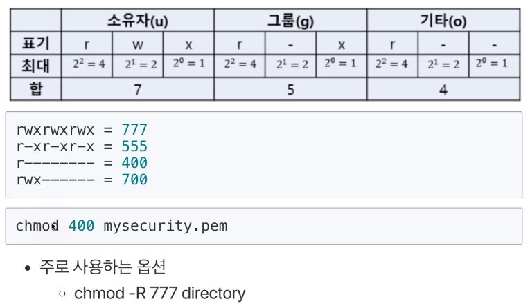

[toc]

# 파일 및 권한 관리

## :heavy_check_mark: sudo 명령어

> root 권한으로 실행하기

- `/etc/sudoers` 설정 파일에서 다음과 같이 설정을 변경할 수 있음
  - visudo가 설치되어 있다면, 해당 명령을 통해 설정 파일이 오픈되어 바로 수정 가능




ex) leeap1004 사용자에게 전체 권한 주기

`sudo - ubuntu`

`cd /etc/`

`sudo vi sudoers`



`:wq!`



> leeap1004사용자가 sudo 명령어 사용 가능


<hr>
## :heavy_check_mark: 파일 관련 명령어

`pwd`

`cd`


### `ls` 와 와일드 카드

*: 임의 문자열

?: 문자 하나




### `ls`와 파일 권한

- 파일마다 소유자, 소유자 그룹, 모든 사용자에 대해
  - 읽고 쓰고 실행하는 권한 설정
  - 소유자 접근 권한 정보는 inode에 저장






<hr>

## :heavy_check_mark: 파일 권한

- 사용자
  - 소유자: 소유자에 대한 권한
  - 그룹: 소유자가 속해있는 그룹에 대한 권한
  - 공개: 모든 사용자들에 대한 권한
- 퍼미션 종류, (권한 기호)
  - 읽기(r): 읽기 권한
  - 쓰기(w): 쓰기 권한
  - 실행(x): 실행 권한


<hr>
## :heavy_check_mark: `chmod`: 파일 권한 변경

### 기호 문자 사용




### 숫자 사용



`-R` 하위 디렉토리 모두 다 권한


<hr>

## :heavy_check_mark: `chown`: 파일 소유자 변경

- `chown [옵션] [소유자:소유자그룹][파일]`

  ```
  chown root:root file
  chown root: file
  chown :root file
  ```

- 주로 사용
  - `chown -R root:root directory`
  - 디폴트 그룹 -> `chown -R leeap1004: directory`
- 참고: 소유자 그룹 변경
  - chgrp [옵션] [그룹] [파일]
  - ex) `chgrp -R root directory`


<hr>

## :heavy_check_mark:  `head/tail`

> 파일 시작부분, 끝부분을 보여줌

기본 출력 라인수는 10

 

<hr>

## :heavy_check_mark: `more`: 파일 보기

: 화면이 넘어갈 경우, 화면이 넘어가기 전 까지 보여줌


<hr>

## :heavy_check_mark: `rm`: 파일 및 폴더 삭제

- 주로 사용하는 명령어 형태: `rm -rf 디렉토리명`
- r 옵션: 하위 디렉토리를 포함한 모든 파일 삭제
- f 옵션: 강제로 파일이나 디렉토리 삭제


<hr>

## :heavy_check_mark: 정리

- 쉘 - Bourne-Again Shell (bash): GNU 프로젝트의 일환으로 개발됨, 리눅스 거의 디폴트임

- user 관련 명령: whoami, useradd, passwd, su - 명령, sudo
- Directory/file 관련: pwd, cd, ls, cat, head/tail, more, rm
- Directory/file 권한 관련 명령: chmod, chown, chgrp
- 관리자 권한 실행: `sudo`
- 다양한 옵션은 man 명령으로 매뉴얼 확인 가능

