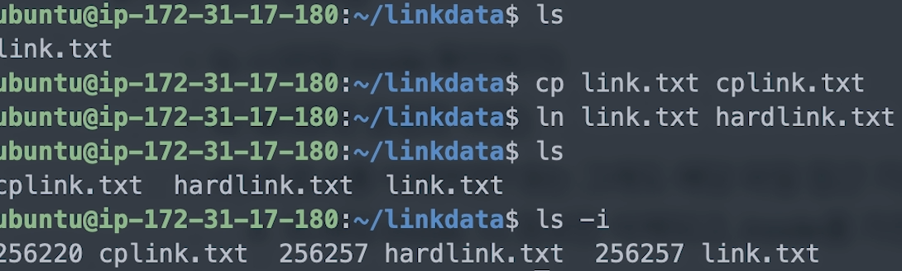
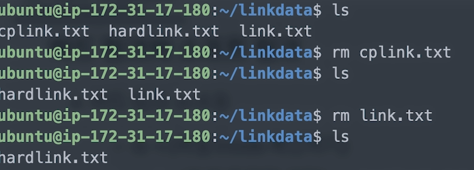
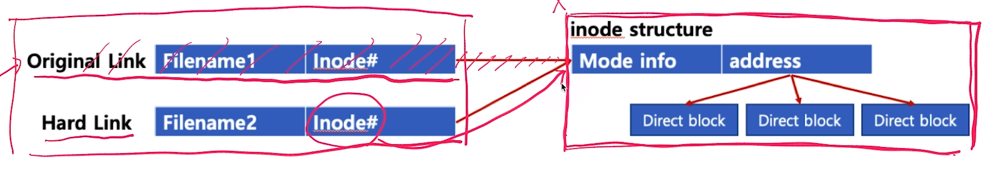
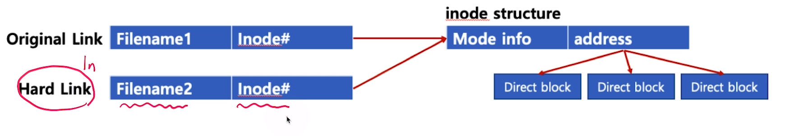
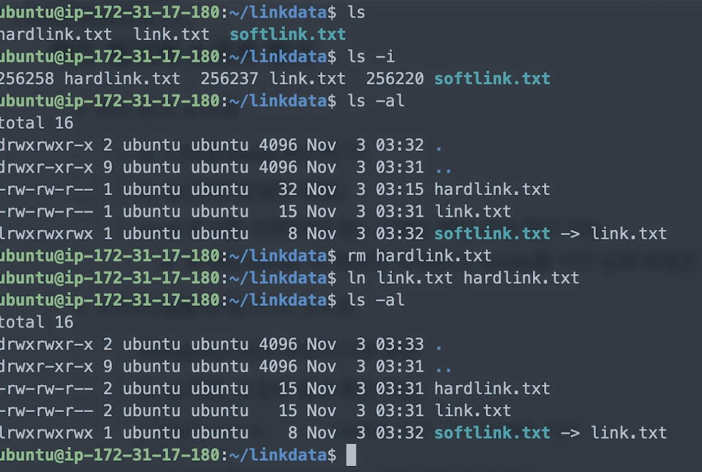
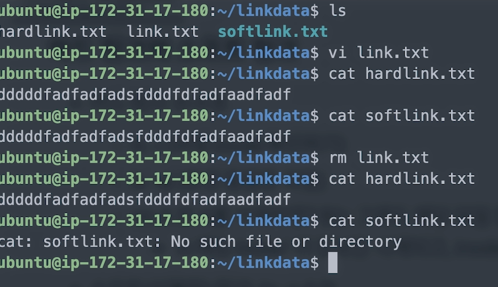
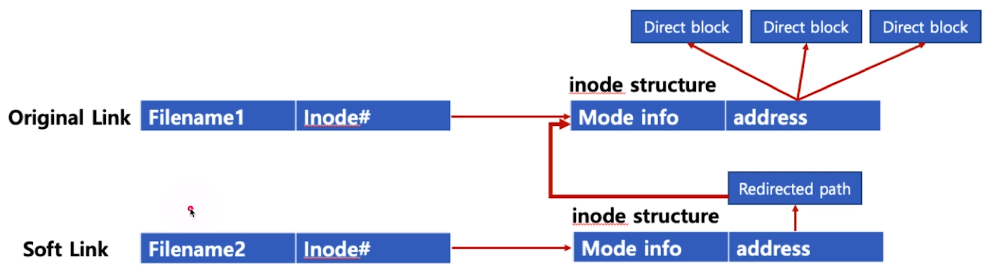

[toc]

# 하드 링크와 소프트 링크

## :heavy_check_mark: 시작 전

- `cp` : copy
  - `cp -rf`: 디렉토리 내부의 모든 파일까지 강제로 복사
- `rm` : remove
  - `rm -rf`: 디렉토리 내부의 모든 파일까지 강제로 삭제

## :heavy_check_mark: 하드링크

- `cp A B` : 10MB 사이즈의 A파일을 B파일로 복사 -> A와 B는 각각 물리적으로 10MB 파일로 저장

- 하드 링크 

  - A와 B는 동일한 10MB 파일을 가리킴

  - 즉, 동일한 파일을 가진 이름을 하나 더 만든 것일 뿐

    - inode는 동일
    - 전체 파일 용량도 달라지지 않음

    `ln A B`: A와 B가 동일함

### 예시

`ls -i` : inode 번호 확인

원본 삭제시 링크만 삭제될 뿐임

### 하드링크와 inode

## :heavy_check_mark: 소프트 링크

`ln -s A B`: windows의 바로가기와 동일

- inode 다름

- `ls -al` 확인

  

- `rm A`로 삭제하면? -> B는 해당파일 접근 불가!

  

### 소프트 링크와 inode

## :heavy_check_mark: 특수파일

- 디바이스 

  - 블록 디바이스 (Block Device) -  저장매체 1byte 단위로 읽기/쓰기

    : HDD, CD/DVD와 같이 블록 또는 섹터 등 정해진 단위로 데이터 전송, IO 송수신 속도가 높음

  - 캐릭터 디바이스 (Character Device)

    : 키보드, 마우스 등 byte 단위 데이터 전송, IO 송수신 속도가 낮음

## :heavy_check_mark: 정리

- 파일 추상화 인터페이스를 활욜 다양한 데이터/디바이스 접근
- 파일 네임스페이스는 전역 네임스페이스 활용 (`/media/floofy/dave.jpg`)
- '파일이름:inode'로 매칭, 파일 시스템은 inode 기반 접근
- 하드링크: 동일 inode 가리키는 파일 이름만 하나 더 만듦
- 소프트 링크: 특정 파일 바로가기 파일을 만듦
- `ln` 명령어
- 특수파일: 블록/캐릭터 디바이스

