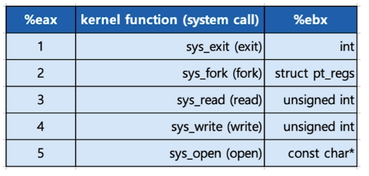

[toc]

# 시스템콜과 API

## :heavy_check_mark: 시스템 프로그래밍의 기반 요소

- 시스템 콜

- C 라이브러리

- C 컴파일러

  > 사용자 영역에서의 시스템 프로그래밍


<hr>
## :heavy_check_mark: 시스템콜

- 운영체제 리소스나 서비스 요청을 위해, 사용자 영역에서 커널 영역으로 들어가는 함수
- 주요 시스템콜: `read()`, `write()`, `open()` 등

> 리눅스/유닉스는 C언어로 만들어져서, 시스템콜도 C언어로 구현


### 시스템콜은 어떻게 구현?

- eax 레지스터에 시스템 콜 번호를 넣고

- ebx 레지스터에는 시스템 콜에 해당하는 인자값을 넣고,

- **소프트웨어 인터럽트 명령**을 호출하면서 0x80 값을 넘겨줌

  - CPU는 사용자 모드를 커널 모드로 바꿔줌
  - IDT(Interrupt Descriptor Table)에서 0x80에 해당하는 주소(함수)를 찾아서 실행함 (**PC를 변경**)
  - `system_call()` 함수에서 eax로부터 시스템 콜 번호를 찾아서, 해당 번호에 맞는 시스템 콜 함수로 이동
  - 해당 시스템 콜 함수 실행 후, 다시 커널 모드에서 사용자 모드로 변경하고, 다시 해당 프로세스 다음 코드 진행

  

```
mov eax, 1
mov ebx, 0

int 0x80
```

> int: instruction code (CPU가 제공하는 코드)

> 1번 시스템콜 번호
>
> 함수에 0번 인자를 넣음


<hr>
## :heavy_check_mark: API

- 응용 프로그램과 분리된 하위 호환 인터페이스
  - ex) 시스템 콜 래퍼, 입출력 라이브러리 등등..


<hr>

## :heavy_check_mark: 부제


