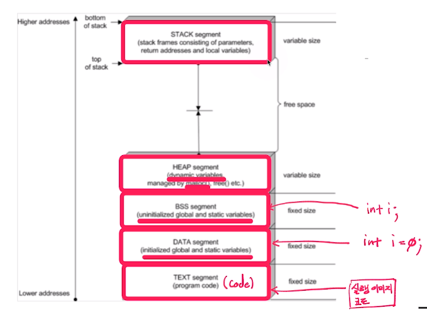
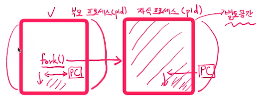
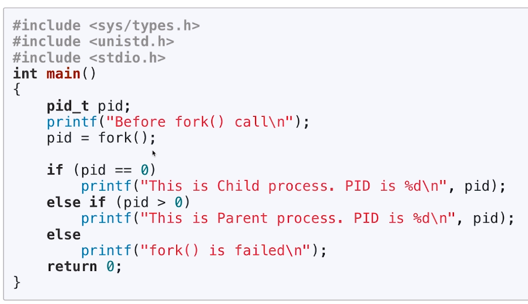
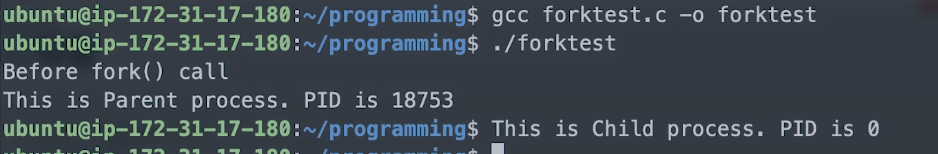

[toc]

# 프로세스 생성 (fork)

## :heavy_check_mark: 프로세스 기본 구조

- TEXT(CODE), DATA&BSS -> 컴파일시 결정

- HEAP, STACK -> 코드가 실행되며 결정

  

  


<hr>
## :heavy_check_mark: 프로세스 생성

- 기본 프로세스 생성 과정
  - TEXT, DATA, BSS, HEAP, STACK의 공간 생성
  - 프로세스 이미지를 해당 공간에 업로드하고, 실행 시작
- 프로세스 계층: 다른 프로세스는 또 다른 프로세스로부터 생성
  - 부모, 자식 프로세스


<hr>
## :heavy_check_mark: `fork()`, `exec()` 시스템 콜

### `fork()` 시스템 콜

- 새로운 프로세스 공간을 별도로 만들고
- `fork()` 시스템콜을 호출한 프로세스(부모) **공간을 모두 복사**
  - 별도의 프로세스 공간을 만들고, 부모 프로세스 공간의 데이터를 그대로 복사




<br>


### `exec()` 시스템 콜

- `exec()` 시스템콜을 호출한 현재 프로세스 공간의 TEXT, DATA, BSS영역을 새로운 프로세스의 이미지로 **덮어씌움**
  - 별도의 프로세스 공간을 만들지 않음


<hr>

## :heavy_check_mark: `fork()`

```
헤더 파일: <unistd.h>
함수 원형: pid_t fork(void); // 인자 X
```






<hr>

## :heavy_check_mark: 정리

- `pid = fork()`가 실행되면 부모 프로세스와 동일한 자식 프로세스가 별도 메모리 공간에 생성
- 자식 프로세스는 pid가 0으로 리턴, 부모 프로세스는 실제 pid 리턴
- 두 프로세스의 변수 및 PC(Program Count) 값은 동일
- 새로운 프로세스 공간을 별도로 만들고
  - `fork()` 시스템 콜을 호출한 프로세스(부모)공간을 모두 복사한 후
  - `fork()`시스템 콜 이후 코드부터 실행