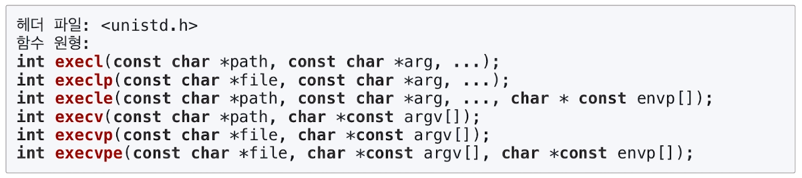
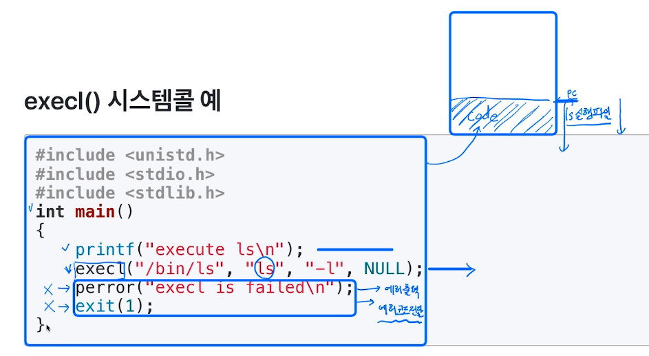
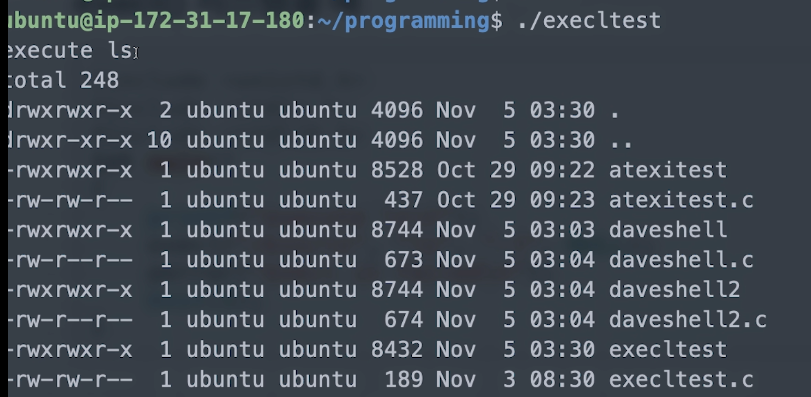
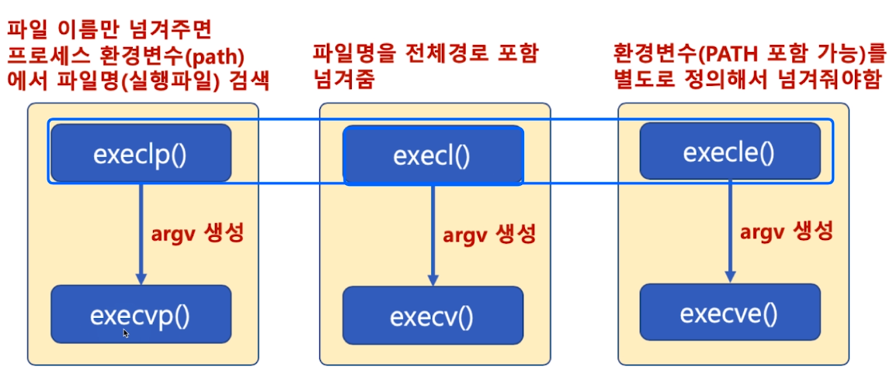
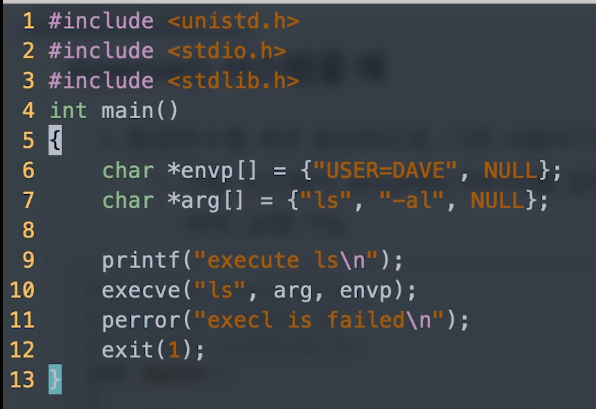
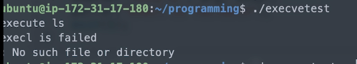

[toc]

# 프로세스 생성 exec()

## :heavy_check_mark: `exec()` 시스템콜 family




<hr>
## :heavy_check_mark: `execl()` 시스템 콜

`execl("디렉토리와 파일 이름이 합친 전체 이름", "명령어 인수 리스트", "끝은 NULL로 끝나야함");`



> `execl()` 다음 라인이 실행되면 그건 에러임 -> 기존 code를 덮어 씌우는거니까




<hr>
## :heavy_check_mark: `execl()`, `execlp()` 시스템콜

```c
execl("디렉토리와 파일 이름이 합친 전체 이름", "명령어 인수 리스트", "끝은 NULL로 끝나야함");
```

```c
// 파일 이름을 해당 프로세스를 실행한 프로세스의 환경변수(path)를 검색함
execp("파일 이름", "명령어 인수 리스트", "끝은 NULL로 끝나야함");
```

> 명령어 인수 리스트 example
>
> - `argv[0] = "ls"`
> - `argv[1] = "-al"`
>
> ```shell
> $ ls -al
> ```
>
> ```c
> execl("/bin/ls", "ls", "-al", NULL);
> ```
>
> ```c
> execl("ls", "ls", "-al", NULL);
> ```


<hr>
## :heavy_check_mark: `execle()` 시스템 콜

```c
// 환경 변수를 지정하고자 할 때
char *envp[] = {"USER=dave", "PATH=/bin", (char *)0};
execle("ls", "ls", "-al", NULL, envp)
```


<hr>


## :heavy_check_mark: `execv()`, `execvp()`, `execve()` 시스템 콜

```c
// 인수 리스트를 내용으로 하는 문자열 배열
char *arg[] = {"ls", "-al", NULL};
execv("/bin/ls", arg)
```

```c
// 파일 이름을 해당 프로세스를 실행한 프로세스의 환경변수(path)를 검색함
// 인수 리스트를 내용으로 하는 문자열 배열
char *arg[] = {"ls", "-al", NULL};
execvp("/ls", arg)
```

```c
// 환경 변수를 지정하고자 할 때
char *envp[] = {"USER=dave", "PATH=/bin", (char *)0};

// 인수 리스트를 내용으로 하는 문자열 배열
char *arg[] = {"ls", "-al", NULL};
execve("ls", arg, envp)
```




<hr>

## :heavy_check_mark: `execve()` 시스템 콜

- 만약 `PATH` 설정을 안하면 error






<hr>

## :heavy_check_mark: `execl()` 시스템 콜

- `execl()` 시스템콜을 실행시킨 프로세스 공간에 새로운 프로세스 이미지를 덮어씌우고, 새로운 프로세스를 실행
- `perror()` 함수가 호출된다는 의미는 새로운 프로세스 이미지로 덮어씌우는 작업이 실행되지 못했다는 의미
  - 즉 `execl()` 시스템 콜 실행 실패


