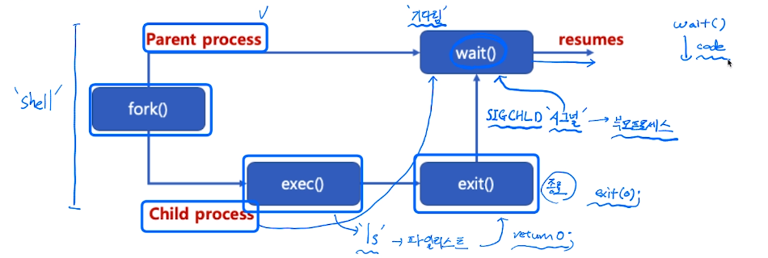
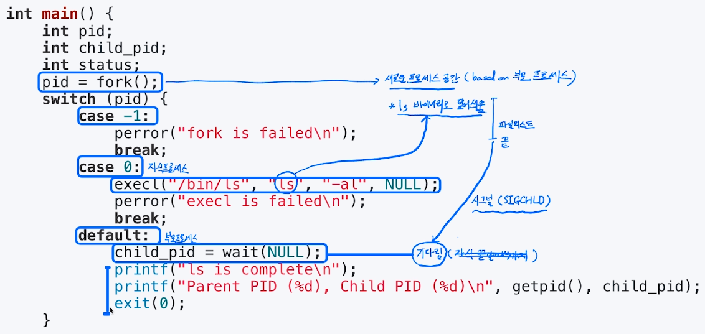
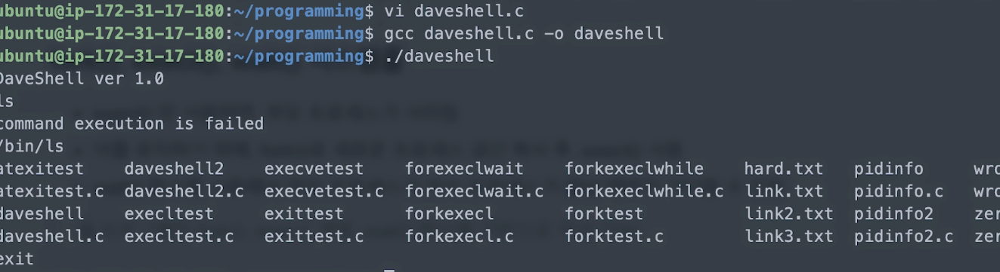

[toc]

# 프로세스 생성(wait)와 쉘 만들기

## :heavy_check_mark: `wait()` 시스템 콜

- `wait()`함수를 사용하면, `fork()` 함수 호출시, 자식 프로세스가 종료할 때까지, 부모 프로세스가 기다림
- 자식 프로세스와 부모 프로세스의 동기화, 부모 프로세스가 자식 프로세스보다 먼저 죽는 경우를 막기 위해 사용 (고아 프로세스)




<hr>

## :heavy_check_mark: `fork()`, `execl()`, `wait()` 시스템 콜



- `execl()` 만 사용하면, 부모 프로세스가 사라짐
- 이를 유지하기 위해, `fork()`로 새로운 프로세스 공간 복사 후, `execl()`사용
- `wait()`함수를 사용해서 부모 프로세스가 자식 프로세스가 끝날 때까지 기다릴 수 있음

> 쉘 프로그램은 fork(), exec() 계열, wait() 함수를 기반으로 작성 가능


<hr>
## :heavy_check_mark: Shell 만들기 예제

```c
#include <unistd.h>
#include <stdlib.h>
#include <stdio.h>
#include <string.h>
#include <sys/wait.h>
#include <sys/types.h>
#define MAXLINE 64

int main(int argc, char **argv) {
    char buf[MAXLINE];
    pid_t pid;
    printf("DaveShell ver 1.0\n");
    while(1)
    {
        memset(buf, 0x00, MAXLINE);
        fgets(buf, MAXLINE - 1, stdin); // 표준 입출력 (standard input stream), 63 byte를 buf로 가져옴
        // char *fgets (char *string, int n, FILE *stream)
        if(strncmp(buf, "exit\n", 5) == 0) {
            break;
        }
        buf[strlen(buf) - 1] = 0x00; // 키보드 입력 엔터 제거
        
        pid = fork();
        if(pid==0) {
            if(execl(buf, buf, NULL) == -1) {
                printf("command execution is failed\n");
                exit(0);
            }
        }
        if (pid > 0) {
            wait(NULL);
        }
    }
    return 0;
}

```



