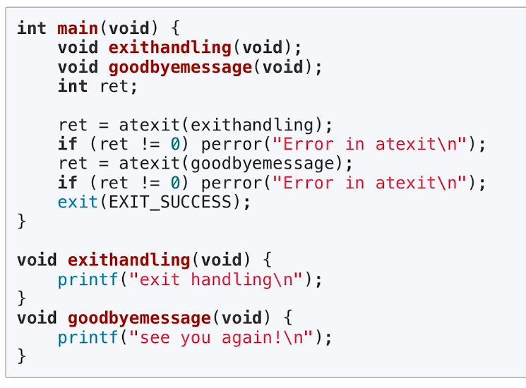
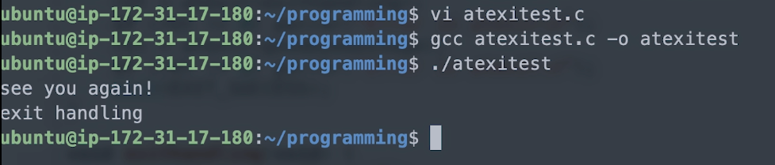

[toc]

# 프로세스 종료 (exit)

## :heavy_check_mark: `exit()` 시스템 콜 = 프로세스 종료

```c
#include <stdlib.h>
void exit(int status); // 인자: 프로세스 종료 상태 번호
```

- main 함수의 `return 0;`과 `exit(0);`의 차이?

  - `exit()`함수: 즉시 프로세스를 종료함 (`exit()` 함수 다음에 있는 코드는 실행되지 않음)
  - `return 0`: 단지 `main()`이라는 함수를 종료함
    - 단, `main()`에서 return시, C 언어 실행 파일에 기본으로 포함된 `_start()` 함수를 호출하게 되고, 해당 함수는 결국 `exit()`함수를 호출함

  - **결과**: `main()`함수에서 `return 0;`은 `exit(0);` 호출과 큰 차이가 없다~


<hr>
## :heavy_check_mark: Status

- 부모 프로세스는 status & 0377 계산 값으로 자식 프로세스 종료 상태 확인 가능

```c
exit(EXIT_SUCCESS); // 0
exit(EXIT_FAILURE); // 1
```


<hr>
## :heavy_check_mark: 주요 동작

- `atexit()`에 등록된 함수 실행

  > - 프로세스 종료시 실행될 함수를 등록하기 위해 사용
  > - 등록된 함수를 등록된 역순서대로 실행

- 열려있는 모든 입출력 스트림 버퍼 삭제 (stdin, stdout, stderr)

- 프로세스가 오픈한 파일을 모두 닫음

- `tmpfile()` 함수를 통해 생성한 임시 파일 삭제

  - `tmpfile()` - 임시 파일을 wb+(쓸 수 있는 이진파일 형태) 모드로 오픈 가능

    ```c
    #include <stdio.h>
    FILE *tmpfile(void);
    ```

    


<hr>
## :heavy_check_mark: `atexit` 예제






