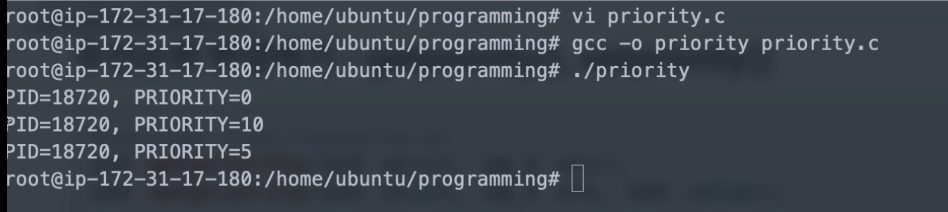

[toc]

# 프로세스 스케쥴링 관련 (참고)

## :heavy_check_mark: 우선 순위 기반 스케쥴러

- Priority-Based 스케쥴러
- 정적 우선순위
  - 프로세스마다 우선순위를 미리 지정
- 동적 우선순위
  - 스케쥴러가 상황에 따라 우선순위를 동적으로 변경


## :heavy_check_mark: 우선순위 변경하기


### `nice()`

- 프로세스 중 사실상 root가 소유한 프로세스만, 우선순위를 높일 수 있음
  - 다른 프로세스는 우선순위를 낮출 수 만 있음
  - 스케쥴링 방식에 따라 우선순위가 적용될 수도 있고, 안될 수도 있음

```c
# include <unistd.h>
int nice (int inc);
```

<br>

### `getpriority()`, `setpriority()`

```c
# include <sys/resource.h>
int getpriority(int which, id_t who);
int setpriority(int which, id_t who, int value);
// int value : 우선순위 값
```

- `which`: 프로세스(PRIO_PROCESS), 프로세스 그룹(PRIO_PGRP), 사용자(PRIO_USER) 별로 우선순위를 가져올 수 있음

ex) priority.c (root 소유로 실행)

- 이외에 스케쥴링 조작 시스템콜 기본 제공 (POSIX 기반), 스케쥴링 알고리즘 변경으로 사용은 어려움

```c
# include <sys/resource.h>
# include <stdio.h>
# include <sys/types.h>
# include <unistd.h>

int main () {
    int which = PRIO_PROCESS;
    id_t pid;
    int ret;

    pid = getpid();
    ret = getpriority(which, 0); // 현재 프로세스의 우선순위
    printf("PID=%d, PRIORITY=%d\n", pid, ret);

    ret = nice(10); // 현재 프로세스의 우선순위 값 10으로 설정
    ret = getpriority(which, 0); 
    printf("PID=%d, PRIORITY=%d\n", pid, ret);

    ret = setpriority(which, 0, 5); // 현재 프로세스 우선순위 5로 설정
    ret = getpriority(which, 0);
    printf("PID=%d, PRIORITY=%d\n", pid, ret);

    return 0;
}
```



