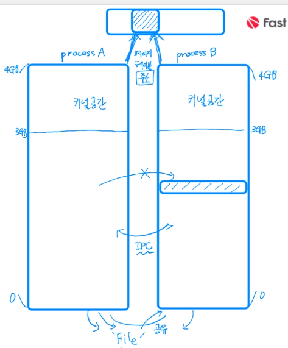
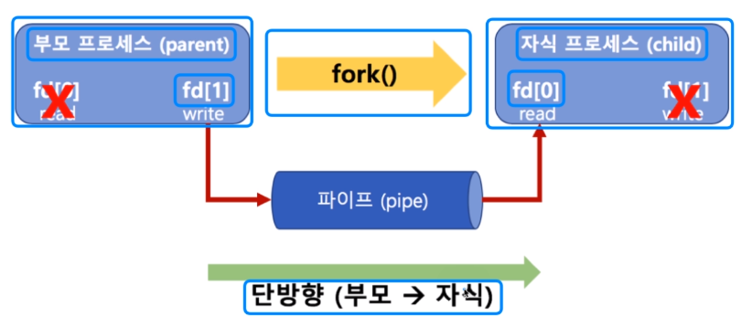
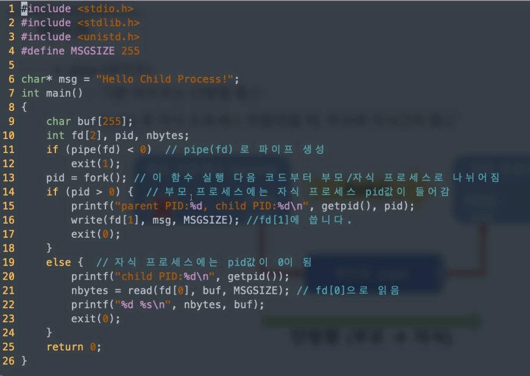
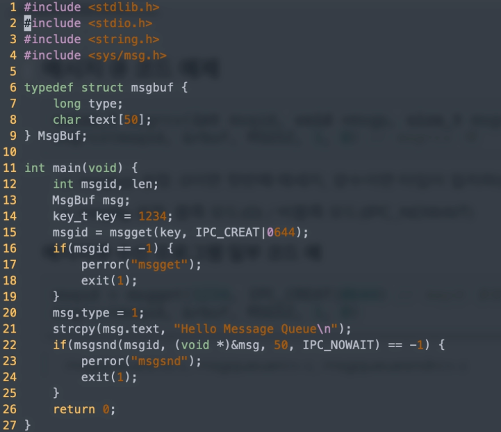
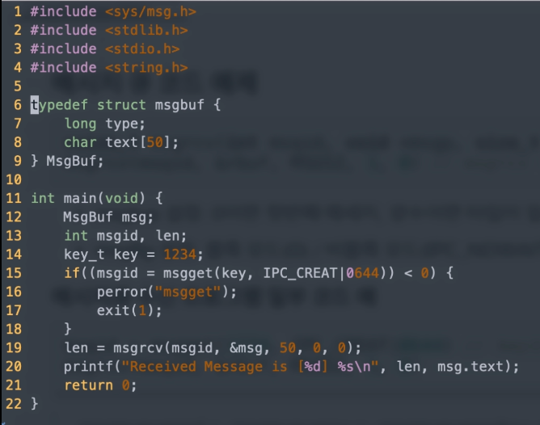
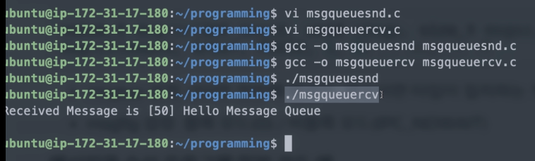

[toc]

# IPC기법 실습 01

## :heavy_check_mark: 다양한 IPC 기법

- IPC - InterProcess Communication
  - file사용
  - Message Queue
  - Shared Memory
  - Pipe
  - Signal
  - Semaphore
  - Socket




<hr>
## :heavy_check_mark: 파이프 (Pipe)

- 기본 파이프는 단방향 통신
- `fork()`로 자식 프로세스를 만들었을 때, 부모와 자식간의 통신



### 코드예제



```
11: pipe 생성 (커널영역에), return이 -1이면 에러임

16: fd[1]에 msg를 최대 255로 데이터를 씀

21: fd[0]으로 읽음
```


<hr>
## :heavy_check_mark: 메시지 큐 (message queue)

- FIFO 정책으로 데이터 전송

- 부모 자식일 필요 X

<br>

```
msqid = msgget(key, msgflg) // key는 1234, msgflg는 옵션
```

- msgflg 설정
  - IPC_CREAT: 새로운 키면 식별자를 새로 생성, IPC_CREAT|접근권한
  - ex) IPC_CREAT|0644 -> re-r--r--

```
msgsnd(msqid, &sbuf, buf_length, IPC_NOWAIT)
```

- msgflg 설정: 블록모드(0), 비블록모드(IPC_NOWAIT)


**메세지큐 전송 프로그램 일부 코드 예**

발신

```
msqid = msgget(1234, IPC_CREAT|0644)
msgsnd(msqid, &sbuf, buf_length, IPC_NOWAIT)
```

수신

- msgtyp 설정: 0이면 첫번째 메세지, 양수면 타입이 일치하는 첫번째 메세지
- msgflg 설정: 블록모드(0), 비블록모드(IPC_NOWAIT)

```
ssize_t msgrcv(int msqid, void *msgp, size_t msgsz, long msgtyp, int msgflg)
msgrcv(msqid, &rbuf, MSGSZ, 1, 0)
```

```
msqid = msgget(1234, IPC_CREAT|0644)
msgrcv(msqid, &rbuf, MSGSZ, 1, 0)
```

<br>

### 코드예제

**msgqueuesnd.c**



**msgqueuercv.c**






<hr>

## :heavy_check_mark: `ftok()`


- unique한 키 생성을 위한 함수
- path 경로명의 inode값과 숫자값(id)를 기반으로 키 생성
- 경로 삭제 후 재 생성시 inode 값이 달라지므로, 이전과를 다른 키 값이 리턴

```c
#include <sys/ipc.h>
key_t ftok(const char *path, int id);

// 예
key = ftok("keyfile", 1);
id = msgget(ket, IPC_CREAT|0604);
```


