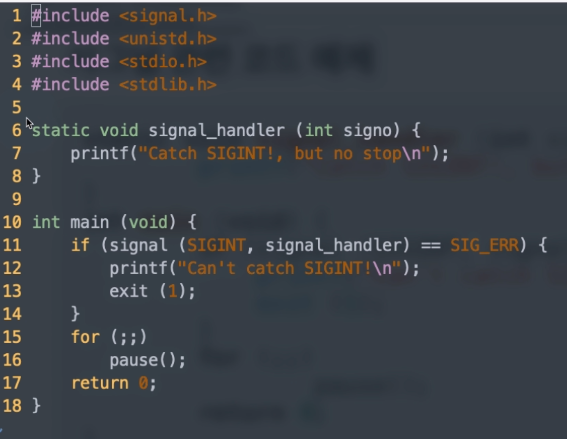
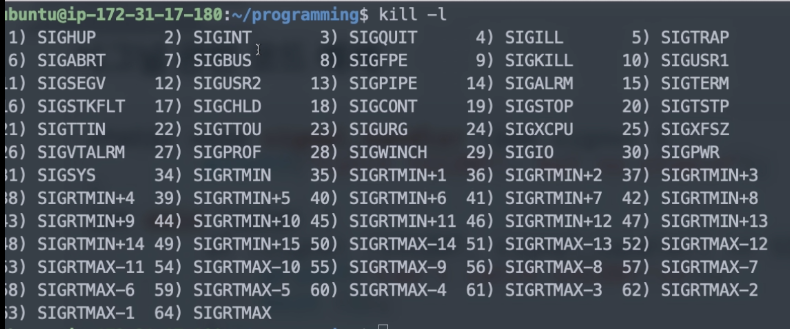
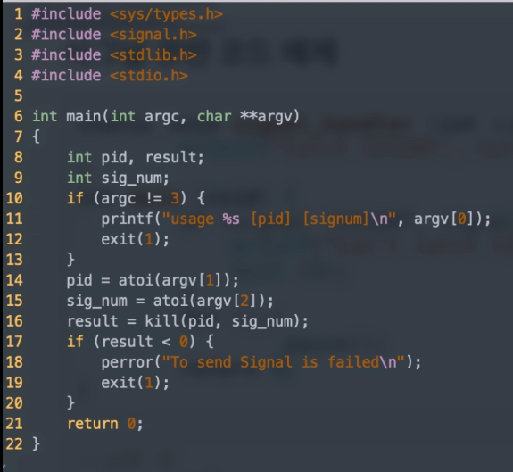
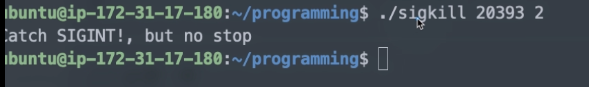
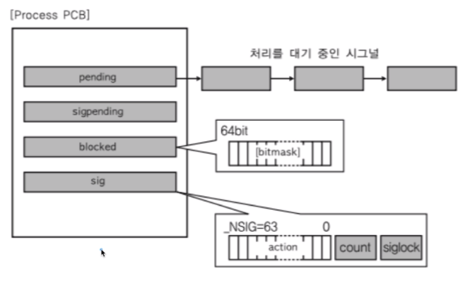

[toc]

# 시그널 동작 메커니즘 - 사용법 이해

## :heavy_check_mark: 시그널 (signal)

- 유닉스에서 30년 이상 사용된 전통적인 기법

- IPC 기법중에 하나로도 쓸 수 있다

  - 커널 또는 프로세스에서 다른 프로세스에 어떤 이벤트가 발생되었는지 알려주는 기법

    > 시그널 예) Ctrl + C 눌러서 프로세스 종료 


<hr>

## :heavy_check_mark: 주요 시그널


- 시그널 종류와 각 시그널에 따른 기본 동작이 미리 정해져 있음
  - SIGKILL: 프로세스 죽이기  (슈퍼 관리자가 사용)
  - SIGALARM: 알람 발생
  - SIGSTP: 프로세스 멈추기 (ctrl+z)
  - SIGCONT: 멈춘 프로세스 실행
  - SIGINT: 프로세스에 인터럽트 보내서 프로세스 죽이기 (ctrl+c)
  - SIGSEGV: 프로세스가 다른 메모리 영역 침범했음

시그널 종류 확인: `kill -l`


<hr>

## :heavy_check_mark: 시그널 동작


- 프로그램에서 특정 시그널의 기본 동작 대신 다른 동작을 하도록 구현 가능
- 각 프로세스에서 시그널 처리에 대해 다음과 같은 동작 설정 가능
  - 시그널 무시
  - 시그널 블록(블록을 푸는 순간, 해당 프로세스에서 시그널 처리)
  - 프로그램 안에 등록된 시그널 핸들러로 재정의한 특정 동작 수행
  - 등록된 시그널 핸들러가 없다면, 커널에서 기본 동작 수행

<br>

### 시그널 보내기

> 시그널 종류, 번호 확인하기 : `kill -l`

```c
#include <sys/types.h>
#include <signal.h>

int kill(pid_t pid, int sig);
// pid: 프로세스 번호
// sig: 시그널 번호
```

<br>

### 받은 시그널에 따른 동작 정의

```c
#include <signal.h>
void (*signal(int signum, void (*handler) (int)))(int);

// ex1
// SIG_IGN - SIGINT 수신 시 시그널 무시
// SIG_DFL - SIGINT 수신 시 디폴트 동작
signal(SIGINT, SIG_IGN);

// ex2: SIGINT 수신 시, signal_handler 함수 호출 (재정의)
signal(SIGINT, (void *)signal_handler);
```


<hr>

## :heavy_check_mark: 시그널 재정의 코드 예제 


### sigloop.c



> `kill -l`로 SIGINT의 번호 확인하면  -> 2번임
>
> 

### sigkill.c




```shell
./sigloop &    // 백그라운드 실행
ps
./sigkill 20393 2
```





<hr>

## :heavy_check_mark: 시그널과 프로세스 (LINUX)

- PCB에 해당 프로세스가 블록 또는 처리해야하는 시그널 관련 정보 관리
- 커널 모드에서 사용자 모드 전환시 시그널 정보 확인해서 해당 처리




