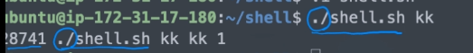
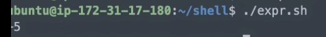

[toc]

# 쉘 스크립트 - 조건문

## :heavy_check_mark: 사전에 정의된 지역변수

```shell
$$ 		# 쉘 프로세스 번호
$0 		# 쉘 스크립트 이름
$1 ~ $9 # 명령줄 인수
$* 		# 모든 명령줄 인수 리스트
$# 		# 인수의 개수
$? 		# 최근 실행한 명령어의 종료 값
# 0 (성공), 1 ~ 125 (에러)
# 126 (파일이 실행가능하지 않음)
# 128 ~ 255 (시그널 발생)
```


### 예제

```shell
#!/bin/bash

echo $$ $0 $1 $* $#
# pid, 쉘 이름, 1st 인자, 이름 뺀 나머지 인자 리스트, 이름 뺸 나머지 인자 개수
```




## :heavy_check_mark: 연산자

- expr: 숫자 계산
- expr를 사용하는 경우 역 작은 따옴표 (`)를 사용해야함
- 연산자 *와 괄호 () 앞에는 역슬래시(`\`)와 같이 사용해야함
- 연산자와 숫자, 변수, 기호 사이에는 space를 넣어야함!

```shell
num=`expr \( 15 \* 2 \) / 8 - 8`
echo $num
```




## :heavy_check_mark: 조건문

- 기본 if 구문
  - 명령문을 꼭 탭으로 띄워야 하는건 아님! (`then`과 `fi` 안에만 들어가 있으면 됨)

```shell
if [ 조건 ]
then
	명령문
fi
```

**예제**

```shell
#!/bin/bash

if [ $1 != $2 ]
then
	echo "different values"
	exit
fi
```


## :heavy_check_mark: 조건

- 조건 작성이 다른 프로그래밍 언어와 달리 가독성이 현저히 떨어짐
- 문자비교

```shell
문자1 == 문자2 # 일치
문자1 != 문자2 # 불일치
-z 문자       # 문자가 null 이면 참	
-n 문자		# 문자가 null 이 아니면 참
```


## :heavy_check_mark: 수치비교

```shell
값1 -eq 값2		# 값이 같음 equal
값1 -ne 값2		# 값이 같지 않음 not equal
값1 -lt 값2		# 값1이 값2보다 작음 less than
값1 -le 값2		# 값1이 값2보다 작거나 같음 less or equal
값1 -gt 값2		# 값1이 값2보다 큼 greater than
값1 -ge 값2		# 값1이 값2보다 크거나 같음 greater or equal
```

**예제**

```shell
#!/bin/bash

if [ $1 -gt $2 ]
then
	echo "$1 is higher than $2"
	exit
fi
```


