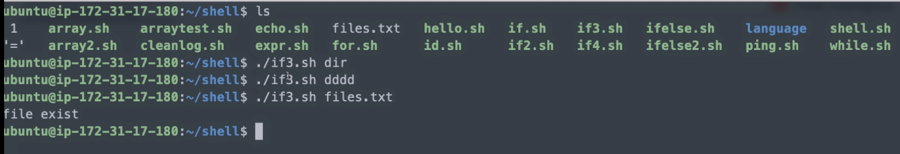
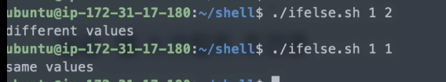
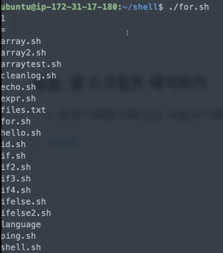

[toc]

# 쉘 스크립트 - 반복문과 실제 예제

## :heavy_check_mark: 파일검사

```shell
-e 파일명 # 파일이 존재하면 참
-d 파일명 # 파일이 디렉토리면 참
-h 파일명 # 심볼릭 링크 파일이면 참
-f 파일명 # 파일이 일반 파일이면 참
-r 파일명 # 파일이 읽기 가능이면 참
-s 파일명 # 파일 크기가 0이 아니면 참
-u 파일명 # 파일이 set-user-id가 설정되면 참
-w 파일명 # 파일이 쓰기 가능 상태이면 참
-x 파일명 # 파일이 실행 가능 상태이면 참
```

**예제**

```shell
#!/bin/bash

if [ -e $1 ]
then 
	echo "file exist"
fi
```




## :heavy_check_mark: 논리 연산

```shell
조건1 -a 조건2	# AND
조건1 -o 조건2	# OR
조건1 && 조건2	# 양쪽 다 성립
조건1 || 조건2	# 한쪽 또는 양쪽 다 성립
!조건		     # 조건이 성립하지 않음
true		  # 조건이 언제나 성립
false 		  # 조건이 언제나 성립하지 않음
```


## :heavy_check_mark: 조건문 문법 `if/else`

```
if [ 조건 ]
then
	명령문
else 
	명령문
fi
```


**예제**

```shell
#!/bin/bash

if [ $1 -eq $2 ]
then 
	echo "same values"
else
	echo "diffrent values"
fi
```




## :heavy_check_mark: 실습: 쉘 스크립트 해석

- 명령 해석
  - ping -c 1 192.168.0.1 1> /dev/null
    - 0: 표준입력, 1: 표준출력, 2: 표준에러
  - 1> /dev/null: 표준 출력 내용은 버려라 (출력하지 말아라 - `/dev/null` null device)
  - `-c 1`: 1번만 체크해봐라 (확인 요청을 한번만 해)


**예제**

```shell
#!/bin/bash
ping -c 1 192.168.0.1 1> /dev/null
if [ $? == 0 ]  # $?: 결과값, 0 이면 성공
then 
	echo "게이트웨이 핑 성공!"
else
	echo "게이트웨이 핑 실패!"
fi
```


## :heavy_check_mark: 조건문 한줄에 작성하기 

- if 구문 한라인으로 작성하는 법

  ```
  if [ 조건 ]; then 명령문; fi
  ```

  ```shell
  if [ -z $1 ]; then echo "Insert arguments"; fi
  ```

  - if [ 뒤와, ] 앞에는 반드시 공백이 있어야함!
  - []에서 &&, ||, <, > 연산자들이 에러가 나는 경우는 [[]]를 사용하면 정상 작동하는 경우가 있음


## :heavy_check_mark: 반복문 (for)

```
for 변수 in 변수값1 변수값2 ...
do
	명령문
done
```

**예제**

```shell
#!/bin/bash
for database in $(ls)
do 
	echo $database
done
```

```shell
#!/bin/bash
for database in $(ls); do
	echo $database
done
```

```shell
#!/bin/bash
for database in $(ls); do echo $database; done
```




## :heavy_check_mark: 반복문 (while)

```
while [ 조건문 ]
do
	명령문
done
```


## :heavy_check_mark: 예제

**현재 디렉토리에 있는 파일과 디렉토리 출력**

```shell
#!/bin/bash
lists=$(ls)                 # 현재 디렉토리 ls
num=${#lists[@]}            # list변수의 개수
index=0
while [ $num -ge 0 ]        # 크거나 같으면
do
	echo ${lists[$index]}   # 해당 인덱스의 값 출력
	index=`expr $index + 1` # index += 1
	num=`expr $num - 1`     # list 값 줄이기
done
```

