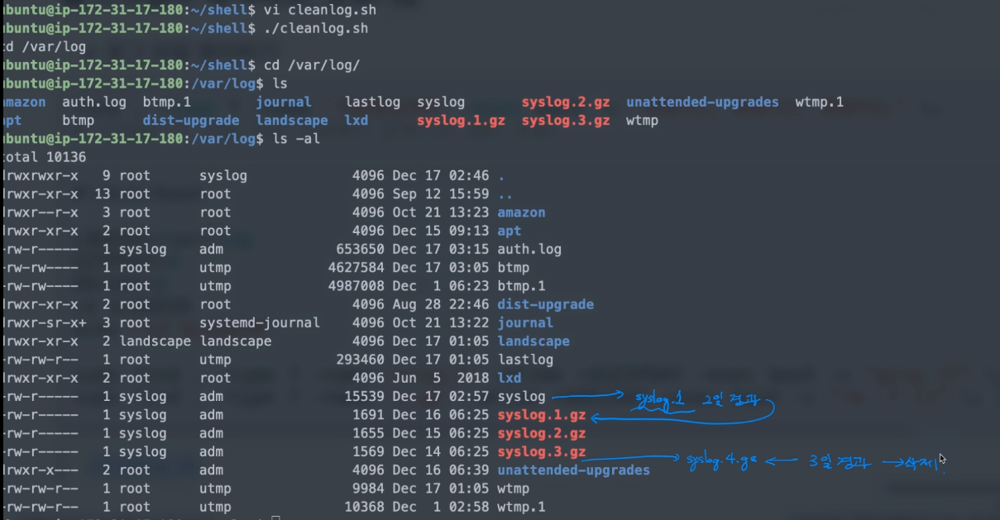

[toc]

# 쉘 스크립트 예제

## :heavy_check_mark: 백업예제

```shell
#!/bin/bash

if [ -z $1 ] || [ -z $2 ]; then  # 두가지 인자 중 하나라도 없으면 
	echo usage: $0 sourcedir targetdir
else 
	SRCDIR=$1
	DSTDIR=$2
	BACKUPFILE=backup.$(date +%y%m%d%H%M%S).tar.gz # 백업 파일 형식
	if [ -d $DSTDIR ]; then
		tar -cvzf $DSTDIR/$BACKUPFILE $SRCDIR  # 압축
	else
		mkdir $DSTDIR
		tar -cvzf $DSTDIR/$BACKUPFILE $SRCDIR 
	fi
fi
```

#### 압축 명령 `tar`

```
주요옵션
x: 묶음을 해제
c: 파일을 묶음
v: 묶음/해제 과정을 화면에 표시
z: gunzip을 사용
f: 파일 이름을 지정

압축시 주로 사용
tar -cvzf [압축된 파일 이름] [압축할 파일이나 폴더명]

압축 해제시 주로 사용
tar -xvzf [압축 해제할 압축 아카이브 이름]
```


## :heavy_check_mark: 로그파일 정리 예제

```shell
find . -type f -name '파일명검색어' -exec bash -c "명령어1; 명령어2; 명령어3;" \;
# -type f: 파일 타입 지정해서 검색함 (f는 일반파일)
# -exec bash -c "쉘 명령어 실행" 
```

```shell
#!/bin/bash

LOGDIR=/var/log
GZIPDAY=1
DELDAT=2
cd $LOGDIR
echo "cd $LOGDIR"

sudo find . -type f -name '*log.?' -mtime +$GZIPDAY -exec bash -c "gzip {}" \; 2> /dev/null
# 파일들을 하나씩 가져와서 압축
# mtime + (현재 ~ x일이상 경과한)
sudo find . -type f -name '*.gz' -mtime +$DELDAY -exec bash -c "rm -f {}" \; 2> /dev/null
```




