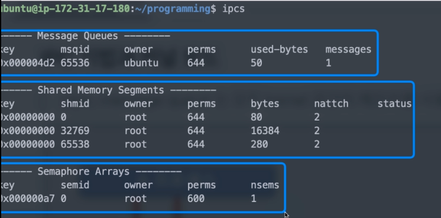
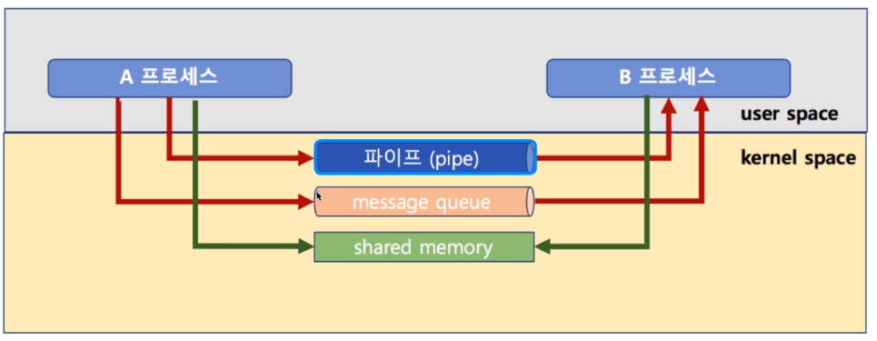
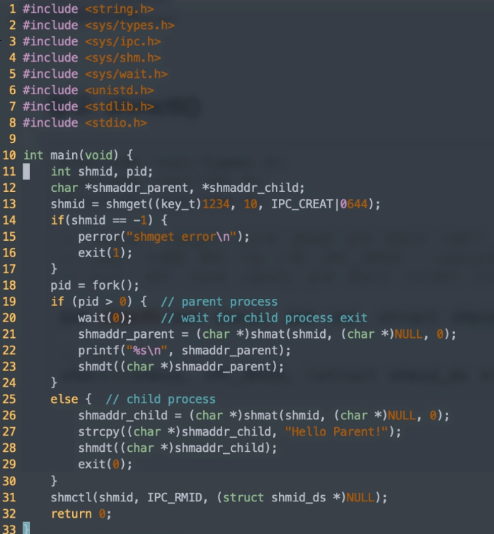

[toc]

# IPC 기법 - 실습 02

## :heavy_check_mark: `ipcs`

- 현재 커널 공간

  


<hr>

## :heavy_check_mark: 공유메모리 (shared memory)


- 노골적으로 kernel space에 메모리 공간을 만들고, 해당 공간을 변수처럼 쓰는 방식
- message queue 처럼 FIFO 방식이 아니라, 해당 메모리 주소를 마치 변수처럼 접근하는 방식
- 공유 메모리 key를 가지고, 여러 프로세스가 접근 가능




### 예제

#### 1. 공유 메모리 생성

```c
#include <sys/types.h>
#include <sys/ipc.h>
#include <sys/shm.h>

// key: 임의 숫자 또는 ftok 함수로 생성한 키 값
// size: 공유 메모리 크기
// shmflg: 공유 메모리 속성
// 리턴 값: 공유 메모리 식별자 리턴
int shmget(key_t key, size_t size, int shmflg);

// 예
shmid = shmget((key_t) 1234, SIZE, IPC_CREAT|0666);
```


#### 2. 공유 메모리 연결

```c
#include <sys/types.h>
#include <sys/shm.h>

// shmid: shmget 함수로 생성한 공유 메모리 식별자
// shmaddr: 공유 메모리 연결 주소 (보통 (char*)NULL으로 설정하면, 알아서 적절한 주소로 연결)
// shmflg: 공유 메모리의 읽기/쓰기 권한 (0이면 읽기/쓰기, SHM_RDONLY면 읽기만 ..)
// 리턴 값: 성공시 연결된 공유 메모리의 시작 주소를 리턴
void *shmat(int shmid, const void *shmaddr, int shmflg);

// 예
shmaddr = (char *)shmat(shmid, (char *) NULL, 0);
```


#### 3. 공유 메모리 해제

```c
#include <sys/types.h>
#include <sys/shm.h>

int shmdt(char *shmaddr);
```


#### 4. 공유 메모리 읽기

> 포인터 변수처럼 사용하면 됨

```c
printf("%s\n", (char *)shmaddr)
```


#### 5. 공유 메모리 쓰기

```c
strcpy((char *) shmaddr, "Linux Programming");
```


#### 6. `shmctl()` 삭제

```c
#include <sys/types.h>
#include <sys/ipc.h>
#include <sys/shm.h>

// shmid: shmget 함수로 생성한 공유 메모리 식별자
// cmd: 수행할 제어 기능 (ex. IPC_RMID - shmid로 지정한 공유 메모리 제거)
// buf: 제어 기능에 사용되는 공유 메모리 구조체의 구조
int shmctl(int shmid, int cmd, struct shmid_ds *buf);

// 예
shmctl(shmid, IPC_RMID, (struct shmid_ds *)NULL);
```


## :heavy_check_mark: 공유 메모리 코드 예제




```
shmdt  -> 공유 메모리의 해당 `변수` 해제
shmctl -> 공유 메모리를 아예 삭제!
```


