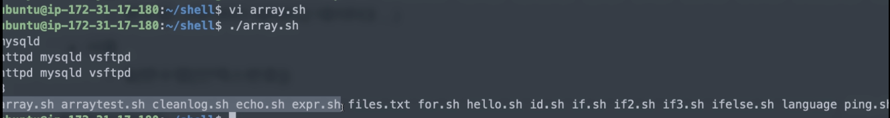

[toc]

# 쉘 스크립트

- 쉘을 사용해서 프로그래밍 할 수 있음
- 서버 작업 자동화 및 운영(DevOps)을 위해 기본적으로 익혀둘 필요가 있음
- 쉘 명령어를 기본으로 하되, 몇가지 문법이 추가된 형태
- 시스템 프로그래밍에서 꼭 익히는 내용 중 하나


## :heavy_check_mark: 기본 문법

- 쉘 스크립트는 파일로 작성 후, 파일을 실행
- 파일의 가장 위의 첫 라인은 `#!/bin/bash`로 시작
- 쉘 스크립트 파일은 실행 권한을 가지고 있어야함
- 일반적으로 `파일이름.sh` 형태로 저장


## :heavy_check_mark: 예제

- bash 쉘에서 제공하는 echo 함수를 이용해 "Hello bash!" 출력하는 스크립트 만들기

**hello.sh**

```
vi hello.sh
```

```shell
#!/bin/bash

echo 'Hello Bash!'
```

```
chmod 777 hello.sh
```


### 주석

`#`


### 변수

- 선언
  - `변수명=데이터`
  - 변수명=데이터 사이 띄어쓰기 XX!!
- 사용 
  - `$변수명`

```shell
#!/bin/bash

mysql_id='root'
mysql_directory='/etc/mysql'

echo $mysql_id
echo $mysql_directory
```


### 리스트 변수 (배열)

- 선언
  - 변수명=(데이터1 데이터2 데이터3 ...)
- 사용
  - ${변수명[index]}

```shell
#!/bin/bash

daemons=("httpd" "mysqld" "vsftpd")
echo ${daemons[1]}  # mysqld
echo ${daemons[@]}  # 배열 모든 데이터 출력
echo ${daemons[*]}  # 배열 모든 데이터 출력
echo ${#daemons[@]} # 배열 크기 출력

filelist=( $(ls) )  # 해당 쉘 스크립트 실행 디렉토리의 파일리스트를 배열로 filelist 리스트에 넣음
echo ${filelist[*]} # 모든 데이터 출력
```




