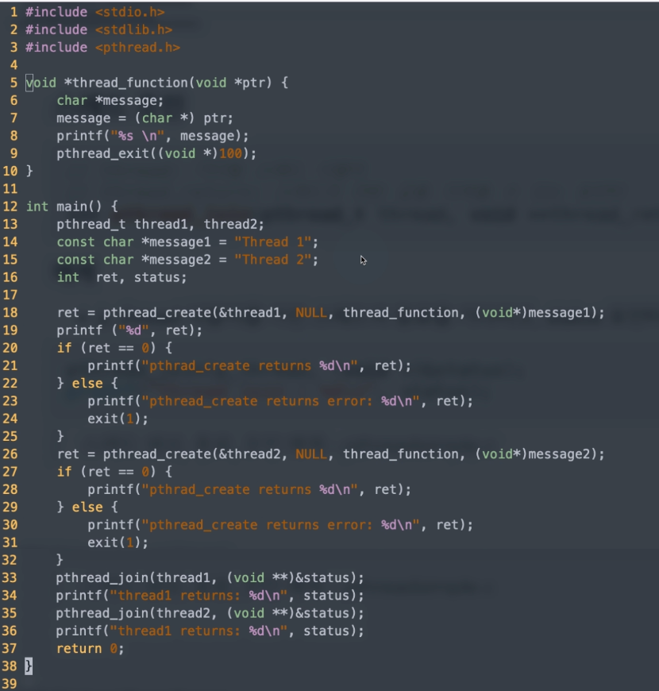
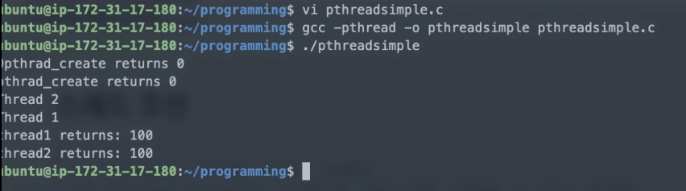

[toc]

# 스레드(Thread)

## :heavy_check_mark: Pthread ?

- thread 표준 API
  - POSIX 스레드 또는 Pthread(피-스레드)라고 부름
- Pthread API
  - 저수준 API로 100여개의 함수 제공
  - 복잡하지만 유닉스 시스템 핵심 스레딩 라이브러리
  - 다른 스레딩 솔루션도 결국 Pthread를 기반으로 구현되어 있음


### Pthread 라이브러리

- `<pthread.h>` 헤더 파일에 정의
- 모든 함수는 `pthread_`로 시작
- 크게 두 가지 그룹
  - 스레드 관리: 생성, 종료, 조인, 디태치 함수 등
  - 동기화: 뮤텍스 등 동기화 관련 함수

- 기본 라이브러리(glibc)와 분리된 libpthread라이브러리에 pthread가 구현되어 있어서 명시적으로 `pthread`옵션이 필요함

  ```
  gcc -pthread test.c -o test
  ```


## :heavy_check_mark: 사용법

### 스레드 생성

```c
// thread: 생성된 스레드 식별자
// attr: 스레드 특정 설정 (기본 NULL)
// start_routine: 스레드 함수 (스레드로 분기해서 실행할 함수)
// arg: 스레드 함수 인자
int pthread_create(pthread_t *thread, const pthread_attr_t *attr,
                  void *(*start_routine) (void *), void *arg);
```

```c
pthread_t thread1;
void *thread_function(void *ptr);

ret = pthread_create(&thread1, NULL, thread_function, (void*)message1);
// 1: &thread1: 포인터
// 2: 특정 설정이 필요한 경우
// 3: thread_function: 실행할 함수
// 4: (void*)message1: 함수 인자
```


### 스레드 종료

```c
// exit와 유사, NULL이나 0은 정상종료
void pthread_exit(void *retval);
```

```c
pthread_exit(NULL);
```


### 스레드 조인

```c
// thread: 기다릴 스레드 식별자
// thread_return: 스레드의 리턴 값을 가져올 수 있는 포인터
int pthread_join(pthread_t thread, void **thread_return);
```

- p_thread 식별자를 가진 스레드의 종료를 기다리고, status 포인터로 종료값을 가져옴

```c
pthread_join(p_thread, (void *)&status);
printf("thread join : %d\n", status);
```


## :heavy_check_mark: 코드예제






