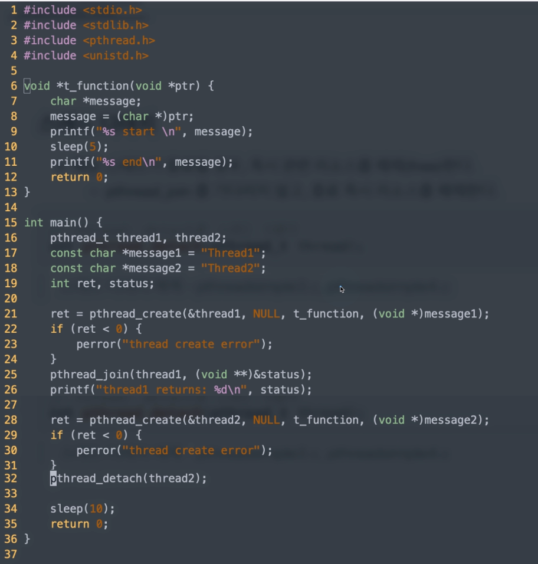
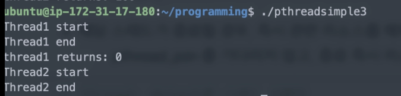
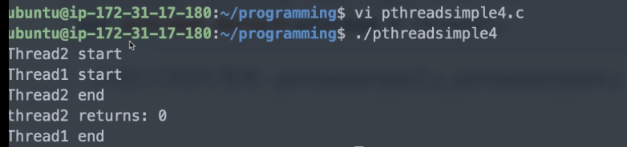
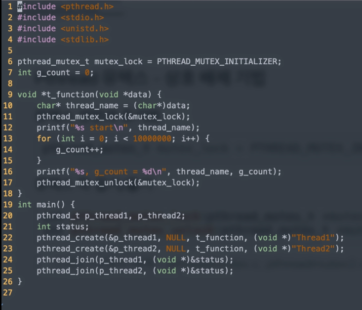
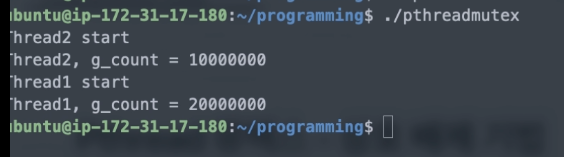
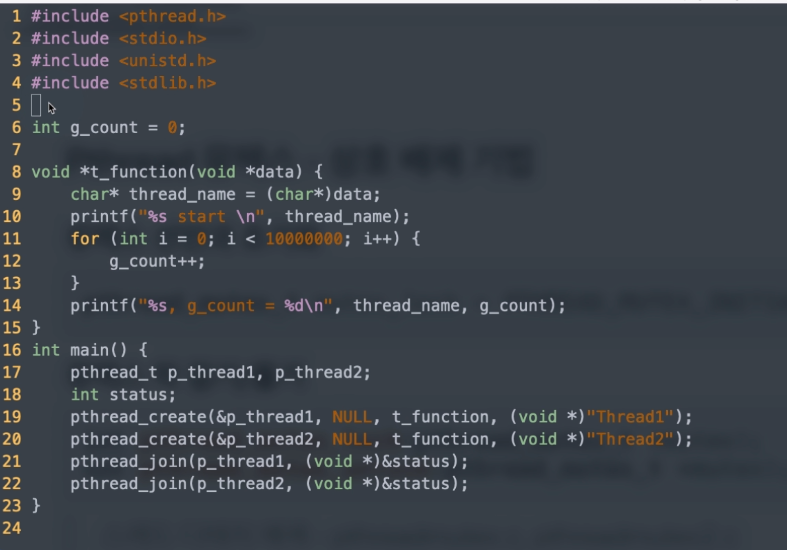
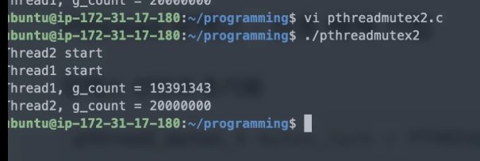

[toc]

# Thread 기본과 동기화

- `pthread_join`: 메인 스레드에서 해당 스레드가 종료되고, 종료 상태값을 가지고 추가 처리가 가능
- `pthread_detach`: 해당 스레드가 종료되면 즉시 해제함


## :heavy_check_mark: 스레드 디태치

- 해당 스레드가 종료될 경우, 즉시 관련 리소스를 해제(free)한다.
  - pthread_join를 기다리지 않고, 종료 즉시 리소스를 해제한다.

```c
// thread: detach할 스레드 식별자
int pthread_detach(pthread_t thread)
```


### 코드 예제






**pthreadsimple4**

> Thread1 - detach
>
> Thread2 - join




## :heavy_check_mark: Pthread 뮤텍스 - 상호 배제 기법

### 뮤텍스 선언과 초기화

```c
pthread_mutex_t mutex_lock = PTHREAD_MUTEX_INITIALIZER;
```


### 뮤텍스 락 걸기/풀기

```c
int pthread_mutex_lock(pthread_mutex_t *mutex);
int pthread_mutex_unlock(pthread_mutex_t *mutex);
```


### 코드예제






**mutex 제거 버전**



