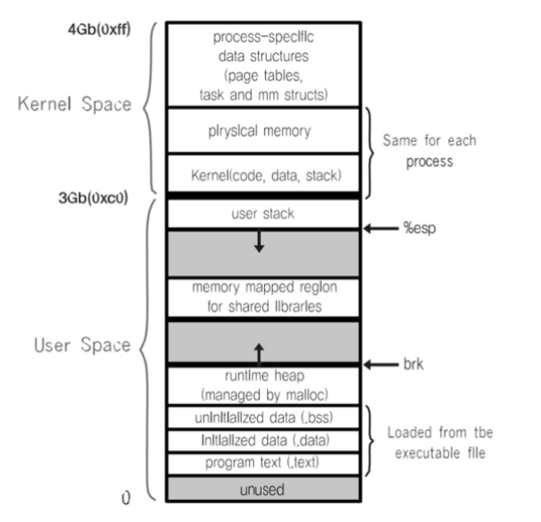

[toc]

# 시스템 프로그래밍 - 메모리와 mmap

## :heavy_check_mark: 동적 메모리 생성하기

- heap 영역에 생성 - `malloc` 함수




## :heavy_check_mark: 파일 처리 성능 개선 기법 - 메모리에 파일 매핑

```c
#include <sys/mman.h>
void *mmap(void *start, size_t length, int prot, int flags, int fd, off_t offset)
```

- [start~offset] ~ [start+offset_length] 만큼의 물리 메모리 공간을 mapping 할 것을 요청
- 보통 start: NULL 또는 0 사용, offset: mapping 되기 원하는 물리 메모리 주소로 지정
- prot: 보호 모드 설정
  - PROT_READ (읽기 가능) 
  - PROT_WRITE (쓰기 가능)
  - PROT_EXEC (실행가능)
  - PROT_NONE (접근 불가)
- flags: 메모리 주소 공간 설정
  - MAP_SHARED (다른 프로세스와 공유 가능)
  - MAP_PRIVATE (프로세스 내에서만 사용 가능)
  - MAP_FIXED (지정된 주소로 공간 지정)
- fd: device file에 대한 file descriptor


## :heavy_check_mark: 부제


## :heavy_check_mark: 부제


