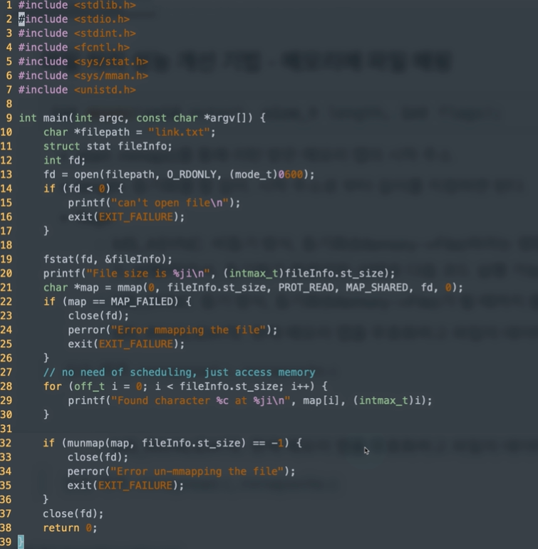

[TOC]

# mmap 예제 및 활용

## :heavy_check_mark: 메모리에 파일 매핑

### 해제

```c
int munmap(void *addr, size_t length)
```

- addr에 maaping된 물리 메모리 주소를 해제한다.
- length: mapping된 메모리의 크기 (mmap에서 지정했던 동일 값을 넣음)


### 메모리 값 변경시 맵핑한 메모리 주소 영역에 대해 동기화

```c
int msync(void *start, size_t length, int flags)
```

- start: mmap()를 통해 리턴 받은 메모리 맵의 시작 주소
- length: 동기화 할 길이, 시작 주소로 부터 길이를 지정하면 된다.
- flags
  - `MS_ASYNC`: 비동기 방식, 동기화(Memory->file)하라는 명령만 내리고 결과에 관계없이 다음 코드 실행(따라서, 동기화가 완료 안된 상태로 다음 코드 실행 가능)
  - `MS_SYNC`: 동기 방식, 동기화(Memory->file)가 될때까지 블럭 상태로 대기
  - `MS_INVALIDATE`: 현재 메모리 맵을 무효화하고 파일의 데이터로 갱신 (File->Memory)


## :heavy_check_mark: 코드 예제




