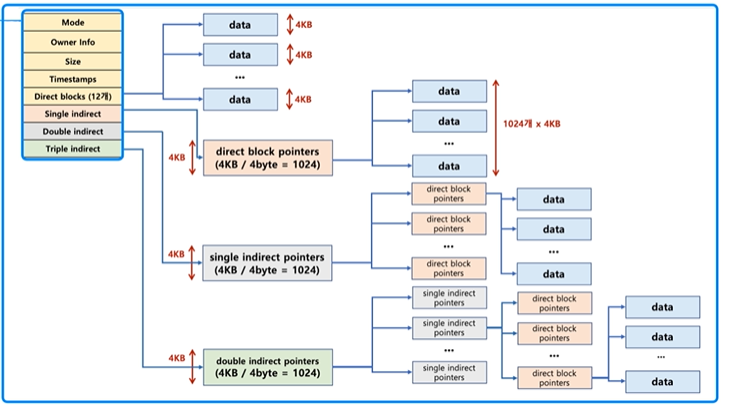
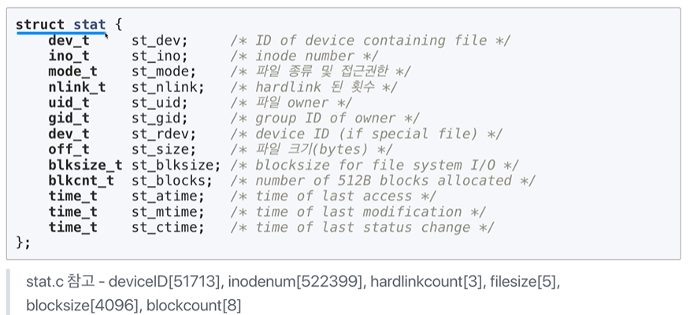

[TOC]

# 파일 시스템 관련 시스템콜, inode

## :heavy_check_mark: inode 방식 파일 시스템




## :heavy_check_mark: inode 메타 데이터 시스템콜

### stat

```c
#include <sys/types.h>
#include <sys/stat.h>
#include <unistd.h>

int stat(const char *path, struct stat *buf);
int fstat(int filedes, struct stat *buf);
```

#### stat 구조체




## :heavy_check_mark: Standard Stream (표준 입출력)과 파일 시스템콜

- command로 실행되는 프로세스는 세 가지 스트림을 가지고 있음
  - 표준 입력 스트림(Standard Input Stream) - **stdin**
  - 표준 출력 스트림(Standard Output Stream) - **stdout**
  - 오류 출력 스트림(Standard Error Stream) - **stderr**
- 모든 스트림은 일반적은 plain text로 console에 출력하도록 되어있음


