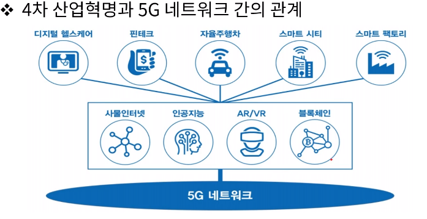
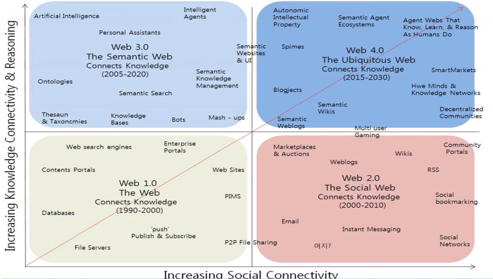

[toc]

# 컴퓨터 구조와 통신

## :heavy_check_mark: 비즈니스 환경에서의 통신과 네트워킹의 역할

## :heavy_check_mark: 양자 컴퓨터

- 중첩, 얽힘 등 양자의 고유한 물리학적 특성을 이용해, 다수의 정보를 동사(병렬) 처리할 수 있는 개념의 컴퓨터
- 고전 컴퓨터 성능 한계 돌파를 위한 대안
- 양자적 정보 단위인 양자 비트, 큐비트를 정보처리의 기본단위로 하는 양자 병렬처리를 통해 빠른 속도로 문제 해결 가능

## :heavy_check_mark: 웹의 진화 - 글로벌 인터넷

