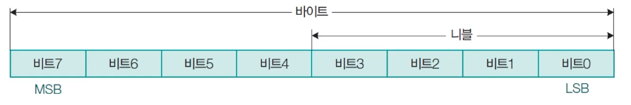
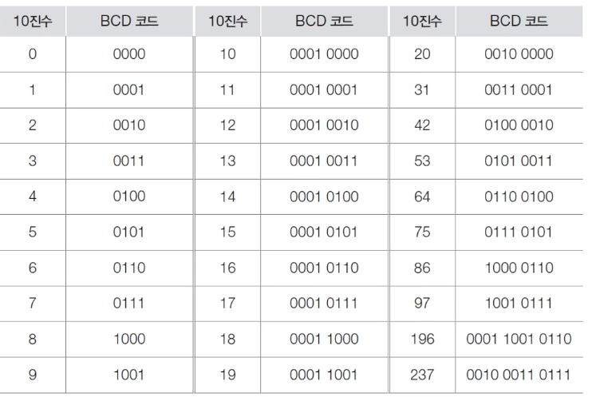
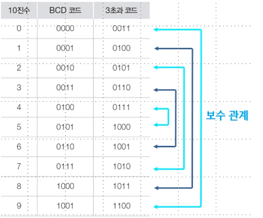
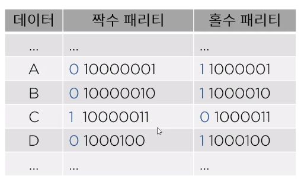
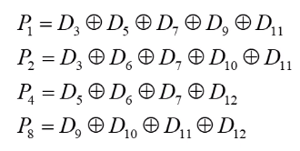

[toc]

# 데이터의 종류

## :heavy_check_mark: 진법과 진법 변환

- 1nibble = 4bit
- 1byte = 8bit
- 1byte = 1문자(character)
- 영어는 1byte 1문자, 한글은 2byte
- 1워드: 데이터 길이에 해당하는 비트 수
- 워드 길이는 8의 배수로 가능



> - MSB: 최상위 비트
> - LSB: 최하위 비트


## :heavy_check_mark: 보수

- 최대값 (해당 bit에서 가장 큰 표현형)을 형성하는데 서로 보완 관계에 있는 두 수 사이의 관계를 one's COMPLEMENT라고 한다.
- MODULUS(최대 표현 자리 수)를 형성하는데 서로 보완관계에 있는 두 수 사이의 관계를 two's COMPLEMENT

```
ex) 10진수에서의 보수
1진보수: A+B=9, A+B=99
2진보수: A+B=10, A+B=100
```


## :heavy_check_mark: 정수 표현


## :heavy_check_mark: 실수 표현


## :heavy_check_mark: 디지털 코드

### BCD 코드




### 3초과 코드 (excess-3 코드)




## :heavy_check_mark: 에러 검출 코드

### 패리티 비트




### 해밍 비트

- 8비트 데이터의 에러 정정 코드




