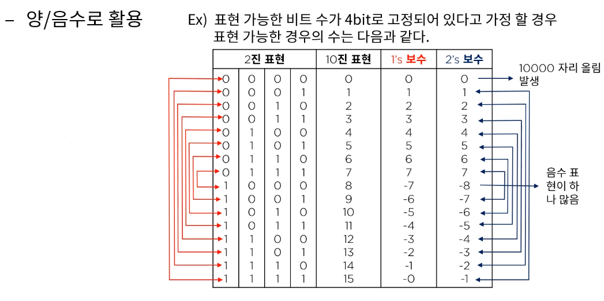
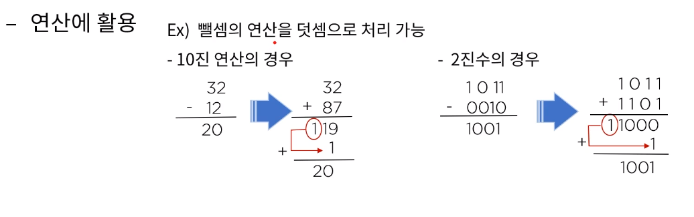
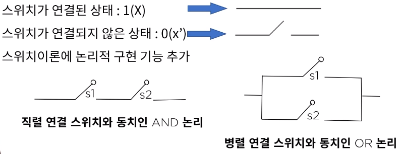
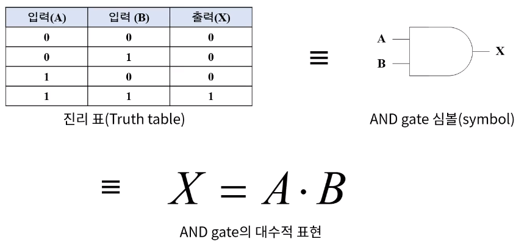
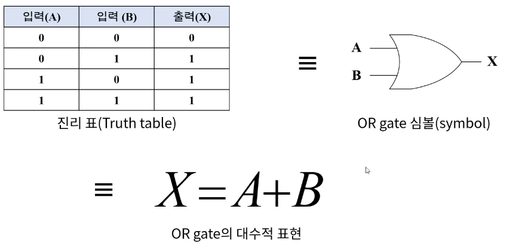
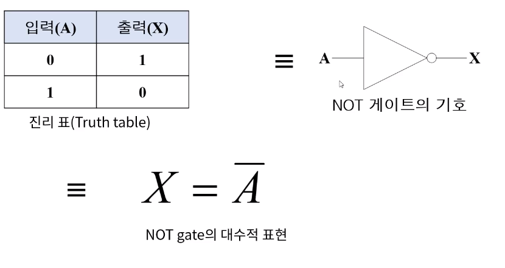
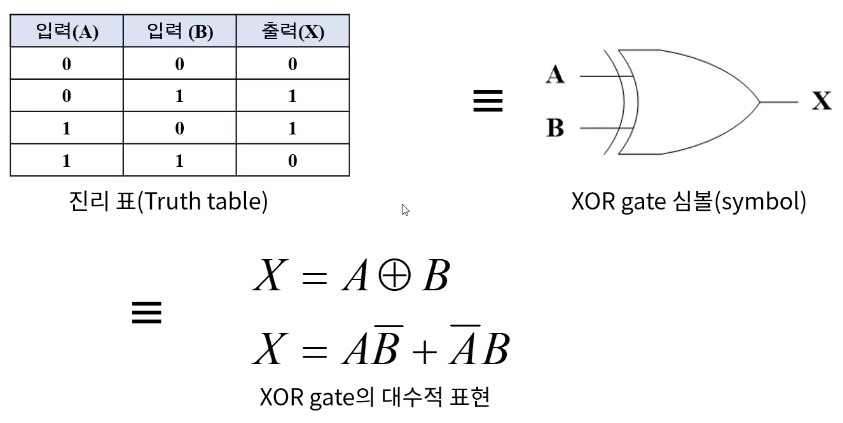
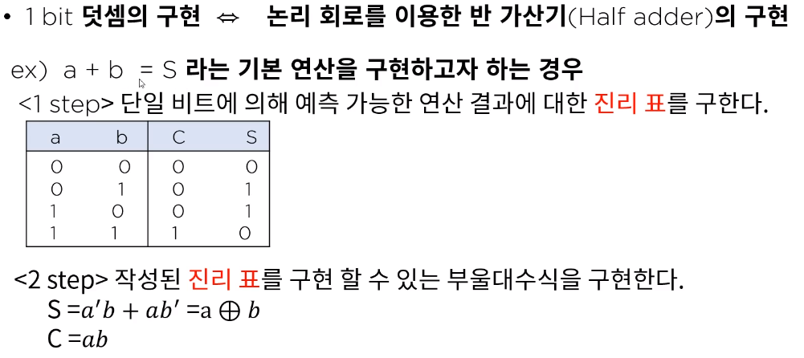

[toc]

# 논리 회로와 데이터 표현

## :heavy_check_mark: 보수의 활용

### 양/음수로 활용

### 연산에 활용

## :heavy_check_mark: 논리 게이트 (Logical gate)

논리 연산을 수행하는 전자소자로서 주어진 입력 변수 값에 대해 정해진 논리 함수를 수행해 그 함수의 연산 경과와 동일한 결과값을 출력하는 하드웨어이다.

### 스위칭 이론

- 스위치로 2진 정보를 표현하거나 논리 연산의 실행을 가능하도록 구성된 이론

## :heavy_check_mark: 논리 연산의 기본 표현

### 논리 곱 (AND)

### 논리 합 (OR)

### 논리 부정 (NOT)

### 배타적 논리합 (exclusive OR, XOR)

## :heavy_check_mark: 적용 사례

