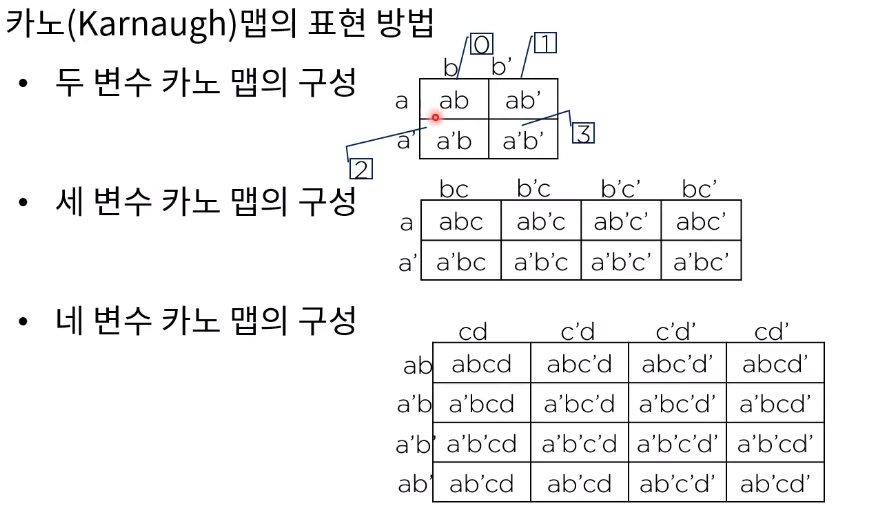

[toc]

# 부울대수와 논리식 간편화

## :heavy_check_mark: 결합 법칙

## :heavy_check_mark: 분배법칙

## :heavy_check_mark: 드모르강의 정리

## :heavy_check_mark: 부울 대수

## :heavy_check_mark: 논리식의 간편화 카노 맵

카노 맵을 이용한 간편화 예

(Karnaugh)

